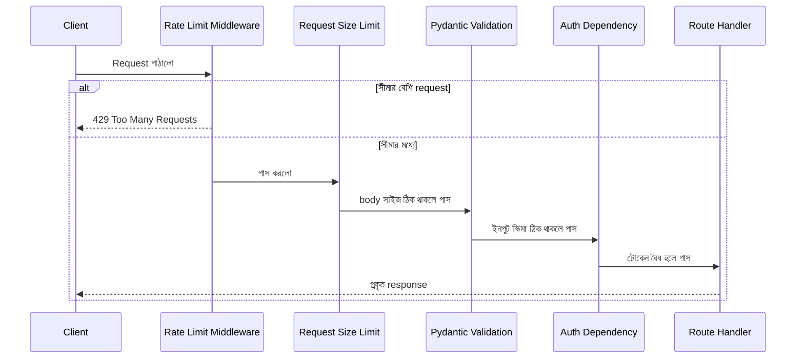

# ৩৫.২ Guard Your API Using Middlewares

আগের লেসনে আমরা দেখলাম হাই ট্রাফিক সামলানোর সার্ভার-সাইড কৌশল — scaling, caching, queueing। কিন্তু একটা জিনিস বাকি রয়ে গেলো: যদি ট্রাফিকের একটা অংশ আসলে বৈধ ব্যবহারকারীই না হয়, বরং কেউ ইচ্ছাকৃতভাবে তোমার সার্ভারকে আক্রমণ করার চেষ্টা করছে (যাকে বলে DoS বা bot abuse)? এই লেসনে আমরা দেখবো কীভাবে middleware ব্যবহার করে API-কে একটা "প্রহরী" (guard) দিয়ে ঘিরে রাখা যায়।

Module ৭-এ আমরা FastAPI-এর middleware আর dependency-এর ধারণা বিস্তারিত শিখেছিলাম — middleware প্রতিটা request-এর জন্য গ্লোবালভাবে চলে (যেমন logging, rate limiting), আর dependency চলে per-route ভিত্তিতে (যেমন authentication)। Module ৭.৬-এ আমরা একটা hand-rolled rate limiter-ও বানিয়েছিলাম। এই লেসনে আমরা সেই প্যাটার্নগুলো নতুন করে শিখবো না, বরং সেগুলোকে বড় নিরাপত্তা কৌশলের অংশ হিসেবে সাজিয়ে দেখবো — কোন প্রহরী কোন ক্রমে থাকা উচিত, আর rate limiting-এর বাইরে আর কী কী প্রহরী দরকার। ভাবো একটা অফিস ভবনের প্রধান ফটকের দারোয়ানকে — সে প্রত্যেক ভিজিটরকে চেক করে: পরিচয়পত্র আছে কিনা, কতবার আজ ঢুকেছে, ব্যাগে কী নিয়ে ঢুকছে, নিষিদ্ধ তালিকায় নাম আছে কিনা। middleware/dependency ঠিক এই কাজটাই করে প্রতিটা incoming request-এর জন্য।



সবচেয়ে সাধারণ প্রহরী হলো **rate limiting** — একজন ব্যবহারকারী বা একটা IP address থেকে নির্দিষ্ট সময়ে কতগুলো request আসতে পারবে, সেটার সীমা বেঁধে দেয়া। Module ৭.৬-এ আমরা এটা হাত দিয়ে বানিয়েছিলাম `@app.middleware("http")` দিয়ে; production-এ প্রায়ই `slowapi`-র মতো তৈরি লাইব্রেরি ব্যবহার করা হয়, যা Flask-এর জনপ্রিয় `flask-limiter`-এর FastAPI সংস্করণ:

```python
from slowapi import Limiter
from slowapi.util import get_remote_address
from fastapi import FastAPI

limiter = Limiter(key_func=get_remote_address)
app = FastAPI()
app.state.limiter = limiter

@app.get("/api/habits")
@limiter.limit("100/15minutes")   # প্রতি IP থেকে ১৫ মিনিটে সর্বোচ্চ ১০০ request
def get_habits():
    return {"habits": []}
```

দ্বিতীয় প্রহরী — **input validation**, যেটা FastAPI-তে আলাদা middleware লেখা লাগে না, কারণ এটা built-in — Pydantic model দিয়ে। খারাপ বা malformed ডেটা route handler-এর ভেতরে ঢোকার আগেই ফ্রেমওয়ার্ক নিজেই আটকে দেয়, আর স্বয়ংক্রিয়ভাবে ৪২২ error ফেরত পাঠায়:

```python
from pydantic import BaseModel, Field
from typing import Literal

class HabitCreate(BaseModel):
    title: str = Field(min_length=1, max_length=100)
    frequency: Literal["daily", "weekly"]

@app.post("/api/habits")
def create_habit(habit: HabitCreate):
    # এই পয়েন্টে আসার মানেই title আর frequency ইতিমধ্যে বৈধ
    return {"created": habit}
```

তৃতীয় প্রহরী — **request size limit**। এমন কেউ যদি ইচ্ছাকৃতভাবে কয়েক গিগাবাইটের একটা body পাঠায় (হয়তো একটা ছবি আপলোড ফর্মকে লক্ষ্য করে), তাহলে সেটা পুরোপুরি মেমরিতে পড়ার চেষ্টা করেই সার্ভার আটকে যেতে পারে — এটাও একরকম DoS। একটা সহজ middleware দিয়ে `Content-Length` header আগেই চেক করে বড় request বাতিল করা যায়:

```python
from starlette.middleware.base import BaseHTTPMiddleware
from starlette.responses import JSONResponse

MAX_BODY_SIZE = 2 * 1024 * 1024  # ২ মেগাবাইট

class LimitRequestSizeMiddleware(BaseHTTPMiddleware):
    async def dispatch(self, request, call_next):
        content_length = request.headers.get("content-length")
        if content_length and int(content_length) > MAX_BODY_SIZE:
            return JSONResponse(
                status_code=413,
                content={"detail": "Request body খুব বড়"},
            )
        return await call_next(request)

app.add_middleware(LimitRequestSizeMiddleware)
```

চতুর্থ প্রহরী — **authentication/authorization guard**, যেটা নিশ্চিত করে শুধু বৈধ টোকেনধারীরাই সংবেদনশীল রুটে ঢুকতে পারে। Module ১২-তে আমরা JWT দিয়ে `Depends()`-ভিত্তিক এই ধরনের guard বানিয়েছিলাম, এখানে সেই একই প্যাটার্ন কিন্তু broader নিরাপত্তা কৌশলের একটা অংশ হিসেবে দেখছি।

গুরুত্বপূর্ণ বিষয় হলো এই প্রহরীগুলোর **ক্রম** — rate limiter সবার আগে থাকা উচিত, কারণ সেটা সবচেয়ে সস্তা চেক (শুধু একটা কাউন্টার দেখা); তারপর request size limit (header পড়া, খুব সস্তা); তারপর Pydantic validation (body parse করা লাগে, একটু বেশি খরচ); auth check (প্রায়ই ডেটাবেজ বা cache lookup লাগে); আর ভারী কাজ (ডেটাবেজ কুয়েরি, ব্যবসায়িক লজিক) সবার শেষে। এভাবে সাজালে অবৈধ request যত দ্রুত সম্ভব বাতিল হয়ে যায়, সার্ভারের রিসোর্স বাঁচে — একটা common mistake হলো ভারী auth/DB check-কে rate limiter-এর আগে রাখা, যার ফলে DoS আক্রমণকারী request-গুলোও পুরো ডেটাবেজ query খরচ করিয়ে ফেলে, রেট-লিমিট কার্যত অর্থহীন হয়ে যায়।

এখন প্রশ্ন হলো — এই সীমাগুলো (যেমন ১০০ request/১৫ মিনিট, ২ মেগাবাইট body) কীভাবে ঠিক করবে? এলোমেলোভাবে সংখ্যা বসিয়ে দিলে চলবে না — তার জন্য দরকার প্রকৃত লোড টেস্টিং, যেটা আমরা পরের লেসনে দেখবো।
