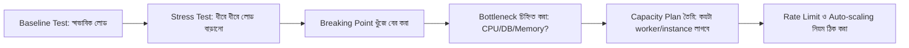

# ৩৫.৩ API Load Testing and Planning High Traffic Management

আগের দুই লেসনে আমরা স্কেলিং কৌশল আর নিরাপত্তা প্রহরী বসিয়েছি, কিন্তু একটা জিনিস এখনো অনুমান-নির্ভর — এই সীমাগুলো (rate limit, worker সংখ্যা) আসলে কতটা যথেষ্ট, সেটা আমরা জানি না। Module ৩১.৩-এ আমরা JMeter আর Locust দিয়ে load testing শিখেছিলাম মূলত response time মাপার জন্য; এখন আমরা সেই একই টুলগুলো ব্যবহার করবো, কিন্তু ভিন্ন উদ্দেশ্যে — capacity planning, মানে "আমার সার্ভার সর্বোচ্চ কত ট্রাফিক সামলাতে পারবে, আর কোথায় গিয়ে ভেঙে পড়বে" সেটা খুঁজে বের করা। এই লেসনে আমরা Locust/JMeter-এর ব্যবহার আবার শেখাবো না (সেটা Module ৩১-এ আছে) — এখানে ফোকাস হলো সেই টেস্টগুলোর ফলাফল দিয়ে কীভাবে সিদ্ধান্ত নেয়া হয়।

ভাবো তুমি একটা ব্রিজ বানিয়েছো, আর জানতে চাও এটা সর্বোচ্চ কত ওজন সহ্য করতে পারবে। বাস্তব ট্রাফিক দিয়ে টেস্ট করা বিপজ্জনক — তাই ইঞ্জিনিয়াররা ধীরে ধীরে ওজন বাড়িয়ে টেস্ট করে, ব্রিজ ভেঙে যাওয়ার আগ পর্যন্ত। API load testing-ও একইরকম, শুধু "ওজন"-এর বদলে concurrent user সংখ্যা।



Locust বা JMeter দিয়ে ক্যাপাসিটি পরিকল্পনার ধাপগুলো এরকম হতে পারে:

1. **Baseline test** — ১০ জন concurrent user দিয়ে শুরু, দেখো response time কেমন (Module ৩১.৪ থেকে শেখা মেট্রিক্স ব্যবহার করে)।
2. **Ramp-up test** — প্রতি মিনিটে ১০ জন করে user বাড়াতে থাকো (১০ → ৫০ → ২০০ → ৫০০...) যতক্ষণ না response time বা error rate খারাপ হতে শুরু করে। Locust-এর ওয়েব UI-তে এই ramp-up rate সরাসরি বসিয়ে দেয়া যায়।
3. **Breaking point চিহ্নিতকরণ** — যে মুহূর্তে p95 latency (Module ৩১.৪) হঠাৎ বেড়ে যায় বা 5xx error আসতে শুরু করে, সেটাই তোমার সিস্টেমের বর্তমান সীমা।

এই টেস্টের ফলাফল থেকে তুমি সিদ্ধান্ত নিতে পারবে rate limiter-এর সংখ্যা (আগের লেসনের `100/15minutes`) বাস্তবসম্মত কিনা, নাকি অনেক কম/বেশি। সাধারণত নিয়ম হলো — breaking point-এর ৬০-৭০% এ rate limit বসানো, যাতে বাফার থাকে।

```python
# লোড টেস্টের ফলাফল অনুযায়ী dynamic threshold লগ করা, FastAPI middleware দিয়ে
import time
from starlette.middleware.base import BaseHTTPMiddleware

class SlowRequestLogger(BaseHTTPMiddleware):
    async def dispatch(self, request, call_next):
        start = time.time()
        response = await call_next(request)
        duration_ms = (time.time() - start) * 1000
        if duration_ms > 800:  # আমাদের লোড টেস্টে দেখা গেছে ৮০০ms-এর পর সিস্টেম চাপে পড়ে
            logger.warning(f"ধীর response: {request.method} {request.url.path} — {duration_ms:.0f}ms")
        return response

app.add_middleware(SlowRequestLogger)
```

শুধু response time না, বটলনেক কোথায় সেটাও গুরুত্বপূর্ণ — CPU নাকি ডেটাবেজ কানেকশন পুল নাকি মেমরি? Module ৩৩-এ শেখা monitoring আর Datadog মেট্রিক্স, আর Module ৩৪.৫-এ শেখা performance profiling এই মুহূর্তে কাজে লাগবে — লোড টেস্ট চলাকালীন সেগুলো পর্যবেক্ষণ করলে দেখা যাবে ঠিক কোন রিসোর্স আগে শেষ হয়ে যাচ্ছে। এই তথ্য দিয়েই capacity planning করা হয় — যেমন, "আমাদের প্রতি ৫০০ concurrent user-এর জন্য একটা নতুন Gunicorn worker (বা instance) দরকার।"

এতক্ষণ আমরা ব্যাকএন্ডের ট্রাফিক আর নিরাপত্তা নিয়ে কথা বললাম। কিন্তু production-এ সমস্যা শুধু ব্যাকএন্ডেই হয় না — frontend-এও অনেক রকম সমস্যা দেখা দেয়। পরের লেসনে আমরা সেদিকে নজর দেবো।
