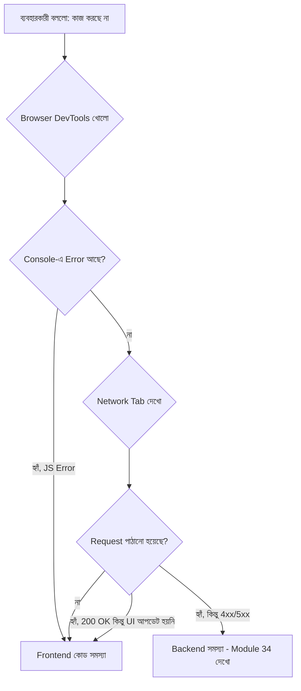

# ৩৫.৪ Trouble Shooting Frontend Application

আগের তিন লেসনে আমরা পুরোটা সময় ব্যাকএন্ড নিয়ে কথা বলেছি — ট্রাফিক, নিরাপত্তা, লোড টেস্টিং। কিন্তু একজন ব্যবহারকারীর কাছে "অ্যাপ কাজ করছে না" মানে সবসময় ব্যাকএন্ডের দোষ না — অনেক সময় সমস্যাটা থাকে frontend-এ, আর একজন ভালো backend engineer-কেও frontend সমস্যা চিহ্নিত করতে জানতে হয়, অন্তত এটুকু বোঝার জন্য যে সমস্যাটা আসলে কোথায়।

ভাবো একজন রোগী ডাক্তারের কাছে এসে বললো "আমার শরীর খারাপ লাগছে"। ডাক্তারের প্রথম কাজ উপসর্গ শুনে বোঝা সমস্যাটা হৃদযন্ত্রে, পাকস্থলীতে, নাকি মস্তিষ্কে। ঠিক তেমনি, "সাইট কাজ করছে না" শুনলে প্রথম কাজ হলো বোঝা সমস্যাটা browser-এ (frontend), নাকি network-এ, নাকি server-এ (backend)।



Frontend ট্রাবলশুটিং-এর প্রধান হাতিয়ার হলো ব্রাউজারের **DevTools**। **Console tab** দেখায় JavaScript error — যেমন `Cannot read property 'map' of undefined`, যেটা সাধারণত মানে API থেকে যা আশা করা হয়েছিলো তার চেয়ে ভিন্ন কাঠামোর ডেটা এসেছে। **Network tab** দেখায় প্রতিটা API call — status code কী এসেছে, response body-তে কী আছে, কতক্ষণ সময় লেগেছে।

একটা বাস্তব উদাহরণ দেখি। ধরো Personal Growth Tracker-এর (যেটা আমরা Module ৩৬-এ বানাবো) frontend-এ habit list দেখানো হচ্ছে না:

```javascript
// frontend কোড
fetch('/api/habits')
  .then(res => res.json())
  .then(data => {
    // ধরো FastAPI backend পাঠাচ্ছে { "habits": [...] } (Pydantic response model অনুযায়ী)
    // কিন্তু frontend আশা করছে সরাসরি array
    setHabits(data.map(h => h.title)); // এখানেই error হবে যদি data একটা object হয়
  });
```

এই কোড ভাঙবে কারণ `data` আসলে `{ habits: [...] }` — একটা object, array না। Console-এ এসে দেখাবে `data.map is not a function`। এই ভুলটা backend-এ না, frontend-এ — API contract সম্পর্কে ভুল ধারণার কারণে হয়েছে। এই ধরনের সমস্যা এড়াতে API response-এর গঠন নিয়ে frontend আর backend টিমের মধ্যে স্পষ্ট চুক্তি (contract) থাকা দরকার — FastAPI-তে এই কাজটা সহজ হয়, কারণ Pydantic response model (Module ৭ আর ৩১-এ দেখা) স্বয়ংক্রিয়ভাবে `/docs`-এ একটা লাইভ, সবসময় আপ-টু-ডেট contract বানিয়ে দেয়, যেটা frontend developer সরাসরি দেখে নিতে পারে।

আরেকটা সাধারণ frontend সমস্যা হলো **CORS error** — যখন frontend আর backend আলাদা ডোমেইনে চলে আর backend সঠিক header পাঠায় না। এটা দেখতে backend সমস্যার মতো মনে হলেও ঠিক করতে হয় backend-এর `CORSMiddleware` (FastAPI-তে `app.add_middleware(CORSMiddleware, ...)`) ঠিক করে।

এখন যেহেতু আমরা জানি frontend সমস্যা কীভাবে আলাদা করে চিনতে হয়, পরের লেসনে আমরা মনোযোগ দেবো তার প্রতিপক্ষের দিকে — যখন সমস্যাটা সত্যিই backend-এ, আর সেটা কীভাবে সিস্টেমেটিকভাবে খুঁজে বের করতে হয়।
