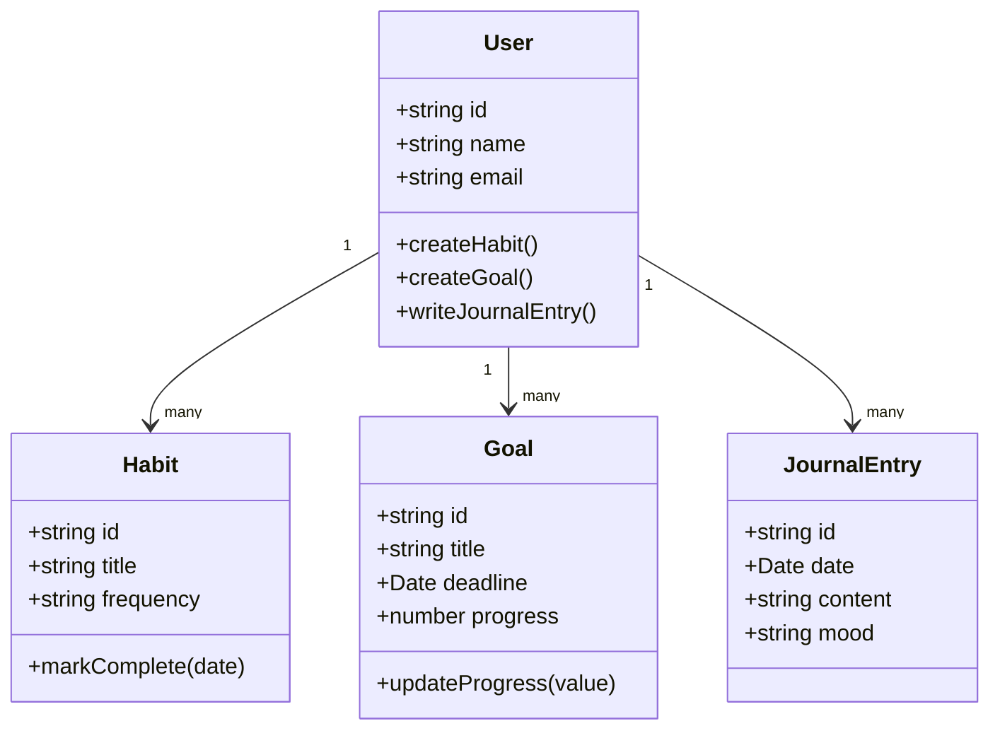

# ৩৬.১ Object Oriented Planning for Project

Module ৩৫ পর্যন্ত আমরা টুকরো টুকরো দক্ষতা শিখেছি — testing, logging, monitoring, debugging, deployment। এখন সময় এসেছে এই সব একসাথে একটা বাস্তব প্রজেক্টে প্রয়োগ করার। এই মডিউল জুড়ে আমরা একটাই অ্যাপ বানাবো — **Personal Growth Tracker**, যেখানে ব্যবহারকারী তার অভ্যাস (habit), লক্ষ্য (goal), আর দৈনন্দিন জার্নাল এন্ট্রি ট্র্যাক করতে পারবে। প্রতিটা লেসন এই একই প্রজেক্টের একটা ধাপ — একটা বাড়ি বানানোর মতো, যেখানে আজ আমরা ভিত্তি নকশা করবো।

কোনো কোড লেখার আগে, প্রথম কাজ হলো ভাবা — এই সিস্টেমে আসলে কী কী "জিনিস" (entity) থাকবে, আর তাদের মধ্যে সম্পর্ক কী। একে বলে **Object-Oriented Planning**। ভাবো তুমি একটা সিনেমার চিত্রনাট্য লিখছো — প্রথমে চরিত্রগুলো ঠিক করতে হয় (কে আছে, তাদের কী ক্ষমতা), তারপর গল্প। সফটওয়্যারেও তাই — প্রথমে অবজেক্ট/ক্লাস ঠিক করা হয়, তারপর তাদের মধ্যে ইন্টারঅ্যাকশনের গল্প (features)।

Personal Growth Tracker-এর মূল চরিত্রগুলো কারা? একজন **User** থাকবে, যে একাধিক **Habit** তৈরি করতে পারবে (যেমন "প্রতিদিন ৩০ মিনিট পড়া"), একাধিক **Goal** সেট করতে পারবে (যেমন "৩ মাসে ৫ কেজি ওজন কমানো"), আর প্রতিদিন **JournalEntry** লিখতে পারবে।



লক্ষ্য করো, প্রতিটা ক্লাসের সাথে শুধু ডেটা (properties) না, তার সাথে যুক্ত আচরণও (methods) লেখা হয়েছে — `markComplete()`, `updateProgress()`। এটাই object-oriented চিন্তার মূল কথা: ডেটা আর সেই ডেটার উপর যে কাজ করা যায়, দুটোকে একসাথে একটা "জিনিস" হিসেবে দেখা। কোডে এটা এরকম দেখাবে:

```javascript
class Habit {
  constructor(id, title, frequency) {
    this.id = id;
    this.title = title;
    this.frequency = frequency;
    this.completions = [];
  }

  markComplete(date = new Date()) {
    this.completions.push(date);
  }

  getStreak() {
    // পরপর কতদিন সম্পন্ন হয়েছে, সেটা হিসাব করার লজিক
    return this.completions.length;
  }
}
```

এই ক্লাস ডায়াগ্রামটাই আমাদের পুরো প্রজেক্টের কঙ্কাল। কোড লেখার আগে এভাবে ভেবে নেয়ার সুবিধা হলো — পরে যখন ডেটাবেজ ডিজাইন করবো, ঠিক এই ক্লাসগুলোই টেবিল/কালেকশনে রূপান্তরিত হবে। পরের লেসনে আমরা ঠিক সেই কাজটাই করবো — এই object মডেলকে একটা বাস্তব ডেটাবেজ স্কিমায় রূপান্তর করবো।
