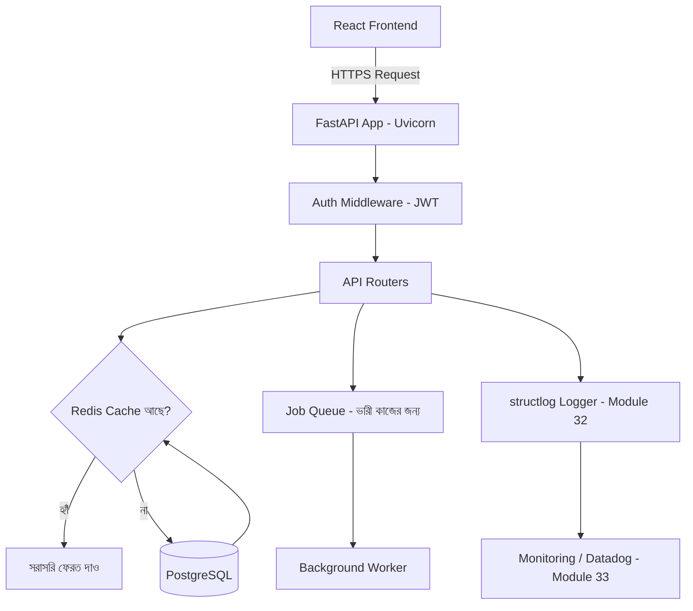

# ৩৬.৩ High Level Diagrams for Project

আগের দুই লেসনে আমরা Personal Growth Tracker-এর "ভেতরের" ডিজাইন করেছি — কী কী অবজেক্ট আছে, আর সেগুলো ডেটাবেজে কীভাবে সাজানো থাকবে। কিন্তু একটা সিস্টেম শুধু ডেটাবেজ আর কোড না — এটা একগুচ্ছ যন্ত্রাংশ, যেগুলো একসাথে কাজ করে। এই লেসনে আমরা একটু পিছিয়ে এসে পুরো সিস্টেমের "উপর থেকে দেখা" ছবিটা আঁকবো।

ভাবো তুমি একটা শহরের মানচিত্র বানাচ্ছো — একটা বাড়ির ভেতরের ঘরের নকশা (আগের লেসন) আর পুরো শহরের রাস্তাঘাট, বিদ্যুৎ লাইন, পানির লাইনের মানচিত্র (এই লেসন) — দুটো সম্পূর্ণ ভিন্ন স্তরের বিস্তারিত তথ্য দেয়। High-level architecture diagram আমাদের দেখায় সিস্টেমের বড় বড় অংশগুলো (client, server, database, cache) একে অপরের সাথে কীভাবে যোগাযোগ করে।

এই ডায়াগ্রামে প্রতিটা বক্স আমাদের আগের মডিউলগুলোর সাথে সরাসরি যুক্ত। **Auth Middleware** আমরা Module ১২-তে শিখেছিলাম, **Redis Cache** Module ৩১.৫-এ, **Job Queue** Module ৩৫.১-এ, আর **Logging/Monitoring** Module ৩২-৩৩-এ। এই ছবিটা আসলে আমাদের এখন পর্যন্ত শেখা প্রায় সব কিছুকে একটা একক সিস্টেমে জোড়া লাগানোর প্রথম প্রচেষ্টা।

এই ডায়াগ্রাম বানানোর সময় একটা গুরুত্বপূর্ণ প্রশ্ন মাথায় রাখতে হয় — request-টা কী পথ দিয়ে ভ্রমণ করে? Personal Growth Tracker-এ যখন কেউ তার habit list চায়:

1. Frontend থেকে request আসে API Gateway-তে
2. Auth middleware চেক করে টোকেন বৈধ কিনা
3. Route handler প্রথমে Redis-এ দেখে ডেটা cache আছে কিনা
4. না থাকলে PostgreSQL থেকে আনে, তারপর Redis-এ রেখে দেয় পরের বারের জন্য
5. প্রতিটা ধাপ structlog দিয়ে লগ হয়, আর Datadog সেই লগ আর মেট্রিক্স নজরদারি করে

এই high-level ছবিটা শুধু ডকুমেন্টেশনের জন্য না — এটা টিমের সবাইকে একই মানসিক মডেল দেয়, যাতে নতুন কেউ প্রজেক্টে যোগ দিলে দ্রুত বুঝতে পারে সিস্টেম কীভাবে সাজানো। ছবি আঁকা হয়ে গেলো, এখন এই ছবি অনুযায়ী ঠিক কী কী বানাতে হবে, সেই স্পষ্ট technical requirement-এর তালিকা তৈরি করার পালা — যেটা আমরা পরের লেসনে করবো।
