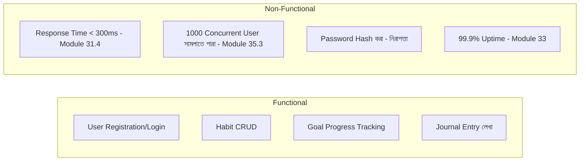

# ৩৬.৪ Technical Requirements for Project

আগের লেসনে আমরা Personal Growth Tracker-এর একটা high-level ছবি এঁকেছি — client, gateway, cache, database, queue, logging। কিন্তু একটা ছবি থেকে সরাসরি কোড লেখা শুরু করা বিপজ্জনক, কারণ ছবিটা অস্পষ্ট প্রশ্ন রেখে যায় — ঠিক কত দ্রুত response আসতে হবে? কতজন ব্যবহারকারী একসাথে ব্যবহার করতে পারবে? এই লেসনে আমরা সেই ছবিকে একগুচ্ছ স্পষ্ট, পরিমাপযোগ্য **technical requirement**-এ রূপান্তর করবো।

Requirement দুই ধরনের হয় — **functional** (সিস্টেম কী কী কাজ করবে) আর **non-functional** (সিস্টেম কতটা ভালো করে সেই কাজ করবে)। এটা একটা গাড়ি কেনার সাথে তুলনা করা যায় — functional requirement হলো "গাড়িটা ৫ জন বসতে পারবে, AC থাকবে"; non-functional হলো "০ থেকে ৬০ কিমি/ঘণ্টা উঠতে কত সময় লাগবে, মাইলেজ কেমন"। দুটোই দরকার, কিন্তু আলাদা ধরনের সিদ্ধান্ত।



Functional requirement-গুলো আমাদের Module ৩৬.১ আর ৩৬.২-এর classDiagram আর ERD থেকেই সরাসরি বের করা যায় — প্রতিটা method (`createHabit`, `updateProgress`) একটা করে functional requirement হয়ে যায়। কিন্তু non-functional requirement-গুলো আসে ব্যবসায়িক প্রেক্ষাপট থেকে — এই অ্যাপ কতজন ব্যবহারকারীর জন্য বানানো হচ্ছে, কতটা সমালোচনামূলক এটার uptime।

একটা বাস্তব উদাহরণ — response time-এর requirement। Module ৩১.৪-এ আমরা শিখেছিলাম p95 latency কীভাবে মাপতে হয়। এখন আমরা প্রজেক্টের শুরুতেই একটা লক্ষ্য বেঁধে দিচ্ছি:

```python
# এই লক্ষ্যকে কোডে একটা টেস্ট হিসেবেও লেখা যায় (pytest + httpx)
import time

def test_get_habits_responds_within_300ms(client):
    start = time.monotonic()
    response = client.get("/api/habits")
    elapsed_ms = (time.monotonic() - start) * 1000
    assert elapsed_ms < 300
```

এই একটা ছোট টেস্ট non-functional requirement-কে বাস্তবে পরিণত করে — এটা এখন শুধু কাগজের একটা লাইন না, বরং প্রতিটা কোড পরিবর্তনের সাথে স্বয়ংক্রিয়ভাবে যাচাই হওয়া একটা শর্ত।

Requirement লিখে ফেললেই কাজ শেষ না — এই বিশাল তালিকা থেকে কোনটা আগে, কোনটা পরে বানাবো, আর কোনটা আদৌ প্রথম ভার্সনে দরকার নেই, সেই সিদ্ধান্ত নিতে হবে। পরের লেসনে আমরা দেখবো কীভাবে এই requirement-গুলোকে বাস্তবসম্মত কাজের টুকরায় (user stories) রূপান্তর করতে হয়।
