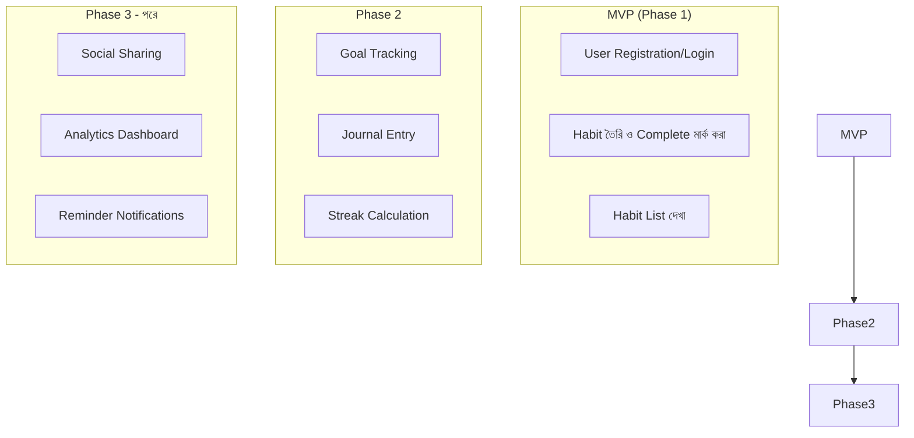

# ৩৬.৬ Handling Project Scope for a Project

আগের লেসনে আমরা Personal Growth Tracker-এর requirement-গুলোকে ছোট ছোট user story-তে ভাঙলাম। কিন্তু যদি সব story — habit, goal, journal, streak, reminder, social sharing, analytics ড্যাশবোর্ড — একসাথে বানাতে চাই, প্রথম ভার্সন বের হতে মাসের পর মাস লেগে যাবে। এই লেসনে আমরা শিখবো কীভাবে **scope** ঠিক করে বোঝা যায় কোনটা এখন দরকার, কোনটা পরে।

স্কোপ ম্যানেজমেন্টকে ভাবা যায় একটা প্রথমবার সাইকেল চালানো শেখার মতো — প্রথমে সহায়ক চাকা (training wheels) সহ শুরু করো, ভারসাম্য শিখে গেলে তারপর সেগুলো খুলে ফেলো। প্রথম ভার্সনে (MVP — Minimum Viable Product) শুধু সেই ফিচারগুলো রাখা হয়, যেগুলো ছাড়া প্রোডাক্টটা আসলে অকেজো, বাকিগুলো ধাপে ধাপে যোগ হয়।



কীভাবে সিদ্ধান্ত নেয়া হলো কোনটা MVP-তে যাবে? একটা সহজ নিয়ম — নিজেকে জিজ্ঞাসা করো, "এই ফিচার ছাড়া কি ব্যবহারকারী প্রোডাক্টের মূল প্রতিশ্রুতি (একটা habit ট্র্যাক করা) পূরণ করতে পারবে?" Goal tracking আর journal দরকারী, কিন্তু "personal growth" ট্র্যাক করার মূল কাজ — habit তৈরি করা আর প্রতিদিন mark করা — এটা ছাড়া বাকি সব অর্থহীন। তাই এটাই MVP-র কেন্দ্রবিন্দু।

কোডেও এই স্কোপ ডিসিপ্লিন প্রতিফলিত হওয়া উচিত — MVP-তে জটিল ফিচারের জন্য জায়গা রেখে দেয়া, কিন্তু আগেভাগে না বানানো:

```javascript
// MVP: শুধু simple streak count, জটিল calendar heatmap পরে যোগ হবে
function getStreak(completions) {
  // এখন: সরল গণনা
  return completions.length;
  // Phase 2: consecutive days streak logic এখানে যোগ হবে
}
```

এই "এখন যথেষ্ট সরল রাখো" মানসিকতাকে বলে **YAGNI** (You Aren't Gonna Need It) — যে ফিচার এখনই দরকার নেই, সেটার জটিল ভার্সন আগেভাগে বানিয়ে সময় নষ্ট না করা। এটা Module ৩৮-এ আমরা যখন clean code নিয়ে কথা বলবো, তখন আবার ফিরে আসবে।

স্কোপ ঠিক হয়ে গেলে, পরের স্বাভাবিক প্রশ্ন হলো — এই MVP বানাতে কত সময় লাগবে, আর কোন ক্রমে কাজগুলো করবো? পরের লেসনে আমরা এই কাজগুলোর একটা বাস্তবসম্মত timeline তৈরি করবো।
