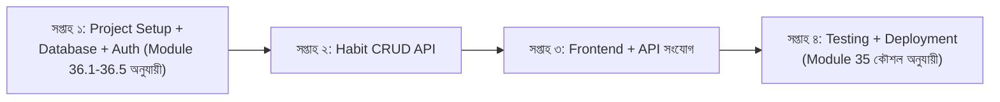

# ৩৬.৭ Handling Project Timeline for a Project

আগের লেসনে আমরা Personal Growth Tracker-এর MVP স্কোপ ঠিক করেছি — User auth, Habit তৈরি করা, complete মার্ক করা, আর habit list দেখা। এখন প্রশ্ন হলো — এই কাজগুলো কোন ক্রমে, কত সময়ে শেষ করবো? পরিকল্পনা পর্বের এই শেষ ধাপে আমরা একটা বাস্তবসম্মত timeline বানাবো।

Timeline বানানোকে ভাবা যায় একটা ভ্রমণের রুট প্ল্যান করার মতো — শুধু গন্তব্য জানলে চলবে না, মাঝপথের বিরতিগুলোও ঠিক করতে হয়, নাহলে বোঝা যাবে না তুমি ঠিক পথে আছো কিনা। সফটওয়্যার প্রজেক্টে এই বিরতিগুলোকে বলে **milestone**।

একটা গুরুত্বপূর্ণ নিয়ম — নির্ভরতা (dependency) অনুযায়ী কাজ সাজানো। Habit complete মার্ক করার ফিচার বানানোর আগে অবশ্যই habit তৈরি করার ফিচার লাগবে, আর তার আগে user authentication লাগবে। এই নির্ভরতাগুলো উপেক্ষা করলে কাজ আটকে যায়।



লক্ষ্য করো, প্রতিটা সপ্তাহের কাজ আগের সপ্তাহের ফলাফলের উপর দাঁড়িয়ে আছে — সপ্তাহ ২-এর API বানাতে সপ্তাহ ১-এর ডেটাবেজ আর auth দরকার। বাস্তবে timeline বানানোর সময় প্রতিটা কাজের পাশে একটা আনুমানিক সময়ও লেখা হয়, আর সবসময় কিছুটা বাফার সময় (buffer) রাখা হয়, কারণ অপ্রত্যাশিত বাগ বা জটিলতা সবসময়ই আসে — একে বলে **estimation padding**।

একটা ছোট প্রজেক্ট ম্যানেজমেন্ট টুল দিয়েও (বা এমনকি একটা সাধারণ markdown checklist দিয়ে) এই timeline ট্র্যাক করা যায়:

```markdown
## Sprint 1 (সপ্তাহ ১)
- [x] PostgreSQL সেটআপ (Module 36.2 স্কিমা অনুযায়ী)
- [x] User model + JWT auth
- [ ] Habit model
```

এই timeline-টা পাথরে খোদাই করা কিছু না — প্রতি সপ্তাহ শেষে পুনর্মূল্যায়ন করা উচিত, বাস্তবতার সাথে মিলিয়ে সামঞ্জস্য করা উচিত। এটাই agile চিন্তাধারার মূল কথা — পরিকল্পনা একটা জীবন্ত জিনিস, একবার লিখে ভুলে যাওয়ার জিনিস না।

পরিকল্পনার সাতটা ধাপ (object design, database, architecture, requirements, requirement-handling, scope, timeline) এখন সম্পূর্ণ। এখন কোড লেখা শুরু করার আগে, একটা আধুনিক প্রশ্ন সামনে আসে — এই পুরো যাত্রায় AI টুলস কীভাবে সাহায্য করতে পারে? পরের লেসন থেকে আমরা AI-assisted development-এর জগতে প্রবেশ করবো।
