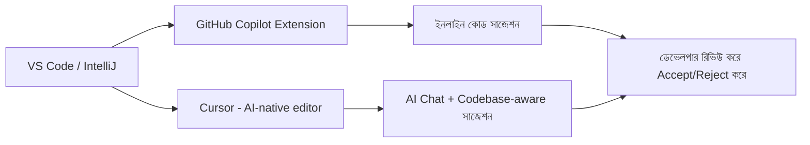

# ৩৬.৯ GitHub Copilot, Cursor, IntelliJ, VS Code — Integration & Best Practices

আগের লেসনে আমরা বুঝেছি AI development-এ একজন সহকারীর ভূমিকা পালন করে, প্রতিস্থাপনকারীর না। এখন Personal Growth Tracker-এর আসল কোডিং শুরু করার আগে, আমাদের development পরিবেশে এই সহকারীদের বসিয়ে নেয়া দরকার — যাতে ৩৬.১৬ লেসনে যখন আমরা সত্যিকারের কোড লিখতে বসবো, টুলগুলো আগে থেকেই প্রস্তুত থাকে।

ভাবো এটা একটা রান্নাঘর সাজানোর মতো — রান্না শুরুর আগে ছুরি, চপিং বোর্ড হাতের কাছে গুছিয়ে রাখলে রান্না দ্রুত আর সহজ হয়। VS Code বা IntelliJ-এর মতো editor হলো তোমার রান্নাঘর, আর Copilot/Cursor হলো তোমার সহকারী শেফ।



**GitHub Copilot** VS Code-এ একটা extension হিসেবে বসে, আর তুমি যখন কোড লেখো, সে পরের লাইন বা পুরো function সাজেস্ট করে। যেমন Habit model-এর জন্য একটা comment লিখলেই:

```python
# Function to calculate the current streak of consecutive completed days
```

Copilot সাধারণত নিচে পুরো implementation সাজেস্ট করে দেবে। এটা accept (Tab চেপে) বা reject (Esc চেপে) করা যায় — গুরুত্বপূর্ণ হলো, সবসময় বুঝে নিয়ে accept করা, চোখ বন্ধ করে না।

**Cursor** হলো VS Code-এরই একটা fork, কিন্তু AI-কে আরও গভীরভাবে সংযুক্ত করা — এটা পুরো কোডবেস "পড়ে" বুঝতে পারে, তাই তুমি জিজ্ঞেস করতে পারো "আমাদের Habit model অনুযায়ী একটা `getWeeklyProgress` function লিখে দাও", আর এটা আমাদের ৩৬.১ আর ৩৬.২ লেসনের schema মাথায় রেখে উত্তর দেবে।

**IntelliJ** (জাভা/টাইপস্ক্রিপ্ট-ভারী প্রজেক্টের জন্য জনপ্রিয়) আর VS Code দুটোতেই AI plugin বসানোর প্রক্রিয়া একইরকম — Extensions/Plugins marketplace থেকে ইনস্টল করে, নিজের GitHub/OpenAI অ্যাকাউন্ট দিয়ে sign-in করা।

কিছু best practice মনে রাখা জরুরি:

- **প্রেক্ষাপট দাও** — শুধু "একটা ফাংশন লেখো" না বলে, "আমাদের Habit model অনুযায়ী, PostgreSQL ব্যবহার করে" বলা।
- **ছোট ছোট অংশে যাচাই করো** — পুরো ফাইল একসাথে generate করানোর বদলে, ছোট function ধরে ধরে রিভিউ করা।
- **secrets কখনো AI-কে দেখিও না** — `.env` ফাইলের আসল password/API key কখনো prompt-এ পেস্ট না করা।

এখন আমাদের টুলস প্রস্তুত। পরের লেসনে আমরা দেখবো কীভাবে এই একই AI টুলগুলো কোড লেখার বাইরেও কাজে লাগে — কোড রিভিউ আর মান যাচাইয়ে।
