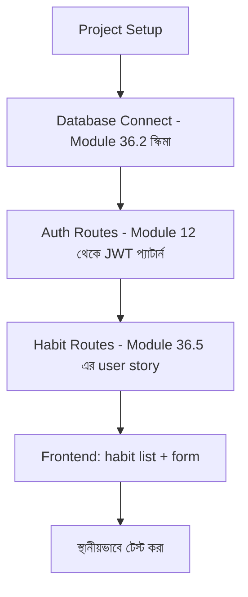

# ৩৬.১৬ Personal Growth Tracker: API + Frontend

পনেরোটা লেসন জুড়ে আমরা পরিকল্পনা করেছি (৩৬.১-৩৬.৭) আর টুল প্রস্তুত করেছি (৩৬.৮-৩৬.১৫)। এখন সময় এসেছে — আজকের লেসনে আমরা Personal Growth Tracker-এর MVP আসলে বানাবো। যা কিছু আঁকা হয়েছিলো কাগজে (classDiagram, ERD, architecture diagram), সেগুলো এখন কোডে রূপান্তরিত হবে।

Module ৩৬.৬-এ ঠিক করা MVP স্কোপ মনে করি: user auth, habit তৈরি করা, complete মার্ক করা, আর list দেখা। আমরা FastAPI + Pydantic + SQLAlchemy দিয়ে backend আর একটা সাধারণ frontend বানাবো।



প্রথমে backend-এর কঙ্কাল:

```python
# main.py
from fastapi import FastAPI
from routers import auth, habits

app = FastAPI(title="Personal Growth Tracker")

app.include_router(auth.router, prefix="/api/auth", tags=["auth"])
app.include_router(habits.router, prefix="/api/habits", tags=["habits"])

# চালানো হয়: uvicorn main:app --reload --port 3000
```

Pydantic schema দিয়ে request/response contract স্পষ্টভাবে সংজ্ঞায়িত করা, Module ৩৬.৪-এর technical requirement অনুযায়ী:

```python
# schemas.py
from pydantic import BaseModel, Field
from datetime import date
import uuid

class HabitCreate(BaseModel):
    title: str = Field(min_length=1, max_length=200)
    frequency: str

class HabitOut(BaseModel):
    id: uuid.UUID
    title: str
    frequency: str

    class Config:
        from_attributes = True

class HabitCompletionOut(BaseModel):
    id: uuid.UUID
    habit_id: uuid.UUID
    completed_on: date

    class Config:
        from_attributes = True

class HabitListOut(BaseModel):
    habits: list[HabitOut]
```

Habit router, ৩৬.৫-এ পরিকল্পিত user story অনুযায়ী:

```python
# routers/habits.py
import uuid
from datetime import date
from fastapi import APIRouter, Depends
from sqlalchemy.orm import Session

from auth import get_current_user
from database import get_db
from models import Habit, HabitCompletion, User
from schemas import HabitCreate, HabitOut, HabitCompletionOut, HabitListOut

router = APIRouter(dependencies=[Depends(get_current_user)])

@router.post("/", status_code=201, response_model=HabitOut)
def create_habit(payload: HabitCreate, user: User = Depends(get_current_user), db: Session = Depends(get_db)):
    habit = Habit(user_id=user.id, title=payload.title, frequency=payload.frequency)
    db.add(habit)
    db.commit()
    db.refresh(habit)
    return habit

@router.get("/", response_model=HabitListOut)
def list_habits(user: User = Depends(get_current_user), db: Session = Depends(get_db)):
    habits = db.query(Habit).filter(Habit.user_id == user.id).all()
    return {"habits": habits}

@router.post("/{habit_id}/complete", status_code=201, response_model=HabitCompletionOut)
def complete_habit(habit_id: uuid.UUID, db: Session = Depends(get_db)):
    completion = HabitCompletion(habit_id=habit_id, completed_on=date.today())
    db.add(completion)
    db.commit()
    db.refresh(completion)
    return completion
```

লক্ষ্য করো, `title` ফাঁকা কিনা যাচাই করার জন্য আলাদা `if not title` চেক লেখা লাগেনি, যেমনটা Express ভার্সনে (Module ৩৬.৫) লাগতো — `HabitCreate` schema-তে `Field(min_length=1, ...)` দেয়ার সাথে সাথে FastAPI নিজেই খালি title-এ 422 রিটার্ন করে, request handler-এ পৌঁছানোর আগে। এটাই FastAPI-তে validation আর business logic আলাদা রাখার সবচেয়ে বড় সুবিধা — একটা প্রায়ই দেখা ভুল হলো, এরপরও route-এর ভেতরে আবার ম্যানুয়াল validation লেখা, যা duplicate কাজ আর অসঙ্গত error message তৈরি করে।

Frontend-এর দিকে, একটা সাধারণ React কম্পোনেন্ট:

```jsx
function HabitList() {
  const [habits, setHabits] = useState([]);

  useEffect(() => {
    fetch('/api/habits', { headers: { Authorization: `Bearer ${token}` } })
      .then(res => res.json())
      .then(data => setHabits(data.habits)); // Module 35.4-এ শেখা শুদ্ধ response-হ্যান্ডলিং
  }, []);

  return (
    <ul>
      {habits.map(h => <li key={h.id}>{h.title} <button onClick={() => markComplete(h.id)}>✓ আজ সম্পন্ন</button></li>)}
    </ul>
  );
}
```

লক্ষ্য করো, frontend-এ `data.habits` ব্যবহার করা হচ্ছে, `data` সরাসরি না — এটা ৩৫.৪ লেসনে শেখা ভুলটা আগে থেকেই এড়িয়ে যাওয়া। এভাবেই MVP-র প্রথম কার্যকরী ভার্সন তৈরি হলো, যদিও এখনো এটা শুধু নিজের কম্পিউটারে (localhost) চলছে। পরের লেসনে আমরা এটাকে প্রকৃত ব্যবহারকারীদের হাতে পৌঁছানোর জন্য প্রোডাকশনে deploy করবো।
