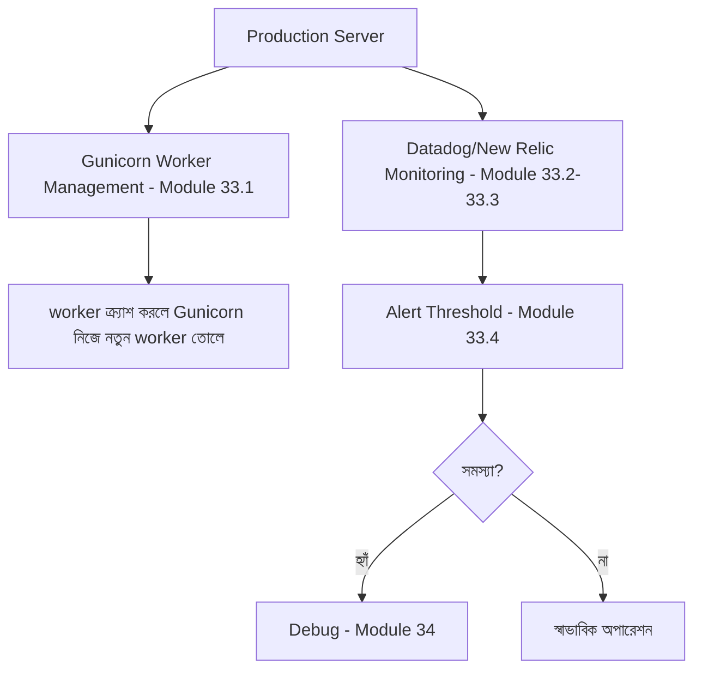

# ৩৬.১৯ Server Management Fullstack Application

আগের লেসনে আমরা deploy পুরোপুরি স্বয়ংক্রিয় করলাম। কিন্তু deploy হয়ে যাওয়াই শেষ কথা না — একটা লাইভ সার্ভার একটা জীবন্ত জিনিসের মতো, যেটার নিয়মিত পরিচর্যা দরকার। এই লেসনে আমরা ফিরে যাচ্ছি Module ৩৩-এ শেখা monitoring কৌশলের কাছে, কিন্তু এবার সেটা Personal Growth Tracker-এর বাস্তব সার্ভারে প্রয়োগ করছি।

একটা বাগানের কথা ভাবো — গাছ লাগানো (deploy করা) একটা কাজ, কিন্তু নিয়মিত পানি দেয়া, আগাছা পরিষ্কার করা, পোকামাকড় দেখা (server management) — এটা একটা চলমান দায়িত্ব।



আমাদের production সার্ভারে Gunicorn-কে systemd দিয়ে বসানো, যাতে অ্যাপ কখনো ক্র্যাশ করলে নিজে থেকে আবার চালু হয়, আর সার্ভার রিবুট হলেও সে নিজেই ফিরে আসে:

```ini
# /etc/systemd/system/growth-tracker.service
[Unit]
Description=Personal Growth Tracker (FastAPI)
After=network.target

[Service]
WorkingDirectory=/srv/growth-tracker
ExecStart=/srv/growth-tracker/venv/bin/gunicorn main:app --workers 4 --worker-class uvicorn.workers.UvicornWorker --bind 0.0.0.0:8000
Restart=always

[Install]
WantedBy=multi-user.target
```

```bash
sudo systemctl enable growth-tracker   # সার্ভার রিবুট হলেও স্বয়ংক্রিয়ভাবে চালু হবে
sudo systemctl start growth-tracker
```

Datadog-এর মতো টুল দিয়ে গুরুত্বপূর্ণ মেট্রিক্স পর্যবেক্ষণ করা, একটা FastAPI middleware দিয়ে:

```python
import time
from datadog import statsd

@app.middleware("http")
async def metrics_middleware(request, call_next):
    start = time.monotonic()
    response = await call_next(request)
    duration_ms = (time.monotonic() - start) * 1000
    statsd.timing("growth_tracker.request_duration", duration_ms)
    statsd.increment(f"growth_tracker.status.{response.status_code}")
    return response
```

আর Module ৩৩.৪-এ শেখা alert threshold, এই প্রজেক্টের বাস্তব সংখ্যায়:

```python
# যদি error rate ৫%-এর বেশি হয়ে যায়, টিমকে notify করা
alert_rule = {
    "metric": "growth_tracker.status.5xx",
    "threshold": "5% of total requests over 5 minutes",
    "notify": ["#growth-tracker-alerts (Slack)"],
}
```

সার্ভার ম্যানেজমেন্টের আরেকটা নিয়মিত কাজ — ডেটাবেজ ব্যাকআপ নেয়া, ডিস্ক স্পেস পর্যবেক্ষণ করা (Module ৩২.৫-এ শেখা log rotation এখানে সরাসরি প্রাসঙ্গিক, কারণ লগ ফাইল না ঘোরালে ডিস্ক ভরে সার্ভার বন্ধ হয়ে যেতে পারে), আর নিয়মিত dependency আপডেট করা নিরাপত্তার জন্য।

সার্ভার এখন স্থিতিশীল আর পর্যবেক্ষিত। কিন্তু ব্যবহারকারী সংখ্যা বাড়লে API ধীর হতে শুরু করতে পারে — পরের লেসনে আমরা দেখবো কীভাবে এই নির্দিষ্ট প্রজেক্টে performance optimize করা যায়।
