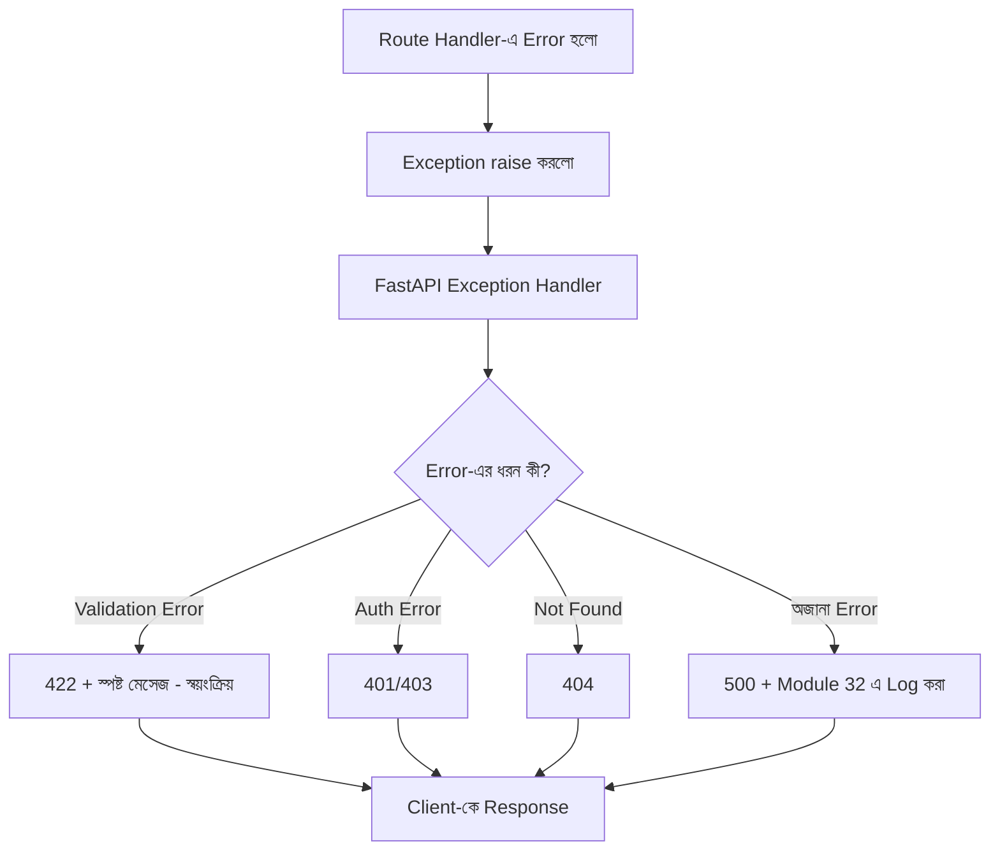

# ৩৬.২১ Error Handling and Debugging in Fullstack Application

আগের লেসনে আমরা API দ্রুত করলাম caching দিয়ে। কিন্তু দ্রুত API-ও যদি ভুলভাবে error handle করে, ব্যবহারকারীর অভিজ্ঞতা খারাপ হবে। এই লেসনে আমরা Module ৩৪-এ শেখা debugging কৌশলগুলোকে একটা সুসংগঠিত error-handling সিস্টেমে রূপ দেবো, পুরো Personal Growth Tracker জুড়ে।

একটা হাসপাতালের ইমার্জেন্সি রুমের কথা ভাবো — প্রতিটা রোগীর (error) জন্য একটা স্পষ্ট প্রক্রিয়া থাকে: প্রথমে ট্রায়াজ (কত গুরুতর), তারপর সঠিক বিভাগে পাঠানো, আর রেকর্ড রাখা। এলোমেলোভাবে সবাইকে একই ঘরে ঢুকিয়ে দিলে বিশৃঙ্খলা তৈরি হয় — কোডেও ছড়িয়ে-ছিটিয়ে `try-catch` লিখলে একই সমস্যা হয়।



FastAPI-তে Module ৩৬.৪ থেকে জানা schema-validation error স্বয়ংক্রিয়ভাবেই 422 দিয়ে সামলানো হয়, কিন্তু অন্য সব ধরনের error-এর জন্য একটা centralized exception handler বসানো যায়, যেটা সব রুটের জন্য একই জায়গা থেকে error সামলায়:

```python
# error_handlers.py
import structlog
from fastapi import Request
from fastapi.responses import JSONResponse

logger = structlog.get_logger()

class NotFoundError(Exception):
    def __init__(self, message: str):
        self.message = message

async def not_found_handler(request: Request, exc: NotFoundError):
    return JSONResponse(status_code=404, content={"error": exc.message})

async def unhandled_exception_handler(request: Request, exc: Exception):
    logger.error(
        "অপ্রত্যাশিত error",
        route=request.url.path,
        error=str(exc),
    )  # Module 32-এ শেখা structured logging
    return JSONResponse(status_code=500, content={"error": "কিছু একটা ভুল হয়েছে, আমরা দেখছি।"})
```

```python
# main.py-তে রেজিস্টার করা হয়:
app.add_exception_handler(NotFoundError, not_found_handler)
app.add_exception_handler(Exception, unhandled_exception_handler)
```

Route-এ এখন শুধু নির্দিষ্ট exception raise করলেই চলে, নিজে থেকে response বানাতে হয় না:

```python
@router.post("/{habit_id}/complete", status_code=201, response_model=HabitCompletionOut)
def complete_habit(habit_id: uuid.UUID, db: Session = Depends(get_db)):
    habit = db.query(Habit).filter(Habit.id == habit_id).first()
    if habit is None:
        raise NotFoundError(f"habit {habit_id} পাওয়া যায়নি")  # centralized handler-এ যাবে
    completion = HabitCompletion(habit_id=habit_id, completed_on=date.today())
    db.add(completion)
    db.commit()
    db.refresh(completion)
    return completion
```

একটা কমন ভুল — `Exception`-এর জন্য catch-all handler বসানোর পর `HTTPException`-ও ভুলবশত এই handler-এ ধরা পড়ে যাওয়া, ফলে ইচ্ছাকৃত 401/404 response-ও 500-এ পরিণত হয়। FastAPI ডিফল্টভাবে `HTTPException` আলাদা করে সামলায়, কিন্তু নিজের catch-all লেখার সময় `isinstance(exc, HTTPException)` চেক করে re-raise করাটা নিরাপদ অভ্যাস।

Frontend-এও একই ধরনের কেন্দ্রীভূত পদ্ধতি দরকার — একটা global fetch wrapper, যেটা সব API error একই জায়গা থেকে সামলায়, যাতে প্রতিটা কম্পোনেন্টে একই try-catch বারবার লিখতে না হয়:

```javascript
async function apiCall(url, options) {
  const res = await fetch(url, options);
  if (!res.ok) {
    const body = await res.json();
    throw new Error(body.error || 'অজানা সমস্যা');
  }
  return res.json();
}
```

এভাবে error handling ছড়িয়ে-ছিটিয়ে না রেখে একটা কেন্দ্রীয় জায়গায় সংগঠিত করা হলো — এখন যেকোনো নতুন error টাইপ যোগ করা, বা error message বদলানো, একটা মাত্র জায়গায় করলেই হয়। এই দীর্ঘ প্রজেক্ট-যাত্রার একদম শেষ ধাপে, একটা বিষয় বাকি রয়ে গেছে, যেটা সবসময় শেষে ভাবলে অনেক দেরি হয়ে যায় — নিরাপত্তা। পরের ও শেষ লেসনে আমরা সেটাই দেখবো।
