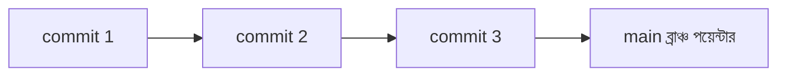
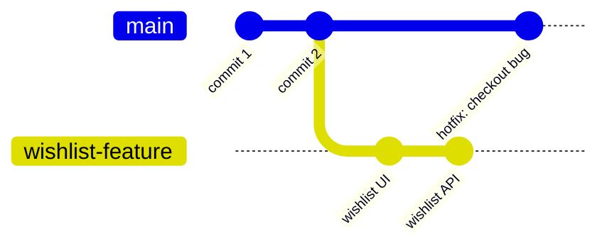
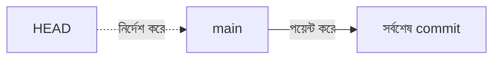

# ৩৭.১ Understanding Git Branches

Module 1-এ আমরা Git-এর তিনটা স্তর শিখেছিলাম — Working Directory, Staging Area, আর Repository। আমরা `git init`, `git add`, `git commit` দিয়ে একটা লিনিয়ার ইতিহাস বানিয়েছিলাম — একটার পর একটা commit, সরলরেখার মতো। কিন্তু বাস্তব প্রজেক্টে কাজ কখনোই এমন সরলরেখায় হয় না। তাই এই মডিউলে আমরা Git-এর সবচেয়ে শক্তিশালী ফিচারে ঢুকছি — **branch**।

এই পুরো মডিউলে আমরা একটা কাল্পনিক টিম প্রজেক্ট, **TaskFlow API**, উদাহরণ হিসেবে ব্যবহার করবো — যেখানে দুইজন ডেভেলপার, রিমা আর করিম, একসাথে কাজ করছে। তাদের বাস্তব সমস্যাগুলো দিয়েই আমরা Git-এর প্রতিটা কনসেপ্ট বুঝবো।

## সমস্যাটা কল্পনা করো

ধরো TaskFlow API-তে `main` ব্রাঞ্চে (এখন পর্যন্ত তুমি শুধু এই একটাই ব্রাঞ্চ চিনতে) প্রোডাকশনে চলা কোড আছে — ব্যবহারকারীরা প্রতিদিন এটা ব্যবহার করছে। এখন রিমাকে দুটো কাজ করতে বলা হলো:

1. একটা নতুন "Wishlist" ফিচার বানাও — যেটাতে সময় লাগবে ৫ দিন।
2. একইসাথে, প্রোডাকশনে একটা জরুরি bug ধরা পড়েছে — checkout পেজ ভেঙে গেছে, এখনই ফিক্স করতে হবে।

যদি তোমার হাতে শুধু একটাই "লাইন" থাকতো কোড লেখার জন্য, তাহলে কী হতো? Wishlist-এর অসম্পূর্ণ, অর্ধেক-লেখা কোডের মাঝখানে গিয়ে bug fix করতে হতো — আর সেই অবস্থাতেই যদি প্রোডাকশনে ডেপ্লয় করে ফেলো, পুরো সাইট ভেঙে পড়তে পারে।

এই সমস্যার সমাধান হচ্ছে branch — একই repository-র ভেতরে সমান্তরাল, স্বাধীন "টাইমলাইন"। প্রতিটা টাইমলাইনে তুমি একে অপরকে না ছুঁয়ে কাজ করতে পারো, এবং শেষে চাইলে সেগুলো এক করে (merge) নিতে পারো।

## Branch আসলে কী — টেকনিক্যাল দিক থেকে

Git-এর প্রতিটা commit একটা স্ন্যাপশট, এবং প্রতিটা commit-এর একটা "প্যারেন্ট" commit থাকে (যেটার উপর ভিত্তি করে এটা তৈরি হয়েছে)। এভাবে commit-গুলো একটা চেইন বা গ্রাফ তৈরি করে। একটা **branch** আসলে আর কিছুই না — শুধু একটা হালকা "পয়েন্টার" বা লেবেল, যেটা একটা নির্দিষ্ট commit-কে নির্দেশ করে।



যখন তুমি একটা নতুন branch বানাও, Git শুধু একটা নতুন পয়েন্টার তৈরি করে — বর্তমান commit-কেই নির্দেশ করে। এত হালকা যে হাজার হাজার branch বানালেও ডিস্কে তেমন জায়গা লাগে না। এখন তুমি যখন নতুন branch-এ commit করো, শুধু সেই branch-এর পয়েন্টারটাই এগিয়ে যায়, `main` ঠিক জায়গায় থেকে যায়।



এই ডায়াগ্রামে লক্ষ্য করো — `main` আর `wishlist-feature` দুটো আলাদা লাইনে এগোচ্ছে। `main`-এ hotfix commit যোগ হলো, অথচ `wishlist-feature`-এর অসম্পূর্ণ কাজ একদম অস্পৃষ্ট থাকলো। দুই কাজ একে অপরকে বিরক্ত করলো না।

## HEAD — তুমি এখন কোথায় আছো

Git-এ সবসময় একটা বিশেষ পয়েন্টার থাকে যার নাম **HEAD** — এটা বলে দেয় তুমি এই মুহূর্তে কোন branch-এ (এবং তার ফলে কোন commit-এ) দাঁড়িয়ে আছো। যখন তুমি নতুন commit করো, সেটা যোগ হয় HEAD যেখানে আছে সেই branch-এ।



মনে করো HEAD একটা "তুমি এখন এখানে" সাইনবোর্ড — সবসময় জানিয়ে দেয় তুমি কোন টাইমলাইনে দাঁড়িয়ে আছো।

## কেন এটা এত গুরুত্বপূর্ণ — বাস্তব সুবিধাগুলো

**বিচ্ছিন্নতা (Isolation)।** একটা ফিচারে কাজ করার সময় অন্য কোনো স্থিতিশীল কোড ভেঙে যাওয়ার ভয় নেই। ভুল হলে পুরো branch-টাই ফেলে দেয়া যায়, `main` অক্ষত থাকে।

**সমান্তরাল কাজ (Parallel Work)।** টিমের একেকজন একেক ফিচারে, একেক branch-এ কাজ করতে পারে — একজনের অসম্পূর্ণ কোড আরেকজনের কাজে বাধা দেয় না।

**নিরাপদ পরীক্ষা-নিরীক্ষা।** নতুন কোনো আইডিয়া চেষ্টা করতে চাও কিন্তু নিশ্চিত না এটা কাজ করবে কিনা? একটা branch বানাও, পরীক্ষা করো। কাজ না করলে branch ডিলিট, কোনো ক্ষতি নেই।

**পরিষ্কার ইতিহাস।** প্রতিটা ফিচার, প্রতিটা bug fix তার নিজস্ব branch-এ থাকলে বোঝা সহজ হয় — কোন commit কোন কাজের জন্য হয়েছিলো।

## branch-এর নামকরণ — একটা প্রচলিত রীতি

টিমগুলো সাধারণত একটা নিয়ম মেনে branch-এর নাম দেয়, যাতে নাম দেখেই বোঝা যায় এটার উদ্দেশ্য কী:

```
feature/wishlist-page
bugfix/checkout-crash
hotfix/payment-gateway-down
chore/update-dependencies
```

`feature/`, `bugfix/`, `hotfix/`, `chore/` — এই প্রিফিক্সগুলো branch-টা কী ধরনের কাজের জন্য, সেটা স্পষ্ট করে দেয়। আমরা পরের লেসনগুলোতে এই ধরনের কনভেনশন বাস্তবে ব্যবহার করবো।

## বর্তমান branch-গুলো দেখা

```bash
git branch
```

এই কমান্ড তোমার লোকাল repository-র সব branch-এর তালিকা দেখায়, আর বর্তমান branch-এর পাশে একটা `*` চিহ্ন থাকে।

এই লেসনে আমরা শুধু ধারণাটা বুঝলাম — branch মানে কী, কেন দরকার, HEAD কীভাবে কাজ করে। পরের লেসনে আমরা রিমার সাথে হাতে-কলমে branch তৈরি করবো, একটা থেকে আরেকটায় সুইচ করবো, আর দেখবো Working Directory ঠিক কীভাবে পাল্টে যায় branch পরিবর্তনের সাথে সাথে।
