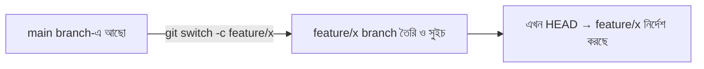
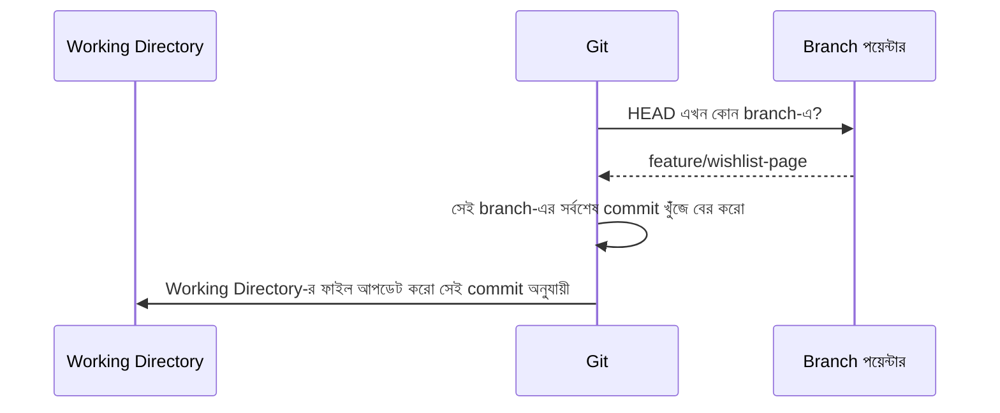

# ৩৭.২ Creating and Switching Branches

আগের লেসনে আমরা বুঝেছি branch আসলে একটা হালকা পয়েন্টার, আর HEAD জানায় আমরা এখন কোন branch-এ আছি। এবার রিমার সাথে হাতেকলমে কাজ শুরু করি — TaskFlow API রিপোজিটরিতে branch তৈরি করা, একটা থেকে আরেকটায় সুইচ করা, আর দেখা যে এই সুইচের সময় আসলে কী ঘটে তোমার ফাইল সিস্টেমে।

## নতুন branch তৈরি করা

```bash
git branch feature/wishlist-page
```

এই কমান্ড একটা নতুন branch তৈরি করে — `feature/wishlist-page` — কিন্তু তোমাকে এখনো সেখানে নিয়ে যায় না। এখনো তুমি আগের branch-এই আছো (সাধারণত `main`)। ভাবতে পারো এটা একটা নতুন রাস্তা তৈরি করে দিলো, কিন্তু তুমি এখনো পুরনো রাস্তাতেই হাঁটছো।

## branch পরিবর্তন করা (switch)

```bash
git checkout feature/wishlist-page
```

অথবা আধুনিক Git-এ (2.23+):

```bash
git switch feature/wishlist-page
```

`git switch` নতুন কমান্ড, বিশেষভাবে branch পরিবর্তনের জন্য বানানো — `git checkout`-এর অনেকগুলো কাজের ভেতর থেকে branch-সুইচিং অংশটা আলাদা করে সহজ করার জন্য। দুটোই একই কাজ করে branch পরিবর্তনের ক্ষেত্রে; নতুন প্রজেক্টে `git switch` ব্যবহার করাই ভালো অভ্যাস কারণ এটা বেশি স্পষ্ট।

## একসাথে তৈরি করা এবং সুইচ করা

বাস্তবে প্রায় সবসময় আমরা এই দুটো কাজ একসাথে করি — তাই একটা শর্টকাট আছে:

```bash
git checkout -b feature/wishlist-page
```

অথবা:

```bash
git switch -c feature/wishlist-page
```

`-b` এবং `-c` দুটোই মানে "তৈরি করো" (create)। এই একটা কমান্ডই branch বানায় এবং সাথে সাথে সেখানে নিয়ে যায়।



## সুইচ করার সময় ফাইল সিস্টেমে কী ঘটে

এটা বোঝা জরুরি — যখন তুমি branch পরিবর্তন করো, Git তোমার Working Directory-র ফাইলগুলো **বদলে দেয়**, যাতে সেগুলো ঠিক সেই branch-এর সর্বশেষ commit-এর মতো দেখায়।

ধরো `main`-এ একটা ফাইল `main.py` আছে যেখানে ৫০ লাইন কোড, আর `feature/wishlist-page`-এ সেই একই ফাইলে ৭০ লাইন (২০ লাইন নতুন যোগ হয়েছে)। যখন তুমি `main` থেকে `feature/wishlist-page`-এ সুইচ করো, VS Code-এ ফাইলটা খোলা থাকলে দেখবে সাথে সাথে ২০ লাইন নতুন কোড হাজির হয়ে গেছে — জাদুর মতো, কিন্তু আসলে এটা শুধু Git তোমার commit history থেকে সঠিক স্ন্যাপশটটা টেনে এনে ফাইলে বসিয়ে দিচ্ছে।



## সাবধানতা — uncommitted পরিবর্তন থাকলে

যদি তোমার Working Directory-তে এমন পরিবর্তন থাকে যা এখনো commit করা হয়নি, এবং সেই পরিবর্তন অন্য branch-এ গেলে সংঘর্ষ (conflict) তৈরি করতে পারে, Git তোমাকে সুইচ করতে দেবে না। এমন হলে Git একটা স্পষ্ট error দেখাবে:

```
error: Your local changes to the following files would be overwritten by checkout
```

এই পরিস্থিতিতে তোমার তিনটা অপশন থাকে — পরিবর্তনগুলো commit করে ফেলা, `git stash` দিয়ে সাময়িকভাবে সরিয়ে রাখা (এটা নিয়ে বিস্তারিত পরের একটা লেসনে আসবে), অথবা পরিবর্তনগুলো বাতিল করে দেয়া। এই সুরক্ষাটাই দেখায় Git কতটা সতর্কভাবে ডিজাইন করা — এটা তোমার কাজ হারিয়ে ফেলতে দেয় না চুপচাপ।

## branch তালিকা এবং পরিচালনা

```bash
git branch
```
সব লোকাল branch দেখায়, বর্তমানটার পাশে `*`।

```bash
git branch -a
```
লোকাল এবং রিমোট — দুই ধরনের branch-ই দেখায় (রিমোট branch নিয়ে আমরা পরের লেসনগুলোতে বিস্তারিত জানবো)।

```bash
git branch -d feature/wishlist-page
```
একটা branch ডিলিট করে — কিন্তু শুধু তখনই, যদি সেটার কাজ ইতিমধ্যে অন্য কোথাও merge হয়ে থাকে। এটা একটা সুরক্ষা — merge না করা কাজ ভুলবশত হারিয়ে যাওয়া ঠেকায়।

```bash
git branch -D feature/wishlist-page
```
জোর করে ডিলিট করে, merge হয়েছে কিনা তা যাচাই না করেই। সাবধানে ব্যবহার করো — এটাতে commit হারিয়ে যেতে পারে যদি সেগুলো অন্য কোনো branch থেকে পৌঁছানো না যায়।

## branch-এর নাম পরিবর্তন করা

```bash
git branch -m old-name new-name
```

## ছোট একটা বাস্তব উদাহরণ — সম্পূর্ণ ফ্লো

```bash
git switch -c feature/wishlist-page   # নতুন branch তৈরি ও সুইচ
# এখানে কিছু কোড লেখো, ফাইল বদলাও
git add .
git commit -m "wishlist UI যোগ করলাম"
git switch main                        # main-এ ফিরে যাও
git branch                             # তালিকা দেখো
```

লক্ষ্য করো — `main`-এ ফিরে গেলে wishlist-এর কোড Working Directory থেকে সরে যাবে (কারণ সেটা `main`-এর commit history-তে নেই), কিন্তু হারাবে না — শুধু `feature/wishlist-page` branch-এ নিরাপদে জমা থাকবে, যেকোনো সময় সুইচ করে আবার দেখা যাবে।

এখন রিমা branch তৈরি করতে আর সুইচ করতে জানে। কিন্তু আসল প্রশ্ন হলো — এই আলাদা টাইমলাইনগুলোকে একসময় তো এক করতে হবে। পরের লেসনে আমরা দেখবো **merge** কীভাবে কাজ করে, আর কেন Git-এর merge করার একাধিক পদ্ধতি আছে।
