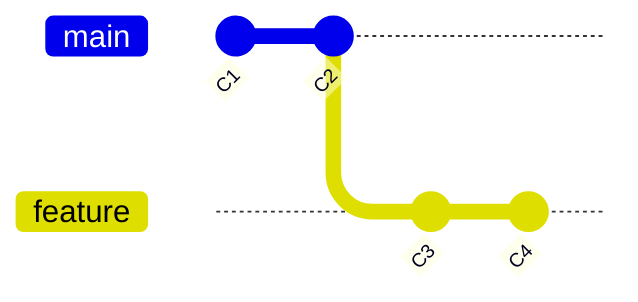
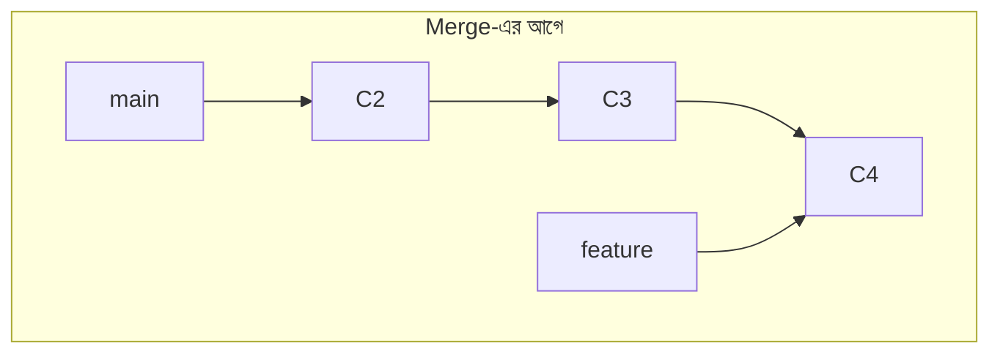
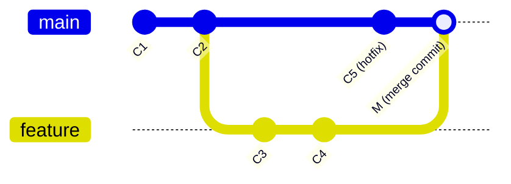

# ৩৭.৩ Merging Branches and Merge Types

রিমা `feature/wishlist-page` branch-এ কাজ শেষ করেছে। এখন সময় এই কাজটাকে `main`-এর সাথে এক করার — এই প্রক্রিয়ার নাম **merge**। কিন্তু merge সবসময় একরকমভাবে হয় না; Git পরিস্থিতি বুঝে আলাদা আলাদা কৌশল নেয়। এই লেসনে আমরা সেই কৌশলগুলো — Fast-Forward আর Three-Way Merge — বিস্তারিত বুঝবো।

## merge করার মূল কমান্ড

```bash
git switch main               # প্রথমে যে branch-এ merge করতে চাও, সেখানে যাও
git merge feature/wishlist-page
```

নিয়মটা মনে রাখো — তুমি যে branch-এ **আছো** (HEAD যেখানে), সেখানে অন্য branch-এর কাজ নিয়ে আসা হয়। "merge feature/wishlist-page" মানে "feature/wishlist-page-এর কাজ, বর্তমান branch-এ নিয়ে এসো।"

## Fast-Forward Merge

কল্পনা করো `main`-এ কোনো নতুন commit হয়নি যখন থেকে তুমি `feature/wishlist-page` branch বানিয়েছিলে। অর্থাৎ `main` ঠিক যেখানে ছিলো, সেখান থেকেই সরাসরি একটা লাইনে এগিয়ে গেছে `feature/wishlist-page`।



এই অবস্থায় merge করা আসলে জটিল কিছু না — Git শুধু `main` পয়েন্টারটাকে সরাসরি এগিয়ে দেয়, যাতে সেটাও `feature`-এর মতো একই commit-এ পৌঁছায়। কোনো নতুন "merge commit" তৈরি হয় না, কারণ কোনো সংঘর্ষের সম্ভাবনা নেই — এটা যেন একটা রাস্তায় "ফাস্ট-ফরওয়ার্ড" করে সামনে চলে যাওয়া।



merge করার পর `main` আর `feature` দুটোই একই commit (`C4`) নির্দেশ করে। ইতিহাস থাকে সম্পূর্ণ সরলরেখার মতো — যেন branch-টা কখনো আলাদা হয়ইনি।

## Three-Way Merge (True Merge)

বাস্তব জীবনে এটাই বেশি সাধারণ — যখন তুমি feature branch-এ কাজ করছো, ততক্ষণে `main`-এও অন্য কেউ নতুন commit যোগ করে ফেলেছে (যেমন কোনো hotfix)। এখন দুটো branch-ই "এগিয়ে গেছে" আলাদা দিকে, একটা কমন পূর্বপুরুষ (common ancestor) থেকে।



এই অবস্থায় Git-কে তিনটা জিনিস দেখতে হয় — কমন পূর্বপুরুষ (`C2`), `main`-এর বর্তমান অবস্থা (`C5`), আর `feature`-এর বর্তমান অবস্থা (`C4`)। এই তিনটা তুলনা করে Git একটা নতুন **merge commit** তৈরি করে (`M`), যার দুটো প্যারেন্ট থাকে — `C5` এবং `C4`। এই কারণেই একে বলা হয় **three-way merge**।

merge commit-টা ইতিহাসে স্পষ্টভাবে দেখায় — "এখানে দুটো টাইমলাইন এক হয়েছিলো।" এই merge commit-এর একটা ডিফল্ট মেসেজ Git নিজেই লিখে দেয় (যেমন `Merge branch 'feature/wishlist-page'`), কিন্তু তুমি চাইলে এডিটরে সেটা বদলাতেও পারো।

## দুটোর মধ্যে পার্থক্য এক নজরে

| | Fast-Forward | Three-Way Merge |
|---|---|---|
| কখন হয় | target branch-এ কোনো নতুন commit নেই | দুই branch-ই আলাদাভাবে এগিয়েছে |
| নতুন merge commit? | না | হ্যাঁ, দুই প্যারেন্ট সহ |
| ইতিহাস | সরলরেখা | branch এবং merge স্পষ্ট দেখা যায় |
| সংঘর্ষের ঝুঁকি | নেই | থাকতে পারে (পরের লেসনে) |

## Fast-Forward জোর করে বন্ধ করা

কিছু টিম চায় সবসময় merge commit থাকুক, ইতিহাসে স্পষ্ট থাকুক কখন কোন feature merge হয়েছে — এমনকি fast-forward সম্ভব হলেও। এর জন্য:

```bash
git merge --no-ff feature/wishlist-page
```

এই ফ্ল্যাগ ব্যবহার করলে Git জোর করে একটা merge commit তৈরি করবে, যদিও fast-forward সম্ভব ছিলো। অনেক টিমের পলিসি অনুযায়ী এটাই স্ট্যান্ডার্ড অভ্যাস, কারণ ইতিহাসে দেখা যায় ঠিক কোন commit-গুলো একটা নির্দিষ্ট feature-এর অংশ ছিলো।

## merge-এর পরে branch পরিষ্কার করা

merge সফল হওয়ার পর, feature branch-টার আর দরকার নেই (যদি না তুমি ভবিষ্যতে আবার সেখানে কাজ করবে):

```bash
git branch -d feature/wishlist-page
```

Git নিজেই যাচাই করে নেয় যে branch-টার কাজ সত্যিই merge হয়ে গেছে — না হলে ডিলিট হতে দেয় না, ভুল করে কাজ হারানো থেকে রক্ষা করে।

## merge history দেখা

```bash
git log --oneline --graph --all
```

এই কমান্ড টার্মিনালে একটা টেক্সট-ভিত্তিক গ্রাফ আঁকে, যেখানে branch, merge, commit সব দেখা যায় এক নজরে — এটা প্রতিদিনের কাজে অত্যন্ত উপকারী একটা অভ্যাস।

আমরা এখন পর্যন্ত ধরে নিয়েছি merge সবসময় নির্বিঘ্নে হয়। কিন্তু বাস্তবে প্রায়ই দুই branch একই লাইনে ভিন্ন পরিবর্তন করে ফেলে, আর Git নিজে থেকে সিদ্ধান্ত নিতে পারে না কোনটা রাখবে — ঠিক যেমনটা এখনই ঘটতে চলেছে রিমা আর করিমের মাঝে। পরের লেসনে আমরা সরাসরি সেই পরিস্থিতিতে যাবো — **merge conflict** কীভাবে চেনা যায় এবং সমাধান করা যায়।
