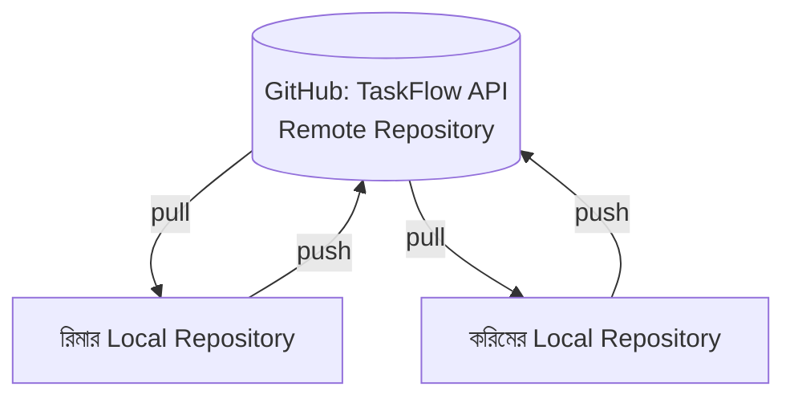

# ৩৭.৫ Working with Remote Repositories

এতদিন আমরা যা কিছু করেছি — branch, merge, conflict resolve — সবই ঘটেছে একটা মাত্র কম্পিউটারে, একটা **local repository**-তে। কিন্তু TaskFlow API-তে যদি রিমা আর করিম দুইজনেই কাজ করে, তাদের কোড একে অপরের কাছে পৌঁছাবে কীভাবে? এখানেই আসে **remote repository**-র ধারণা।

ভাবো একটা শেয়ার্ড গুগল ডকস ফাইল, যেখানে প্রত্যেকে নিজের কম্পিউটারে একটা কপি নিয়ে কাজ করে, তারপর তাদের পরিবর্তন "sync" করে যাতে সবাই সবার আপডেট দেখতে পায়। GitHub (বা GitLab, Bitbucket) হলো সেই কেন্দ্রীয়, শেয়ার্ড জায়গা, যেখানে প্রতিটা ডেভেলপারের local repository sync হয়।



লক্ষ্য করো, কোনো ডেভেলপার সরাসরি একে অপরের কম্পিউটারে কোড পাঠায় না — সবাই একটা কেন্দ্রীয় remote-এর সাথে যোগাযোগ করে। এটা ডিজাইনের একটা গুরুত্বপূর্ণ সিদ্ধান্ত — এটা নিশ্চিত করে remote-টাই সবসময় "সত্যের একক উৎস" (single source of truth) থাকে।

Local repository-কে একটা remote-এর সাথে যুক্ত করতে:

```bash
git remote add origin https://github.com/our-team/taskflow-api.git
git remote -v   # কী কী remote যুক্ত আছে দেখা
```

এখানে `origin` হলো একটা প্রথাগত নাম (alias), যেটা সাধারণত মূল remote-কে নির্দেশ করে — এটা যেকোনো নাম হতে পারতো, কিন্তু কনভেনশন হিসেবে সবাই `origin` ব্যবহার করে।

দুইটা মূল ক্রিয়া remote-এর সাথে কাজ করার জন্য — **push** (নিজের local commit remote-এ পাঠানো) আর **pull/fetch** (remote-এর নতুন পরিবর্তন নিজের কাছে আনা)। এই দুটো নিয়েই পরের দুই লেসনে আমরা বিস্তারিত দেখবো — প্রথমে push দিয়ে শুরু করি।
