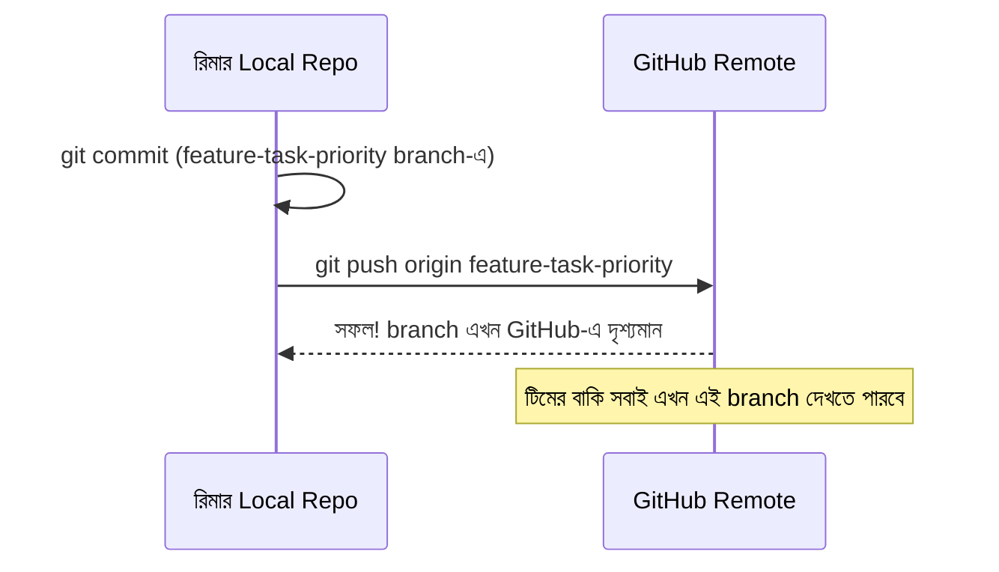

# ৩৭.৬ Adding Remote Repositories and Pushing Changes

আগের লেসনে আমরা TaskFlow API-এর local repository-কে GitHub-এর একটা remote-এর সাথে যুক্ত করেছি (`git remote add origin ...`)। এখন রিমার লেখা `feature-task-priority` branch-এর commit-গুলো সেই remote-এ পাঠানোর পালা, যাতে করিম আর বাকি টিম সেটা দেখতে পায়।

এটা ভাবা যায় নিজের ডায়েরির কিছু পাতা ফটোকপি করে টিমের শেয়ার্ড বোর্ডে টাঙিয়ে দেয়ার মতো — মূল ডায়েরি (local repository) তোমার কাছেই থাকে, কিন্তু একটা কপি এখন সবাই দেখতে পারবে।



কমান্ড:

```bash
git push origin feature-task-priority
```

প্রথমবার একটা নতুন branch push করার সময়, Git প্রায়ই একটা "upstream tracking" সেট আপ করার পরামর্শ দেয়, যাতে পরের বার শুধু `git push` লিখলেই চলে:

```bash
git push -u origin feature-task-priority
# পরের বার থেকে শুধু:
git push
```

`main` branch-এ সরাসরি push করা সাধারণত ভালো অভ্যাস না, বিশেষ করে টিম প্রজেক্টে — এর বদলে GitHub-এ একটা **Pull Request** তৈরি করা হয় (Module ৩৭.১০-এ আমরা বিস্তারিত দেখবো), যাতে merge করার আগে অন্য কেউ কোড রিভিউ করতে পারে।

একটা গুরুত্বপূর্ণ সতর্কতা — push করার আগে নিশ্চিত হওয়া উচিত remote-এ ইতিমধ্যে এমন কোনো commit নেই যা তোমার কাছে নেই, নাহলে Git push প্রত্যাখ্যান করবে এই বলে যে "remote-এ নতুন কিছু আছে, আগে সেটা নিয়ে এসো।" এই "নিয়ে আসা" প্রক্রিয়াটাই আমরা পরের লেসনে দেখবো — pull আর fetch।
