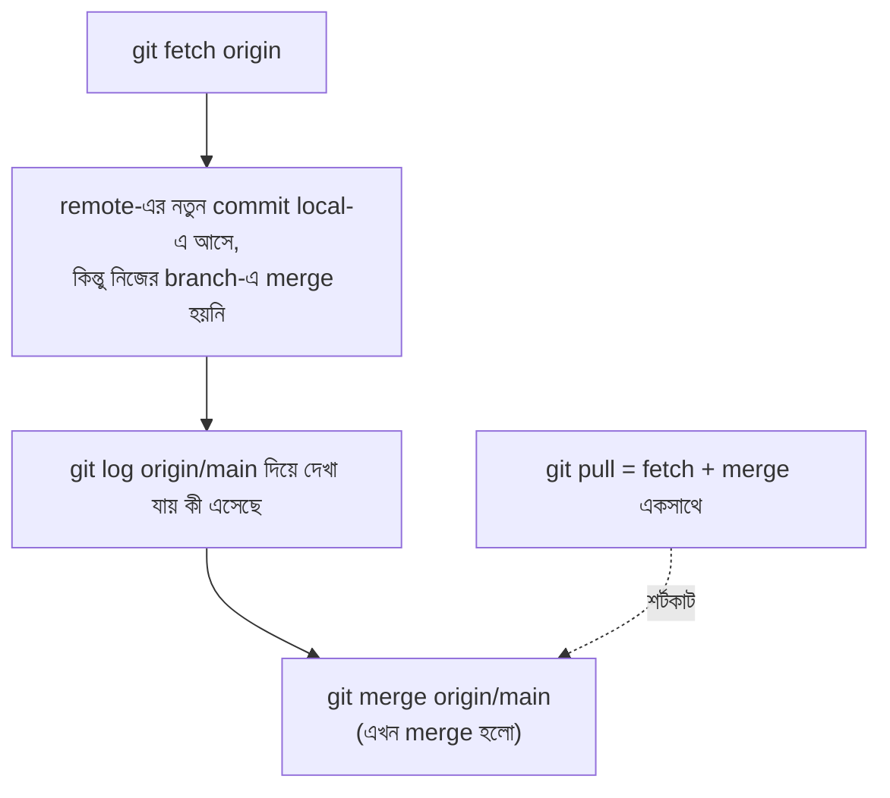

# ৩৭.৭ Pulling Updates and Fetching Changes

আগের লেসনে রিমা তার কাজ push করলো GitHub-এ। এখন করিম, যে একই TaskFlow API প্রজেক্টে কাজ করছে, তার local repository-তে রিমার নতুন কাজ আনতে চায়। এই লেসনে আমরা দেখবো কীভাবে remote থেকে পরিবর্তন নিজের কাছে আনতে হয়, আর `fetch` ও `pull`-এর মধ্যে পার্থক্য কী।

`git fetch` আর `git pull`-এর পার্থক্য বোঝা যায় ডাকঘরের সাথে তুলনা করে। `fetch` মানে হলো ডাকঘরে গিয়ে দেখা তোমার নামে কোনো চিঠি এসেছে কিনা, আর সেগুলো নিয়ে আসা — কিন্তু চিঠি এখনো না খুলে টেবিলে রাখা। `pull` মানে চিঠি নিয়ে আসা এবং সাথে সাথে খুলে পড়া (নিজের কাজে merge করে ফেলা)।



করিমের workflow:

```bash
git fetch origin
git log main..origin/main   # দেখা যাক রিমা কী পরিবর্তন করেছে, merge করার আগে
git merge origin/main       # এখন নিজের main-এ merge করলাম

# অথবা এক লাইনে (fetch + merge একসাথে)
git pull origin main
```

`fetch` ব্যবহার করার সুবিধা হলো — merge করার আগে দেখে নেয়ার সুযোগ থাকে ঠিক কী পরিবর্তন আসছে, বিশেষ করে বড় বা স্পর্শকাতর প্রজেক্টে এটা একটা নিরাপত্তা স্তর। `pull` দ্রুত, কিন্তু কম নিয়ন্ত্রিত — ছোট, স্থিতিশীল প্রজেক্টে `pull` যথেষ্ট, কিন্তু বড় টিমে অনেকে `fetch` তারপর ম্যানুয়ালি merge/rebase পছন্দ করে।

একটা গুরুত্বপূর্ণ অভ্যাস — নিজের feature branch-এ কাজ করার সময় নিয়মিত `main`-এর পরিবর্তন নিজের branch-এ নিয়ে আসা, যাতে Module ৩৭.৪-এ শেখা বড় conflict এড়ানো যায়। এটা করার আরেকটা উপায় আছে merge ছাড়াও — যেটা history-কে পরিষ্কার রাখে। পরের লেসনে আমরা সেই কৌশল, `git rebase`, নিয়ে আলোচনা করবো।
