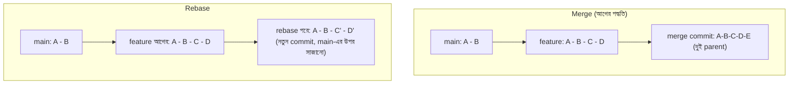

# ৩৭.৮ Understanding Git Rebase

আগের লেসনগুলোতে আমরা `merge` দিয়ে branch একসাথে করেছি, যেটা একটা নতুন "merge commit" তৈরি করে দুটো ইতিহাসকে জোড়া লাগায়। কিন্তু একটা ভিন্ন উপায় আছে — **rebase**, যেটা ইতিহাসকে জোড়া লাগানোর বদলে, পুরো ইতিহাসটাই নতুন করে লেখে, যেন সবকিছু একটা সরলরেখায় ঘটেছে।

ভাবো তুমি একটা গল্প লিখছিলে, আর মাঝপথে বন্ধু বললো তার লেখা কয়েকটা অধ্যায় তোমার গল্পে যোগ করতে। Merge হলো একটা নোট রেখে দেয়া "এখানে বন্ধুর অধ্যায় যোগ হলো"। Rebase হলো পুরো বইটা আবার লেখা, যেন বন্ধুর অধ্যায়গুলো শুরু থেকেই তোমার গল্পের অংশ ছিলো — কোনো "জোড়া লাগানোর দাগ" থাকে না, ইতিহাস একদম মসৃণ দেখায়।



রিমার `feature-task-priority` branch-কে `main`-এর সাম্প্রতিক পরিবর্তনের উপর rebase করা:

```bash
git switch feature-task-priority
git rebase main
```

Git এখন `feature-task-priority`-র প্রতিটা commit একে একে নিয়ে, `main`-এর সবচেয়ে নতুন commit-এর উপর "পুনরায় বসাবে" (replay করবে)। এতে commit-গুলোর একটা নতুন hash তৈরি হয় (তাই ডায়াগ্রামে `C'` আর `D'`), কারণ আসলে এগুলো নতুন commit, শুধু একই পরিবর্তনের বিষয়বস্তু।

Rebase-এর একটা গুরুত্বপূর্ণ নিয়ম — **কখনো একটা shared branch (যেমন `main`, যেটা অন্যরাও ব্যবহার করছে) rebase করা উচিত না**, কারণ এটা ইতিহাস পাল্টে দেয়, আর যারা আগের ইতিহাসের উপর ভিত্তি করে কাজ করছিলো তাদের কাছে সব এলোমেলো দেখাবে। rebase নিরাপদ শুধু নিজের ব্যক্তিগত feature branch-এ, push করার আগে।

Merge বনাম rebase বেছে নেয়ার সহজ নিয়ম — নিজের কাজ পরিষ্কার রাখতে rebase, কিন্তু টিমের সাথে শেয়ার্ড ইতিহাসে merge। এখন আমরা branch ব্যবস্থাপনার মূল হাতিয়ারগুলো জানি। পরের লেসনে আমরা GitHub-এর আরেকটা গুরুত্বপূর্ণ ফিচার — fork আর clone নিয়ে কথা বলবো, যেটা ওপেন সোর্স প্রজেক্টে অবদান রাখার দরজা খুলে দেয়।
