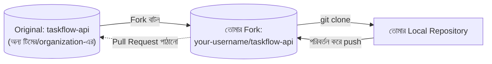

# ৩৭.৯ Forking and Cloning Repositories

আগের লেসনগুলোতে আমরা ধরে নিয়েছি TaskFlow API-এর টিমে থাকা সবারই সরাসরি push করার অনুমতি আছে। কিন্তু বাস্তবে, বিশেষ করে ওপেন সোর্স প্রজেক্টে, বাইরের কেউ হয়তো সরাসরি লেখার অনুমতি পায় না। এই লেসনে আমরা দেখবো **clone** আর **fork**-এর মধ্যে পার্থক্য, আর কীভাবে বাইরের একজন অবদানকারী কোনো প্রজেক্টে অংশ নিতে পারে।

**Clone** মানে হলো একটা remote repository-র সম্পূর্ণ কপি নিজের কম্পিউটারে নামিয়ে আনা — এটা তোমার টিমের রিপোজিটরির জন্য প্রথম দিনের কাজ, একটা লাইব্রেরির বই ধার নেয়ার মতো, সরাসরি সেই লাইব্রেরির কপি।

```bash
git clone https://github.com/our-team/taskflow-api.git
```

**Fork** ভিন্ন জিনিস — এটা GitHub-এর একটা ফিচার (Git নিজের কমান্ড না), যেটা কোনো রিপোজিটরির একটা সম্পূর্ণ কপি তোমার নিজের GitHub অ্যাকাউন্টে তৈরি করে দেয়। এটা এমন, যেন তুমি লাইব্রেরির বইটা ধার না নিয়ে, পুরো বইটার একটা ফটোকপি নিজের ঘরে রেখে দিলে — এখন তুমি নিজের ইচ্ছামতো এতে দাগ দিতে, নোট লিখতে পারো, মূল বইয়ের কোনো ক্ষতি না করে।



Fork করার পর workflow:

```bash
git clone https://github.com/your-username/taskflow-api.git
cd taskflow-api
git remote add upstream https://github.com/our-team/taskflow-api.git  # আসল প্রজেক্টের রেফারেন্স
git switch -c fix-typo-in-docs
# পরিবর্তন করে commit, তারপর নিজের fork-এ push
git push origin fix-typo-in-docs
```

লক্ষ্য করো `upstream` নামে একটা দ্বিতীয় remote যোগ করা হয়েছে — এটা মূল প্রজেক্টকে নির্দেশ করে, যাতে ভবিষ্যতে মূল প্রজেক্টের নতুন পরিবর্তন নিজের fork-এ নিয়ে আসা যায় (`git fetch upstream`)।

Fork করার পর, নিজের branch থেকে মূল প্রজেক্টে পরিবর্তন প্রস্তাব করতে হয় একটা বিশেষ পদ্ধতিতে — Pull Request-এর মাধ্যমে, যেটা পরের লেসনের বিষয়।
