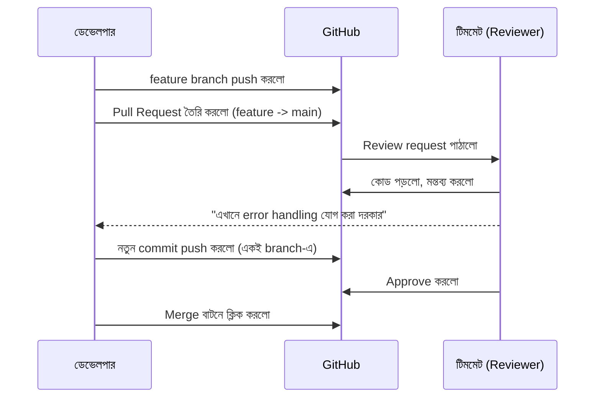

# ৩৭.১০ Working with Pull Requests and Code Reviews

আগের লেসনে আমরা fork করে নিজের একটা কপিতে পরিবর্তন push করলাম। কিন্তু সেই পরিবর্তন মূল প্রজেক্টে (বা টিম প্রজেক্টে অন্য branch থেকে `main`-এ) কীভাবে পৌঁছাবে? সরাসরি merge না করে, GitHub-এ একটা আনুষ্ঠানিক প্রস্তাব পাঠানো হয় — এটাই **Pull Request** (PR), যাকে GitLab-এ বলা হয় Merge Request।

PR-কে ভাবা যায় একটা লেখা প্রকাশনা সংস্থায় জমা দেয়ার মতো — তুমি লেখা শেষ করে সরাসরি ছাপিয়ে দাও না, একজন সম্পাদকের (reviewer) কাছে জমা দাও, সে মন্তব্য করে, তুমি সংশোধন করো, তারপর অনুমোদন পেলে ছাপা হয়।



একটা PR তৈরি করার সময় গুরুত্বপূর্ণ অংশগুলো — একটা স্পষ্ট শিরোনাম, একটা বিবরণ যেখানে বোঝানো হয় কী পরিবর্তন হয়েছে আর কেন (Module ৩৬.৫-এ শেখা user story-র ভাষায় লেখা যায়), আর প্রাসঙ্গিক reviewer যোগ করা।

```markdown
## Pull Request: Task Priority ফিল্ড যোগ করা

**কী পরিবর্তন হয়েছে:** Task মডেলে `priority` ফিল্ড যোগ করা হয়েছে (low/medium/high)।
**কেন:** ব্যবহারকারীরা গুরুত্বপূর্ণ টাস্ক আলাদা করে চিনতে চান (Module 36.5-এর মতো user story থেকে)।
**টেস্ট:** নতুন unit test যোগ করা হয়েছে `test_task.py`-এ।
```

Reviewer সাধারণত GitHub-এর ইনলাইন কমেন্ট ফিচার ব্যবহার করে নির্দিষ্ট লাইনে মন্তব্য করে, আর তিনটা সিদ্ধান্তের একটা দেয় — **Approve** (মার্জ করার জন্য প্রস্তুত), **Request Changes** (কিছু ঠিক করতে হবে), বা **Comment** (শুধু পর্যবেক্ষণ, বাধ্যতামূলক না)। Module ৩৬.১০-এ শেখা AI code review এখানে মানব reviewer-এর প্রথম ধাপ হিসেবে কাজ করতে পারে, সহজ ভুলগুলো আগেই ধরিয়ে দিয়ে।

PR অনুমোদন পেলে, GitHub-এ সাধারণত তিন ধরনের merge অপশন থাকে — regular merge (Module ৩৭.৩-এর মতো merge commit তৈরি করে), squash merge (সব commit একটাতে মিশিয়ে ফেলে), আর rebase merge (Module ৩৭.৮-এর rebase প্রয়োগ করে)। কোনটা ব্যবহার করবে তা নির্ভর করে টিমের গৃহীত workflow-এর উপর — পরের লেসনে আমরা এই ধরনের টিম-ওয়াইড workflow ধরন নিয়ে আলোচনা করবো।
