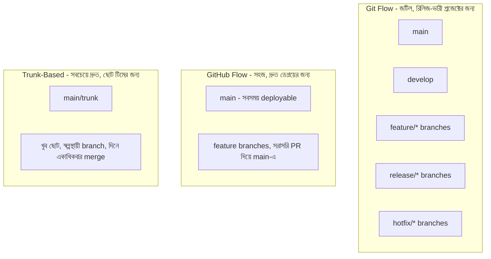

# ৩৭.১১ Git Flow vs GitHub Flow vs Trunk-Based Development

আগের লেসনগুলোতে আমরা branch, merge, আর pull request-এর প্রযুক্তিগত হাতিয়ার শিখেছি। কিন্তু এই হাতিয়ারগুলো টিম হিসেবে কীভাবে ব্যবহার করবো, সেই নিয়ম-কানুন আলাদা একটা প্রশ্ন — একে বলে **branching strategy** বা **workflow**। এই লেসনে আমরা তিনটা জনপ্রিয় workflow তুলনা করবো।

এটা ভাবা যায় ট্রাফিক নিয়মের মতো — গাড়ি (commit) আর রাস্তা (branch) থাকলেই চলে না, সবাই কোন নিয়মে চলবে সেটাও ঠিক করতে হয়, নাহলে বিশৃঙ্খলা হবে।

**Git Flow** একটা জটিল কিন্তু সুশৃঙ্খল পদ্ধতি, যেখানে `main` (সবসময় production-ready), `develop` (পরবর্তী রিলিজের কাজ চলছে), `feature/*`, `release/*`, আর `hotfix/*` — এই সব ধরনের branch আলাদা উদ্দেশ্যে ব্যবহৃত হয়। এটা এমন প্রজেক্টের জন্য উপযুক্ত যেখানে নির্দিষ্ট সময়ে সংস্করণ (versioned release) বের হয়, যেমন একটা মোবাইল অ্যাপ যেটা মাসে একবার আপডেট হয়।

**GitHub Flow** অনেক সহজ — শুধু `main` branch (যেটা সবসময় deploy করার যোগ্য) আর সংক্ষিপ্ত-জীবী feature branch, যেগুলো PR দিয়ে সরাসরি `main`-এ merge হয়। TaskFlow API-এর মতো প্রজেক্ট, যেখানে Module ৩৫.৭-এ শেখা CI/CD পাইপলাইন প্রতিটা merge-এর পর স্বয়ংক্রিয়ভাবে deploy করে, GitHub Flow স্বাভাবিক পছন্দ।

**Trunk-Based Development** আরও চরম — ডেভেলপাররা দিনে একাধিকবার সরাসরি `main` (বা "trunk")-এ ছোট ছোট পরিবর্তন merge করে, প্রায়ই feature flag ব্যবহার করে অসম্পূর্ণ ফিচার লুকিয়ে রাখে। এটা বড়, দ্রুতগতির টিমে (যেমন Google) জনপ্রিয়, যেখানে দীর্ঘস্থায়ী branch এড়িয়ে ঘন ঘন integration-এর মাধ্যমে Module ৩৭.৪-এর মতো বড় conflict প্রতিরোধ করা হয়।

কোনো একটা "সঠিক" workflow নেই — ছোট টিম, ঘন ঘন deploy করা প্রজেক্টের জন্য GitHub Flow ভালো ভারসাম্য, বড় enterprise প্রজেক্টে Git Flow-এর কাঠামো দরকার হতে পারে। TaskFlow API-এর মতো একটা ছোট টিমের প্রজেক্টে, আমরা এই কোর্সে GitHub Flow-কেই default ধরে নেবো।

Workflow ঠিক হলেও, দৈনন্দিন কাজে মাঝে মাঝে এমন পরিস্থিতি আসে যেখানে অসম্পূর্ণ কাজ সাময়িকভাবে সরিয়ে রাখতে হয় — পরের লেসনে আমরা দেখবো `git stash` কীভাবে সেই সমস্যার সমাধান দেয়।
