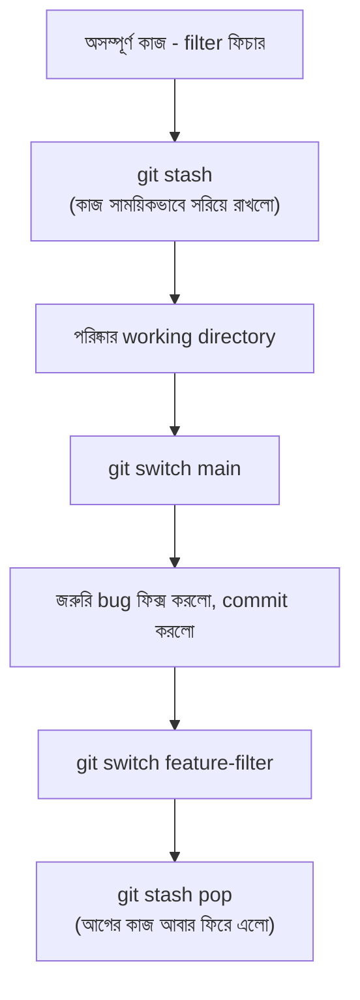

# ৩৭.১২ Using Git Stash for Unfinished Work

ধরো করিম TaskFlow API-তে task priority-র উপর ফিল্টারিং ফিচার নিয়ে কাজ করছিলো, কিন্তু কাজ এখনো commit করার মতো সম্পূর্ণ না। ঠিক তখনই একজন টিমমেট বললো একটা জরুরি bug আছে `main`-এ, এখনই ঠিক করতে হবে। কিন্তু করিমের বর্তমান কাজ অসম্পূর্ণ অবস্থায় আছে — commit করাও ঠিক না (অসম্পূর্ণ, ভাঙা কোড), আবার ফেলেও দেয়া যাবে না। এই পরিস্থিতির সমাধান — `git stash`।

এটা ভাবা যায় ডেস্কের উপর ছড়িয়ে থাকা কাজ একটা ড্রয়ারে দ্রুত গুছিয়ে রাখার মতো, যাতে ডেস্কটা খালি হয়ে যায় জরুরি কাজের জন্য, কিন্তু আগের কাজ হারিয়ে যায় না — পরে ড্রয়ার খুলে ঠিক যেখানে রেখেছিলে সেখান থেকে আবার শুরু করা যায়।



কমান্ডগুলো:

```bash
git stash                          # বর্তমান পরিবর্তন stash-এ সরিয়ে রাখলো
git switch main
git switch -c hotfix-crash
# bug ফিক্স করে commit
git switch feature-filter
git stash pop                      # stash থেকে কাজ ফিরিয়ে আনলো (এবং stash থেকে মুছে দিলো)
```

একাধিক stash জমতে পারে, সেগুলো তালিকা দেখা যায়:

```bash
git stash list
# stash@{0}: WIP on feature-filter: priority ফিল্টার যোগ করা হচ্ছে
git stash apply stash@{0}          # pop-এর মতো, কিন্তু stash তালিকা থেকে মুছে না
```

`stash pop` আর `stash apply`-র পার্থক্য — `pop` প্রয়োগ করার পর stash তালিকা থেকে মুছে ফেলে, `apply` মুছে না, তাই একই stash একাধিকবার প্রয়োগ করতে চাইলে `apply` ব্যবহার করা হয়।

`git stash` অস্থায়ী সমাধান হলেও, মাঝে মাঝে দরকার হয় কোনো নির্দিষ্ট commit শুধু আরেকটা branch-এ নিয়ে যাওয়া, পুরো branch merge না করে — পরের লেসনে আমরা সেই কৌশল, cherry-pick, আর সাথে reset কমান্ড নিয়ে আলোচনা করবো।
