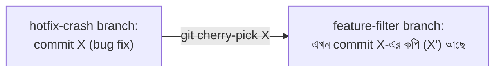
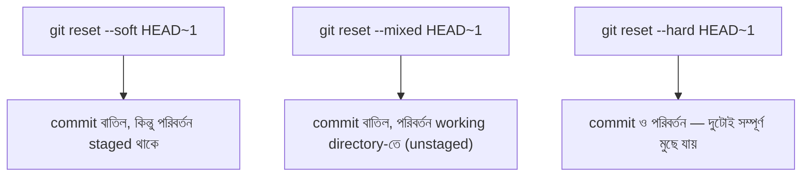

# ৩৭.১৩ Cherry-picking and Reset Commands

আগের লেসনে আমরা `hotfix-crash` branch-এ একটা জরুরি bug ফিক্স commit করেছিলাম। ধরো এই ফিক্সটা শুধু `main`-এ না, `feature-filter` branch-এও দরকার, কিন্তু পুরো `hotfix-crash` branch merge করতে চাই না, কারণ তাতে অপ্রাসঙ্গিক অন্য পরিবর্তনও চলে আসবে। এই নির্দিষ্ট একটা commit বেছে নেয়ার হাতিয়ার হলো `git cherry-pick`।

ভাবো একটা ফলের বাগানে, তুমি পুরো গাছ কাটতে চাও না, শুধু একটা পাকা ফল তুলে নিতে চাও — cherry-pick ঠিক এই কাজ করে, নির্দিষ্ট একটা commit-এর পরিবর্তন তুলে এনে বর্তমান branch-এ বসিয়ে দেয়।



```bash
git switch feature-filter
git log hotfix-crash --oneline    # commit hash খুঁজে বের করা
git cherry-pick a1b2c3d           # শুধু সেই একটা commit তুলে এনে বসানো
```

এখন `feature-filter` branch-এও bug fix চলে এসেছে, `hotfix-crash`-এর অন্য কোনো পরিবর্তন ছাড়াই। এটা বিশেষভাবে কাজে লাগে যখন একটা জরুরি fix একাধিক active branch-এ দরকার হয়।

আরেকটা গুরুত্বপূর্ণ কমান্ড হলো `git reset`, যেটা branch-এর pointer পিছনে নিয়ে যায় — যেন কিছু commit "হয়নি"। তিনটা মোড আছে:



```bash
git reset --soft HEAD~1   # ভুল commit message ঠিক করতে চাইলে, পরিবর্তন হারায় না
git reset --hard HEAD~1   # সবচেয়ে বিপজ্জনক — সব পরিবর্তন সম্পূর্ণ হারিয়ে যায়
```

`--hard` ব্যবহারের সময় বিশেষ সতর্ক থাকা উচিত — এটা কাজ স্থায়ীভাবে মুছে ফেলতে পারে, বিশেষ করে যদি ইতিমধ্যে remote-এ push হয়ে থাকা commit-এর উপর করা হয়, যেটা টিমের অন্যদের কাছেও আছে।

`reset` ইতিহাস মুছে দেয়, কিন্তু অনেক সময় আমরা চাই ইতিহাস অক্ষত রেখে শুধু একটা আগের পরিবর্তন বাতিল করতে — পরের লেসনে আমরা সেই নিরাপদ বিকল্প, `git revert`, নিয়ে আলোচনা করবো।
