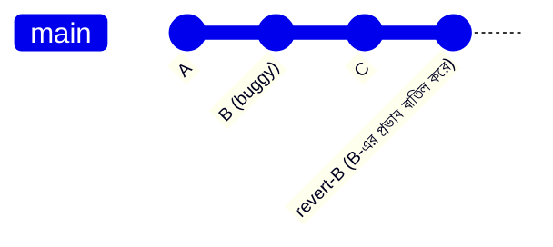

# ৩৭.১৪ Reverting Changes and Understanding Git Commands

আগের লেসনে আমরা `git reset`-এর শক্তি আর বিপদ দুটোই দেখেছি — বিশেষ করে `--hard` মোড, যেটা ইতিহাস মুছে ফেলে। কিন্তু ধরো TaskFlow API-এর একটা commit ইতিমধ্যে `main`-এ push হয়ে গেছে আর টিমের সবাই সেটার উপর কাজ করছে, আর পরে বোঝা গেলো সেই commit-এ একটা মারাত্মক bug আছে। এই অবস্থায় `reset` ব্যবহার করা বিপজ্জনক, কারণ এটা shared history পাল্টে দেবে। এই লেসনে আমরা নিরাপদ বিকল্প — `git revert` দেখবো।

`reset` আর `revert`-এর পার্থক্য বোঝা যায় এভাবে — `reset` মানে ইতিহাসের বই থেকে একটা পাতা ছিঁড়ে ফেলা (যেন সেটা কখনো লেখা হয়নি), আর `revert` মানে একটা নতুন পাতা যোগ করা, যেখানে লেখা থাকে "আগের পাতায় যা লেখা ছিলো, তা বাতিল করা হলো" — মূল ইতিহাস অক্ষত থাকে, শুধু তার প্রভাব নাকচ হয়।



```bash
git revert a1b2c3d   # যে commit বাতিল করতে চাও তার hash দাও
# Git স্বয়ংক্রিয়ভাবে একটা নতুন commit তৈরি করবে, যেটা B-এর পরিবর্তন উল্টে দেয়
```

`revert` করার সময় যদি সেই পুরনো পরিবর্তনের জায়গায় পরে আরও পরিবর্তন হয়ে থাকে, তাহলে conflict হতে পারে — ঠিক Module ৩৭.৪-এর মতোই, ম্যানুয়ালি resolve করতে হবে।

এই মুহূর্তে এসে, আমরা এতদিনে শেখা Git কমান্ডগুলো একটা জায়গায় গুছিয়ে দেখি — প্রতিটার কাজ ভিন্ন, কিন্তু সবগুলোই ইতিহাস আর পরিবর্তন সামলানোর হাতিয়ার:

| কমান্ড | কাজ | কখন ব্যবহার করবে |
|---|---|---|
| `git commit` | স্ন্যাপশট সংরক্ষণ | নিয়মিত কাজের প্রতিটা অর্থবহ ধাপে |
| `git merge` | দুই branch জোড়া লাগানো | Feature সম্পন্ন হলে main-এ আনতে |
| `git rebase` | ইতিহাস পুনর্বিন্যাস | নিজের branch পরিষ্কার রাখতে (push-এর আগে) |
| `git cherry-pick` | নির্দিষ্ট commit তুলে আনা | একটা fix একাধিক branch-এ দরকার হলে |
| `git reset` | ইতিহাস মুছে ফেলা | নিজের, অ-push করা কাজ ঠিক করতে |
| `git revert` | পরিবর্তনের প্রভাব বাতিল, ইতিহাস অক্ষত | shared/production ইতিহাসে ভুল ঠিক করতে |

এই টেবিলটাই আসলে Git-এর মানসিক মডেল — প্রতিটা কমান্ড "ইতিহাস" নিয়ে কী করে তা বোঝাই Git দক্ষতার মূল চাবিকাঠি। এখন আমরা দৈনন্দিন workflow-এর কমান্ডগুলো জানি। পরের লেসনে আমরা দেখবো কীভাবে একটা নির্দিষ্ট মুহূর্তকে (যেমন একটা রিলিজ ভার্সন) স্থায়ীভাবে চিহ্নিত করে রাখা যায় — Git tags দিয়ে।
