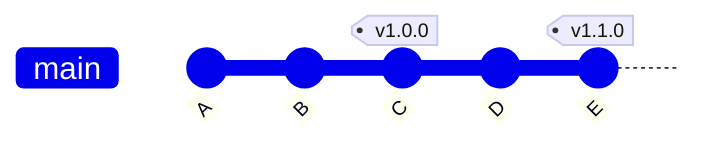

# ৩৭.১৫ Working with Git Tags

আগের লেসনগুলোতে আমরা commit, branch, আর ইতিহাস বদলানোর কমান্ড শিখেছি। কিন্তু ধরো TaskFlow API-এর একটা নির্দিষ্ট commit-কে আমরা "ভার্সন ১.০" হিসেবে চিহ্নিত করে রাখতে চাই, যাতে ভবিষ্যতে যখনই দরকার হয় ঠিক সেই মুহূর্তে ফিরে যাওয়া যায়। branch নাম বদলাতে থাকে, নতুন commit যোগ হতেই থাকে — কিন্তু একটা স্থায়ী, অপরিবর্তনীয় চিহ্নের জন্য দরকার **tag**।

Branch-কে ভাবা যায় একটা চলমান বুকমার্কের মতো, যেটা প্রতিটা নতুন commit-এর সাথে এগিয়ে যায়। Tag ভাবা যায় দেয়ালে গাঁথা একটা ফলকের মতো — একবার বসানো হলে, সেটা একই জায়গায় স্থির থাকে, ইতিহাসের একটা নির্দিষ্ট মুহূর্তকে চিরস্থায়ীভাবে চিহ্নিত করে রাখে।



দুই ধরনের tag আছে — **lightweight tag** (শুধু একটা নাম, একটা commit-এর দিকে নির্দেশ করে) আর **annotated tag** (এর সাথে মেসেজ, তারিখ, আর লেখকের তথ্যও থাকে, প্রায় একটা মিনি-commit-এর মতো)। রিলিজের জন্য annotated tag ব্যবহার করা ভালো অভ্যাস:

```bash
git tag -a v1.0.0 -m "প্রথম স্থিতিশীল রিলিজ: task CRUD + auth"
git push origin v1.0.0        # tag আলাদাভাবে push করতে হয়
```

Semantic versioning কনভেনশন (`v MAJOR.MINOR.PATCH`) অনুসরণ করা প্রচলিত অভ্যাস — MAJOR বদলায় বড় ব্রেকিং পরিবর্তনে, MINOR নতুন ফিচারে (backward-compatible), PATCH ছোট bug fix-এ। TaskFlow API-তে যদি priority ফিল্ড (Module ৩৭.১০) যোগ করা একটা backward-compatible ফিচার হয়, সেটা `v1.1.0` হবে, `v2.0.0` না।

Tag-এর একটা ব্যবহারিক প্রয়োগ — Module ৩৫.৭-এ শেখা CI/CD পাইপলাইনে, একটা নির্দিষ্ট tag push হলেই production deploy trigger করা:

```yaml
on:
  push:
    tags:
      - 'v*'
```

এভাবে শুধু ইচ্ছাকৃতভাবে চিহ্নিত রিলিজ-ই production-এ যায়, প্রতিটা সাধারণ commit না। এখন আমরা একটা প্রজেক্টের ইতিহাস চিহ্নিত করতে জানি। পরের লেসনে আমরা দেখবো যখন একটা প্রজেক্ট আরেকটা প্রজেক্টের উপর নির্ভর করে (যেমন একটা shared library), তখন Git কীভাবে সেই সম্পর্ক সামলায় — submodule দিয়ে।
