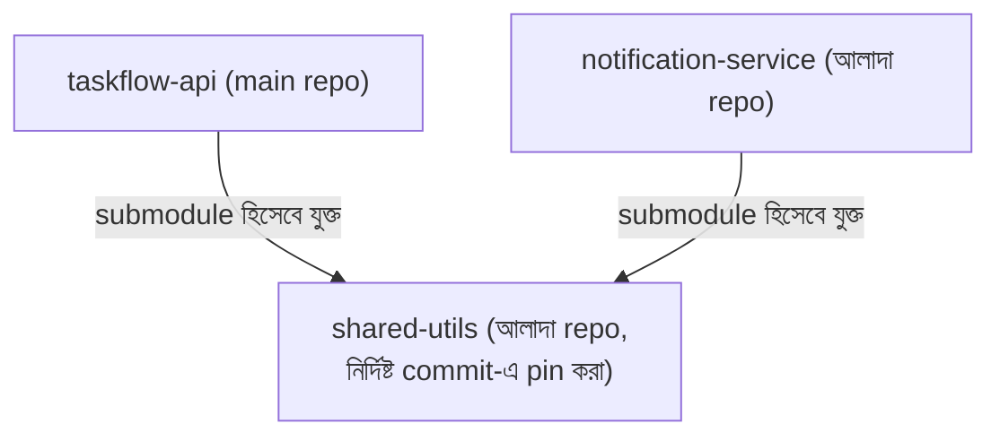

# ৩৭.১৬ Managing Git Submodules

ধরো TaskFlow API-এর টিম আরেকটা প্রজেক্টেও (একটা নোটিফিকেশন সার্ভিস) কাজ করছে, আর দুটো প্রজেক্টই একটা শেয়ার্ড ইউটিলিটি লাইব্রেরি (যেমন কমন validation function) ব্যবহার করতে চায়। এই লাইব্রেরির কোড দুই জায়গায় কপি-পেস্ট করলে, একটায় বাগ ফিক্স করলে অন্যটায় আপডেট করতে ভুলে যাওয়ার ঝুঁকি থাকে। এই সমস্যার একটা সমাধান হলো **Git submodule** — একটা রিপোজিটরির ভেতরে আরেকটা সম্পূর্ণ রিপোজিটরি রেফারেন্স হিসেবে রাখা।

এটা ভাবা যায় একটা বইয়ের মধ্যে আরেকটা বইয়ের নির্দিষ্ট সংস্করণের রেফারেন্স দেয়ার মতো — মূল বই সেই রেফারেন্স বইয়ের কনটেন্ট নিজের মধ্যে কপি করে না, শুধু বলে "এই নির্দিষ্ট সংস্করণটা দেখো।"



Submodule যোগ করা:

```bash
git submodule add https://github.com/our-team/shared-utils.git libs/shared-utils
git commit -m "shared-utils submodule যোগ করা হলো"
```

কেউ যখন এই repository clone করবে, submodule-এর কন্টেন্ট আলাদাভাবে আনতে হয়:

```bash
git clone --recurse-submodules https://github.com/our-team/taskflow-api.git
# অথবা ইতিমধ্যে clone করা থাকলে:
git submodule update --init --recursive
```

একটা গুরুত্বপূর্ণ বৈশিষ্ট্য — submodule সবসময় একটা নির্দিষ্ট commit-এ "pin" করা থাকে, শেষ ভার্সনে না। মানে `shared-utils`-এ নতুন commit হলেও, `taskflow-api` স্বয়ংক্রিয়ভাবে সেই নতুন ভার্সন পাবে না, যতক্ষণ না কেউ ইচ্ছাকৃতভাবে submodule আপডেট করে:

```bash
cd libs/shared-utils
git pull origin main
cd ../..
git add libs/shared-utils
git commit -m "shared-utils আপডেট করা হলো লেটেস্ট ভার্সনে"
```

Submodule-এর সুবিধা নিয়ন্ত্রণ (কখন আপডেট নেবে সেটা তোমার হাতে), কিন্তু জটিলতাও আছে — নতুন টিমমেটদের এই দুই-ধাপের clone প্রক্রিয়া মনে রাখতে হয়, যেটা প্রায়ই বিভ্রান্তির কারণ হয়। এই জটিলতা এড়ানোর একটা ভিন্ন দর্শন আছে, যেখানে একাধিক প্রজেক্ট একটাই রিপোজিটরিতে রাখা হয় — পরের লেসনে আমরা সেই ধারণা, monorepo নিয়ে আলোচনা করবো।
