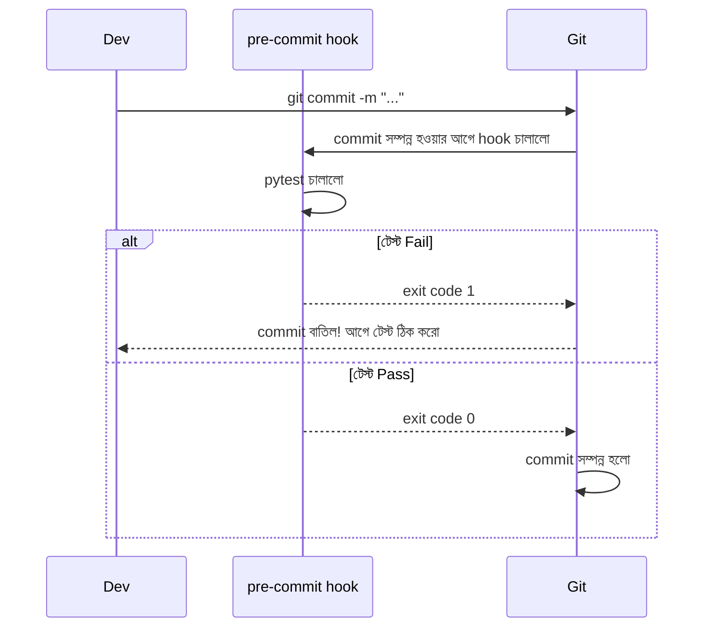

# ৩৭.১৮ Git Hooks and Workflow Automation

TaskFlow API-এর টিমে একটা সমস্যা বারবার হচ্ছিলো — কেউ কেউ commit করার আগে টেস্ট চালাতে ভুলে যাচ্ছিলো, ফলে ভাঙা কোড push হয়ে যাচ্ছিলো। মানুষকে মনে করিয়ে দেয়ার বদলে, Git-কে নিজেই কাজটা করতে বাধ্য করা যায় — এই লেসনে আমরা দেখবো কীভাবে, **Git hooks** দিয়ে।

Git hook-কে ভাবা যায় একটা দরজার সেন্সরের মতো, যেটা দরজা খোলার (একটা নির্দিষ্ট Git ক্রিয়া, যেমন commit) মুহূর্তে স্বয়ংক্রিয়ভাবে একটা স্ক্রিপ্ট চালায় — যেমন লাইট জ্বালানো, বা এলার্ম বাজানো।



`.git/hooks/` ফোল্ডারে একটা `pre-commit` নামের executable ফাইল বানানো:

```bash
#!/bin/sh
# .git/hooks/pre-commit
pytest
if [ $? -ne 0 ]; then
  echo "টেস্ট ফেল করেছে, commit বাতিল করা হলো।"
  exit 1
fi
```

সমস্যা হলো, `.git/hooks/` ফোল্ডার সাধারণত গিটে commit হয় না, তাই এটা টিমের সবার সাথে সহজে শেয়ার করা যায় না। এই সমস্যার সমাধানে Python ইকোসিস্টেমে **pre-commit** ফ্রেমওয়ার্কের মতো টুল ব্যবহার করা হয়, যেটা hook কনফিগারেশনকে প্রজেক্টের নিজের কোডের অংশ বানিয়ে দেয়:

```bash
pip install pre-commit
# .pre-commit-config.yaml ফাইলে hook কনফিগার করা (pytest, ruff, black ইত্যাদি)
pre-commit install
git add .pre-commit-config.yaml
git commit -m "pre-commit hook যোগ করা হলো"
```

এখন থেকে যে কেউ এই রিপোজিটরি clone করে `pre-commit install` চালালে, hook স্বয়ংক্রিয়ভাবে সক্রিয় হয়ে যাবে। সাধারণ কিছু hook: `pre-commit` (কোড format/lint/test চেক), `commit-msg` (commit message-এর ফরম্যাট যাচাই, যেমন conventional commits), `pre-push` (push করার আগে পুরো টেস্ট স্যুট চালানো)।

Git hooks Module ৩৫.৭-এ শেখা CI/CD পাইপলাইনের একটা "স্থানীয় প্রথম স্তর" হিসেবে কাজ করে — সমস্যা যত আগে ধরা পড়ে (নিজের কম্পিউটারে, push করার আগে), তত কম সময় নষ্ট হয়। কিন্তু hooks যথেষ্ট হয়ে গেলেও, টিমের নিরাপত্তা নিশ্চিত করতে আরও কিছু নিয়ম দরকার — পরের লেসনে আমরা commit signing আর branch protection নিয়ে আলোচনা করবো।
