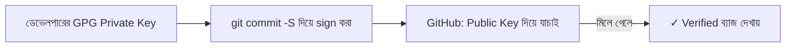
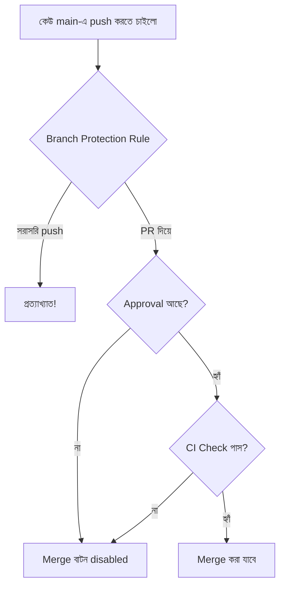

# ৩৭.১৯ Commit Signing and Branch Protection

আগের লেসনে আমরা hook দিয়ে নিশ্চিত করলাম প্রতিটা commit টেস্ট পাস করে। কিন্তু আরেকটা প্রশ্ন থেকে যায় — কীভাবে নিশ্চিত হবো একটা commit সত্যিই সেই ব্যক্তি করেছে যার নামে সেটা দেখাচ্ছে? Git-এর author নাম-ইমেইল যে কেউ যেকোনো কিছু বসাতে পারে, কারণ এটা শুধু একটা টেক্সট ফিল্ড। এই লেসনে আমরা দেখবো কীভাবে **commit signing** আর **branch protection** দিয়ে TaskFlow API-এর নিরাপত্তা আর ইতিহাসের বিশ্বাসযোগ্যতা বাড়ানো যায়।

Commit signing-কে ভাবা যায় একটা চিঠির সিলমোহরের মতো — যে কেউ চিঠির নিচে যেকোনো নাম লিখতে পারে, কিন্তু একটা ইউনিক সিলমোহর (cryptographic signature) জাল করা কঠিন। GPG (বা SSH key) দিয়ে commit sign করলে, GitHub একটা "Verified" ব্যাজ দেখায়, যেটা প্রমাণ করে commit-টা সত্যিই সেই key-র মালিক করেছে।



```bash
gpg --gen-key                              # প্রথমবার key তৈরি করা
git config --global user.signingkey <key-id>
git config --global commit.gpgsign true    # সব commit স্বয়ংক্রিয়ভাবে sign হবে

git commit -S -m "priority ফিল্ড যোগ করা"
```

**Branch protection** ভিন্ন একটা নিরাপত্তা স্তর — GitHub-এর repository settings-এ গিয়ে `main` branch-এর জন্য নিয়ম বসানো যায়, যেমন: কেউ সরাসরি push করতে পারবে না (PR বাধ্যতামূলক), কমপক্ষে একজন reviewer-এর approval লাগবে, আর Module ৩৭.১৮-এর CI check (টেস্ট) পাস করতে হবে merge করার আগে।



এই নিয়মগুলো একসাথে কাজ করে একটা গুরুত্বপূর্ণ নিশ্চয়তা দেয় — `main` branch-এ যা কিছু আসে, সেটা রিভিউ হয়েছে, টেস্ট পাস করেছে, আর যাচাইকৃত (verified) কারো কাছ থেকে এসেছে। ছোট প্রজেক্টে এটা "অতিরিক্ত" মনে হতে পারে, কিন্তু টিম বড় হওয়ার সাথে সাথে এই সুরক্ষাগুলো অমূল্য হয়ে ওঠে।

এখন আমাদের ইতিহাস নিরাপদ আর যাচাইকৃত। কিন্তু ইতিহাস অনেক সময় অগোছালো হয়ে যায় — অনেকগুলো ছোট, এলোমেলো "wip" commit জমে যায়। পরের লেসনে আমরা দেখবো কীভাবে interactive rebase দিয়ে এই ইতিহাস পরিষ্কার করা যায়।
