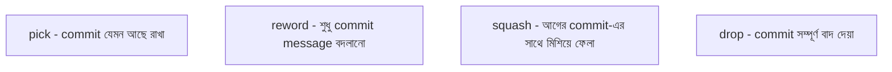

# ৩৭.২০ Interactive Rebasing and Commit Squashing

কাজ করতে করতে করিমের `feature-filter` branch-এ commit history দেখতে এরকম হয়ে গেছে: "wip", "fix typo", "actually fix it", "add filter logic", "oops forgot import"। এই এলোমেলো ইতিহাস PR-এ পাঠানোর আগে পরিষ্কার করতে চাইলে, দরকার **interactive rebase** — Module ৩৭.৮-এ শেখা সাধারণ rebase-এর একটা আরও নিয়ন্ত্রিত ভার্সন।

এটা ভাবা যায় একটা ভিডিও এডিটরের মতো — কাঁচা ফুটেজে (messy commit) অনেক ভুল টেক, পুনরাবৃত্তি থাকে, কিন্তু চূড়ান্ত সংস্করণে (clean history) শুধু গুরুত্বপূর্ণ, সুসংগঠিত অংশগুলোই থাকে। Interactive rebase হলো সেই এডিটিং প্রক্রিয়া।

```bash
git rebase -i HEAD~5   # শেষ ৫টা commit নিয়ে interactive rebase
```

এই কমান্ড একটা এডিটর খুলবে এরকম কিছু দেখিয়ে:

```
pick a1b2c3d add filter logic
pick e4f5g6h wip
pick h7i8j9k fix typo
pick k1l2m3n actually fix it
pick n4o5p6q oops forgot import
```

এখানে `pick`-এর বদলে অন্য কমান্ড লিখে প্রতিটা commit-এর ভাগ্য ঠিক করা যায়:



করিম চাইলে এভাবে সাজাবে:

```
pick a1b2c3d add filter logic
squash e4f5g6h wip
squash h7i8j9k fix typo
squash k1l2m3n actually fix it
squash n4o5p6q oops forgot import
```

সেভ করার পর, Git এই পাঁচটা commit-কে একটাতে মিশিয়ে দেবে, আর একটা নতুন, পরিষ্কার commit message লেখার সুযোগ দেবে: "task priority অনুযায়ী filter ফিচার যোগ করা হলো"। এখন PR-এ (Module ৩৭.১০) একটাই অর্থবহ commit দেখা যাবে, পাঁচটা এলোমেলো commit না।

একটা গুরুত্বপূর্ণ নিয়ম, Module ৩৭.৮-এর মতোই — interactive rebase শুধু নিজের, এখনো push না-করা commit-এ করা উচিত। push করে ফেলা shared commit-এ rebase করলে টিমের অন্যদের ইতিহাস এলোমেলো হয়ে যাবে।

Squashing-এর বিকল্প হিসেবে, GitHub-এর PR merge করার সময় "Squash and Merge" অপশনও ব্যবহার করা যায়, যেটা ম্যানুয়াল interactive rebase ছাড়াই একই ফলাফল দেয় — পুরো PR-এর সব commit `main`-এ একটা মাত্র commit হিসেবে যোগ হয়। এখন আমরা ব্যক্তিগত ইতিহাস পরিষ্কার রাখার কৌশল জানি। পরের লেসনে আমরা দেখবো কীভাবে একটা নতুন টিমের জন্য একটা রিপোজিটরি প্রথম থেকে সঠিকভাবে সেটআপ করতে হয়।
