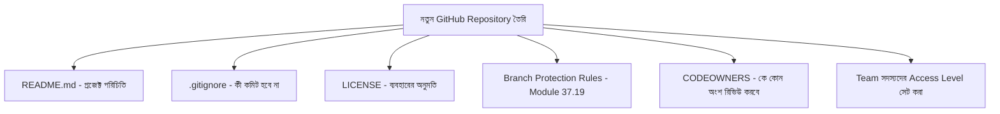

# ৩৭.২১ Setting Up Team Repositories

এতদিন আমরা ধরে নিয়েছিলাম TaskFlow API-এর রিপোজিটরি আগে থেকেই আছে। এই লেসনে আমরা পিছিয়ে গিয়ে দেখবো — একদম শুরু থেকে একটা নতুন টিম রিপোজিটরি কীভাবে সঠিকভাবে সাজাতে হয়, যাতে ভবিষ্যতে Module ৩৭.১৯-এর মতো সুরক্ষা আর Module ৩৭.১৮-এর মতো automation সহজে বসানো যায়।

এটা ভাবা যায় একটা নতুন অফিস খোলার মতো — শুধু আসবাবপত্র (কোড) থাকলেই চলে না, নিয়ম-কানুন (কে কী করতে পারবে), জরুরি প্রস্থান পথ (ডকুমেন্টেশন), আর অভ্যর্থনা ডেস্ক (README) থাকা দরকার প্রথম দিন থেকেই।



`.gitignore` ফাইল দিয়ে নিশ্চিত করা হয় সংবেদনশীল বা অপ্রয়োজনীয় ফাইল কখনো commit না হয়:

```
__pycache__/
*.pyc
.venv/
.env
*.log
dist/
```

`CODEOWNERS` ফাইল দিয়ে নির্দিষ্ট করা যায় কোন ফোল্ডারের পরিবর্তনের জন্য কার approval বাধ্যতামূলক:

```
# .github/CODEOWNERS
/packages/task-api/     @karim-dev
/packages/shared-utils/ @rima-dev
```

Access level নিয়ন্ত্রণের জন্য GitHub-এ ভূমিকা (role) নির্ধারণ করা হয় — **Admin** (সব নিয়ন্ত্রণ, branch protection বদলাতে পারে), **Maintainer** (merge করতে পারে, settings বদলাতে পারে না), **Write** (কোড push করতে পারে, PR তৈরি করতে পারে), **Read** (শুধু দেখতে পারে)। নতুন টিম সদস্য যোগ করার সময় সবাইকে Admin না দিয়ে, প্রয়োজন অনুযায়ী ন্যূনতম অনুমতি দেয়া (principle of least privilege) একটা গুরুত্বপূর্ণ নিরাপত্তা অভ্যাস, Module ৩৬.২২-এ শেখা নিরাপত্তা নীতির সাংগঠনিক প্রতিফলন।

একটা ভালো README-তে থাকা উচিত প্রজেক্ট কী করে, কীভাবে সেটআপ করতে হয়, আর কীভাবে অবদান রাখতে হয় (contributing guideline) — যাতে নতুন কেউ টিমে যোগ দিলে দ্রুত কাজ শুরু করতে পারে।

রিপোজিটরি প্রস্তুত হয়ে গেলো, এখন টিম এতে কাজ করবে একটা নির্দিষ্ট branching strategy অনুসরণ করে। পরের লেসনে আমরা দেখবো বাস্তবে কীভাবে একটা branching strategy পুরো টিমে বাস্তবায়ন করতে হয়।
