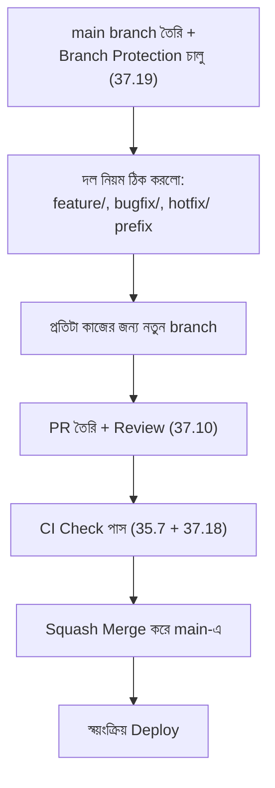

# ৩৭.২২ Implementing Branching Strategies

Module ৩৭.১১-এ আমরা Git Flow, GitHub Flow, আর Trunk-Based Development তুলনা করেছিলাম, তত্ত্বগতভাবে। Module ৩৭.২১-এ আমরা টিমের রিপোজিটরি সাজিয়েছি। এখন এই দুটো একসাথে করে, TaskFlow API টিমে বাস্তবে একটা branching strategy বাস্তবায়ন করার প্রক্রিয়া দেখি।

ধরে নিচ্ছি টিম GitHub Flow বেছে নিয়েছে, কারণ Module ৩৫.৭-এর CI/CD পাইপলাইন প্রতিটা merge-এই deploy করে, তাই দীর্ঘস্থায়ী `develop` branch (Git Flow-এর মতো) অপ্রয়োজনীয় জটিলতা যোগ করবে।



টিমের জন্য একটা লিখিত নিয়ম (`CONTRIBUTING.md`-তে) তৈরি করা:

```markdown
## Branching নিয়ম

- `main` — সবসময় deployable, সরাসরি push নিষিদ্ধ
- `feature/<নাম>` — নতুন ফিচারের জন্য, যেমন `feature/task-priority`
- `bugfix/<নাম>` — bug ফিক্সের জন্য
- `hotfix/<নাম>` — জরুরি production ফিক্সের জন্য, দ্রুততম রিভিউ পাবে

## প্রতিটা PR-এ যা লাগবে
1. কমপক্ষে একজন Reviewer-এর Approval
2. সব automated test পাস (Module 36.11-এ AI-সহায়ক টেস্ট সহ)
3. Squash merge ব্যবহার করে main-এ যাওয়া
```

এই নিয়মগুলো শুধু কাগজে লিখে রাখলে চলে না, Module ৩৭.১৯-এ শেখা GitHub branch protection দিয়ে এগুলো প্রযুক্তিগতভাবে বাধ্যতামূলক করা হয় — যাতে কেউ ভুলে বা ইচ্ছাকৃতভাবে নিয়ম ভাঙতে না পারে।

একটা বাস্তব দৃশ্যকল্প দেখি — করিম একটা নতুন ফিচারে কাজ শুরু করছে:

```bash
git switch main
git pull origin main               # সবচেয়ে আপডেটেড main দিয়ে শুরু
git switch -c feature/goal-reminders
# কাজ, commit, push
git push -u origin feature/goal-reminders
# GitHub-এ গিয়ে PR তৈরি, রিভিউয়ার হিসেবে রিমাকে যোগ করা
```

এই নিয়মিত অনুশীলনের মধ্য দিয়ে branching strategy শুধু তত্ত্ব না, টিমের প্রতিদিনের বাস্তব অভ্যাসে পরিণত হয়। কিন্তু বাস্তব টিমওয়ার্কে, বিশেষ করে অনেকজন একসাথে কাজ করলে, মাঝে মাঝে জটিল conflict দেখা দেয় যেটা Module ৩৭.৪-এর সহজ উদাহরণের চেয়ে অনেক কঠিন — পরের লেসনে আমরা সেই জটিল পরিস্থিতি সামলানো শিখবো।
