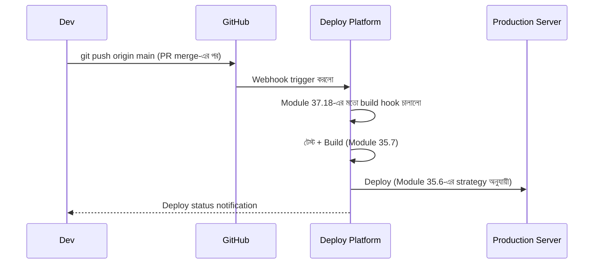

# ৩৭.২৪ Deploying Projects from Git

এই মডিউলের শেষ লেসনে এসে, আমরা এতদিন শেখা সব Git ধারণা একসাথে করে দেখবো কীভাবে Git থেকে সরাসরি একটা প্রজেক্ট production-এ পৌঁছায় — যেটা Module ৩৫.৭-এ আমরা তাত্ত্বিকভাবে দেখেছিলাম, আর Module ৩৬.১৮-এ TaskFlow-এর বদলে Personal Growth Tracker-এ প্রয়োগ করেছিলাম। এখন আমরা Git-নির্দিষ্ট বিস্তারিত অংশটা পরিষ্কার করবো।

আধুনিক deployment প্ল্যাটফর্ম (Render, Vercel, Railway) সবই একটা মূলনীতির উপর দাঁড়িয়ে আছে — **Git push-ই deployment trigger করে**। এটা ভাবা যায় একটা স্বয়ংক্রিয় প্রকাশনা ব্যবস্থার মতো — লেখক পাণ্ডুলিপি একটা নির্দিষ্ট বাক্সে (branch) জমা দিলেই, বাকি প্রক্রিয়া (ছাপা, বাঁধাই, বিতরণ) নিজে থেকে শুরু হয়ে যায়।



Git tag-ভিত্তিক deployment (Module ৩৭.১৫-এর ধারাবাহিকতা), যেখানে শুধু tag push হলেই production deploy হয়, staging-এর জন্য প্রতিটা `main` push:

```yaml
# শুধু production
on:
  push:
    tags: ['v*']

# staging - প্রতিটা main push
on:
  push:
    branches: [main]
```

একটা গুরুত্বপূর্ণ প্রশ্ন — যদি একটা খারাপ deploy চলে যায়, কীভাবে দ্রুত আগের অবস্থায় ফিরে যাবো? যেহেতু আমরা Git tag দিয়ে প্রতিটা রিলিজ চিহ্নিত রেখেছি, rollback আসলে আগের tag-এ ফিরে গিয়ে আবার deploy করার মতোই সহজ:

```bash
git checkout v1.0.0
git push origin v1.0.0:main --force-with-lease   # সতর্কতার সাথে, শুধু জরুরি অবস্থায়
```

`--force-with-lease` ব্যবহার করা হচ্ছে সাধারণ `--force`-এর বদলে, কারণ এটা প্রথমে যাচাই করে remote-এ অন্য কারো নতুন commit এসেছে কিনা — যদি এসে থাকে, push প্রত্যাখ্যাত হবে, যাতে ভুলবশত টিমের কারো কাজ মুছে না যায়।

এখানেই আমাদের Git ও GitHub যাত্রা সম্পূর্ণ হলো — branch তৈরি করা থেকে শুরু করে, merge, conflict resolve, remote সংযোগ, rebase, PR workflow, hooks, নিরাপত্তা, আর সবশেষে Git থেকে সরাসরি production deployment পর্যন্ত। এই দক্ষতাগুলো এখন থেকে প্রতিটা প্রজেক্টে, একা কাজ করলেও, ব্যবহৃত হবে। পরের মডিউলে আমরা কোড লেখার সময়ের চিন্তাভাবনায় ফিরে যাবো — সফটওয়্যার ডিজাইন প্যাটার্ন আর ক্লিন কোডের নীতি নিয়ে।
