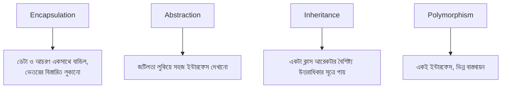

# ৩৮.১ Object-Oriented Programming

Module ৩৬-এ আমরা Personal Growth Tracker বানানোর সময় class, object, আর তাদের সম্পর্ক নিয়ে ব্যবহারিকভাবে কাজ করেছি — এখন সময় হয়েছে সেই ব্যবহারিক অভিজ্ঞতাটাকে একটা তাত্ত্বিক কাঠামোয় সাজানোর। এই মডিউলে আমরা কোড লেখার পেছনের চিন্তাভাবনার প্যাটার্নগুলো নিয়ে আলোচনা করবো, শুরু করছি Object-Oriented Programming (OOP)-এর চারটা স্তম্ভ দিয়ে।

OOP-কে ভাবা যায় বাস্তব জগতের জিনিসপত্র নিয়ে চিন্তা করার একটা উপায় হিসেবে — একটা গাড়ির ইঞ্জিনের ভেতরে কী হচ্ছে সেটা না জেনেই তুমি স্টিয়ারিং হুইল ঘুরিয়ে গাড়ি চালাতে পারো। কোডেও, একটা অবজেক্টের ভেতরের জটিলতা লুকিয়ে রেখে, বাইরে একটা সহজ ইন্টারফেস দেখানো যায়।



Module ৩৬.১-এর Habit ক্লাস মনে করো — এটা **encapsulation**-এর উদাহরণ, কারণ `completions` array আর সেটা নিয়ে কাজ করার লজিক (`markComplete`) একসাথে বান্ধা।

**Inheritance**-এর একটা উদাহরণ দেখি — TaskFlow API-তে যদি বিভিন্ন ধরনের Notification থাকে:

```python
class Notification:
    def __init__(self, message):
        self.message = message

    def send(self):
        raise NotImplementedError("send() must be implemented")

class EmailNotification(Notification):
    def send(self):
        print(f"ইমেইল পাঠানো হলো: {self.message}")

class SMSNotification(Notification):
    def send(self):
        print(f"SMS পাঠানো হলো: {self.message}")
```

`EmailNotification` আর `SMSNotification` দুটোই `Notification`-এর বৈশিষ্ট্য উত্তরাধিকার সূত্রে পেয়েছে, কিন্তু নিজেদের মতো `send()` বাস্তবায়ন করেছে — এটাই **polymorphism**: একই মেথড নাম, ভিন্ন আচরণ, ব্যবহারকারী কোডের কাছে দুটোই "একটা Notification" হিসেবে দেখা যায়:

```python
def notify_user(notification):
    notification.send()  # কোন ধরনের Notification তা না জেনেই কাজ করে
```

এই চারটা স্তম্ভ মিলেই OOP-এর চিন্তাভাবনা তৈরি করে — কোডকে বাস্তব জগতের জিনিসের মতো মডেল করা, জটিলতা লুকানো, আর পুনর্ব্যবহারযোগ্য কাঠামো তৈরি করা। কিন্তু শুধু ক্লাস আর inheritance ব্যবহার করলেই "ভালো" OOP হয় না — পরের লেসনে আমরা দেখবো SOLID নীতিগুলো, যেগুলো OOP ডিজাইনকে সত্যিকারের নমনীয় আর রক্ষণাবেক্ষণযোগ্য করে তোলে।
