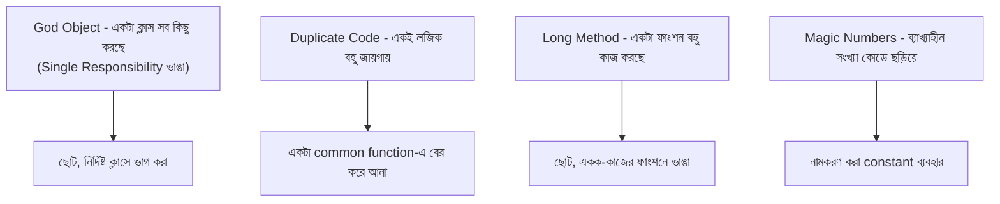

# ৩৮.৩ Code Smells & Refactoring

আগের লেসনে আমরা SOLID নীতি শিখলাম — আদর্শ ডিজাইন কেমন হওয়া উচিত। কিন্তু বাস্তবে সময়ের চাপে, বা অভিজ্ঞতার অভাবে, এই নীতিগুলো প্রায়ই ভাঙা হয়। এই ভাঙনের ফলে যে লক্ষণগুলো কোডে দেখা যায়, সেগুলোকে বলে **code smell** — আর সেগুলো ঠিক করার প্রক্রিয়াকে বলে **refactoring**।

"Smell" শব্দটা ইচ্ছাকৃতভাবে ব্যবহার করা হয়েছে — দুধ টক হয়ে গেলে সেটা প্রমাণ না যে দুধ অবশ্যই খারাপ, কিন্তু গন্ধ একটা সতর্কসংকেত, আরও পরীক্ষা করে দেখার ইঙ্গিত। Code smell তেমনি — এটা প্রমাণ না যে বাগ আছে, কিন্তু ইঙ্গিত দেয় ভবিষ্যতে সমস্যা হতে পারে।



একটা বাস্তব উদাহরণ — TaskFlow API-এর একটা "Long Method" smell:

```python
# smell: এই ফাংশন একসাথে validation, calculation, এবং notification করছে
def process_task(task):
    if not task.title or len(task.title) > 100:
        raise ValueError("invalid title")
    if task.priority == "high" and not task.deadline:
        raise ValueError("deadline needed")
    days_left = math.ceil((task.deadline - datetime.now()).total_seconds() / 86400)
    if days_left < 2:
        send_email(task.assignee, f"জরুরি: {task.title} সময় প্রায় শেষ!")
    return {**task.__dict__, "days_left": days_left}
```

Refactor করার পর, Module ৩৮.২-এর Single Responsibility নীতি অনুসরণ করে:

```python
def validate_task(task):
    if not task.title or len(task.title) > 100:
        raise ValueError("invalid title")
    if task.priority == "high" and not task.deadline:
        raise ValueError("deadline needed")

def calculate_days_left(deadline):
    return math.ceil((deadline - datetime.now()).total_seconds() / 86400)

URGENT_THRESHOLD_DAYS = 2  # magic number-এর বদলে নামকরণ করা constant

def notify_if_urgent(task, days_left):
    if days_left < URGENT_THRESHOLD_DAYS:
        send_email(task.assignee, f"জরুরি: {task.title} সময় প্রায় শেষ!")

def process_task(task):
    validate_task(task)
    days_left = calculate_days_left(task.deadline)
    notify_if_urgent(task, days_left)
    return {**task.__dict__, "days_left": days_left}
```

লক্ষ্য করো, refactoring-এর একটা গুরুত্বপূর্ণ নিয়ম — বাইরের আচরণ (input দিলে কী output আসে) একই থাকে, শুধু ভেতরের গঠন উন্নত হয়। এই কারণেই Module ৩৬.১১-এ শেখা automated test refactoring-এর সময় অমূল্য — টেস্ট পাস করতে থাকলে নিশ্চিত হওয়া যায় refactoring কিছু ভাঙেনি।

Refactoring সাধারণত ছোট ছোট নিরাপদ ধাপে করা হয়, একবারে পুরো ফাইল উল্টে দেয়া হয় না। এখন আমরা একটা মাত্র সার্ভিসের ভেতরের ডিজাইন সমস্যা দেখেছি। কিন্তু যখন সিস্টেম বড় হয়ে একাধিক সার্ভার/ডেটাবেজে ছড়িয়ে যায়, তখন সম্পূর্ণ ভিন্ন ধরনের একটা সীমাবদ্ধতার মুখোমুখি হতে হয় — পরের লেসনে আমরা সেই বিতরণকৃত সিস্টেমের মৌলিক নিয়ম, CAP Theorem নিয়ে আলোচনা করবো।
