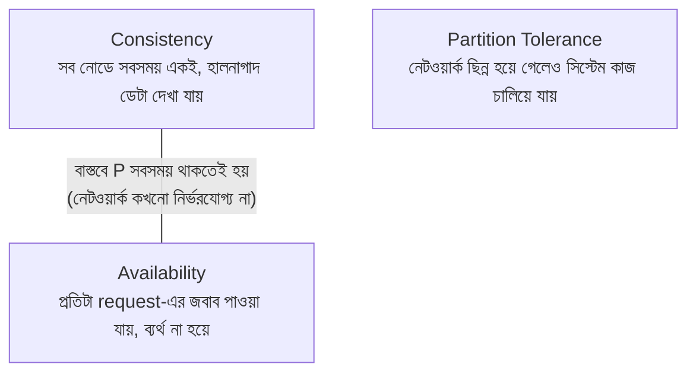
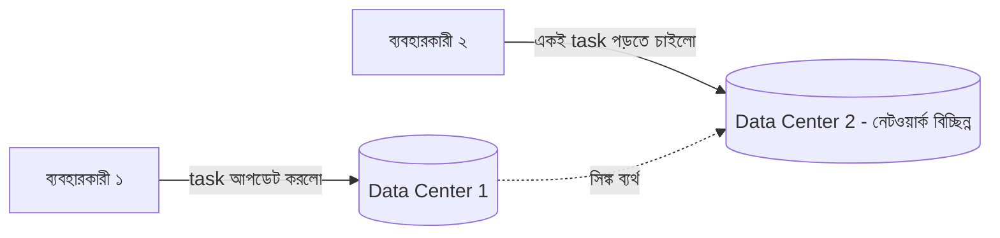

# ৩৮.৪ CAP Theorem

আগের তিনটা লেসন জুড়ে আমরা একটা মাত্র প্রোগ্রামের ভেতরের ডিজাইন (OOP, SOLID, refactoring) নিয়ে কথা বলেছি। এখন আমরা এক ধাপ বড় করে ভাবি — যখন একটা সিস্টেম একাধিক সার্ভার/ডেটাবেজ নোডে ছড়িয়ে থাকে (Module ৩৫.১-এর horizontal scaling মনে করো), তখন একটা মৌলিক তাত্ত্বিক সীমাবদ্ধতার মুখোমুখি হতে হয় — **CAP Theorem**।

CAP Theorem বলে, একটা বিতরণকৃত (distributed) সিস্টেম একসাথে তিনটা জিনিসের সবগুলো, সবসময়, পুরোপুরি দিতে পারে না — এর মধ্যে যেকোনো দুটো বেছে নিতে হয়, নেটওয়ার্ক সমস্যার মুহূর্তে। এটা একটা রেস্তোরাঁর তিনটা লক্ষ্যের মতো — দ্রুত সার্ভিস, সবসময় সঠিক অর্ডার, আর যেকোনো শাখায় সেবা পাওয়া — কোনো এক সংকটে (যেমন রান্নাঘরের সাথে ফোন লাইন কেটে গেলে) তিনটাই একসাথে বজায় রাখা অসম্ভব হয়ে পড়ে।

যেহেতু বাস্তব দুনিয়ায় নেটওয়ার্ক পার্টিশন (partition) — মানে দুই সার্ভারের মধ্যে সাময়িক যোগাযোগ বিচ্ছিন্নতা — একটা অনিবার্য বাস্তবতা, তাই আসল পছন্দ হয়ে দাঁড়ায় **Consistency** নাকি **Availability**-এর মধ্যে।

একটা বাস্তব উদাহরণ — TaskFlow API-এর ডেটাবেজ যদি দুইটা ডেটা সেন্টারে (replica) থাকে, আর তাদের মধ্যে নেটওয়ার্ক সংযোগ সাময়িকভাবে বিচ্ছিন্ন হয়ে যায়:

**CP পছন্দ** (Consistency-focused, যেমন PostgreSQL সাধারণত): DC2 নতুন ডেটা দেখাতে না পেরে request প্রত্যাখ্যান করবে, বরং ভুল/পুরনো তথ্য দেখানোর চেয়ে। **AP পছন্দ** (Availability-focused, যেমন অনেক NoSQL সিস্টেম, Cassandra): DC2 তার কাছে থাকা পুরনো ডেটা দিয়ে জবাব দেবে, "সিস্টেম কাজ করছে" নিশ্চিত করতে, যদিও সেটা সাময়িকভাবে ভুল/পুরনো হতে পারে।

কোনটা "ভালো" তা প্রেক্ষাপটের উপর নির্ভর করে — ব্যাংকের লেনদেনে Consistency সবচেয়ে জরুরি (ভুল ব্যালেন্স দেখানো বিপর্যয়কর), কিন্তু একটা সোশ্যাল মিডিয়া "লাইক কাউন্ট"-এ সামান্য পুরনো সংখ্যা দেখানো (Availability অগ্রাধিকার) গ্রহণযোগ্য।

এই তত্ত্বীয় ট্রেড-অফ আমাদের শেখায় বড় সিস্টেম ডিজাইন করার সময় "সবকিছু নিখুঁত" চাওয়া বাস্তবসম্মত না — সচেতনভাবে trade-off বেছে নিতে হয়। এই মডিউলের শেষ লেসনে আমরা আবার ছোট স্কেলে ফিরে আসবো — ক্লিন কোড লেখার দৈনন্দিন অভ্যাস নিয়ে, যেখানে আমরা Module ৩৮.৩-এর code smell থেকে ভিন্ন একটা কোণ থেকে "ভালো কোড" কী তা দেখবো।
