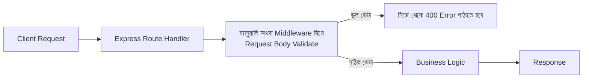

# ৩৯.১ REST API with Express.js

Module ৪-এ আমরা FastAPI দিয়ে হাতে-কলমে একটা REST API বানিয়েছিলাম, আর Module ৪.৮-এ দেখেছিলাম FastAPI আর Express.js গঠনগতভাবে কতটা মিল — দুটোই route define করে, request/response সামলায়, middleware ব্যবহার করে। এই বোনাস মডিউলে আমরা সেই মিলটাকে উল্টো দিক থেকে যাচাই করবো — এবার Node.js-এর Express.js দিয়ে একই ধারণার একটা কাজ করা API বানিয়ে।

তুমি এই আকৃতিটা ইতিমধ্যে জানো FastAPI থেকে — শুধু সিনট্যাক্স বদলাবে। FastAPI-তে যেখানে `class Task(BaseModel)` লিখে Pydantic দিয়ে ডেটার গঠন নিশ্চিত করতাম, Express.js-এ built-in কোনো validation নেই — এটাই প্রথম বড় পার্থক্য যেটা মনে রাখা জরুরি।



একই TaskFlow ধারণার API, এবার Express.js-এ:

```js
const express = require('express');
const app = express();
app.use(express.json());

const tasksDb = {};
let nextId = 1;

app.post('/tasks', (req, res) => {
  const { title, priority = 'medium', completed = false } = req.body;

  // FastAPI-তে এই যাচাইটা Pydantic নিজে করে দিতো, এখানে আমাদের নিজে করতে হবে
  if (!title || typeof title !== 'string') {
    return res.status(400).json({ error: 'title আবশ্যক এবং string হতে হবে' });
  }

  const id = nextId++;
  tasksDb[id] = { title, priority, completed };
  res.status(201).json({ id, ...tasksDb[id] });
});

app.get('/tasks/:id', (req, res) => {
  const task = tasksDb[req.params.id];
  if (!task) {
    return res.status(404).json({ error: 'Task পাওয়া যায়নি' });
  }
  res.json(task);
});

app.get('/tasks', (req, res) => {
  const list = Object.entries(tasksDb).map(([id, t]) => ({ id: Number(id), ...t }));
  res.json(list);
});

app.listen(3000, () => console.log('চলছে http://localhost:3000'));
```

লক্ষ্য করো `!title || typeof title !== 'string'` অংশটা — FastAPI-তে `title: str` লিখলেই এই চেক ফ্রেমওয়ার্ক নিজে করে দিতো, ভুল ডেটা এলে স্বয়ংক্রিয়ভাবে একটা স্পষ্ট 422 error দিতো। Express.js-এ এই দায়িত্ব সম্পূর্ণ আমাদের — আর এখানেই একটা সাধারণ প্রোডাকশন ভুল হয়: শুরুর দিকে অনেকে `title` চেক করে কিন্তু `priority` একটা এলোমেলো string (যেমন `"urgent!!"`) হিসেবে এসে গেলেও কিছু আটকায় না, কারণ কোথাও এনফোর্স করা নেই যে এটা `"low" | "medium" | "high"`-এর একটা হতে হবে। বাস্তব প্রজেক্টে এই ফাঁক বন্ধ করতে `zod` বা `joi`-এর মতো একটা schema validation লাইব্রেরি ব্যবহার করা হয় — যেটা কার্যত Pydantic-এর কাজটাই করে, শুধু আলাদা প্যাকেজ হিসেবে।

আরেকটা জিনিস মনে রাখার মতো — `app.use(express.json())` লাইনটা বাদ দিলে `req.body` থাকবে `undefined`, আর তোমার route হ্যান্ডলার একটা অস্পষ্ট error দিয়ে ক্র্যাশ করবে। FastAPI-তে body parsing স্বয়ংক্রিয়, কিন্তু Express.js-এ এটা একটা middleware যা explicitly যুক্ত করতে হয় — নতুনরা প্রায়ই এই লাইনটা ভুলে যায় আর তারপর ঘণ্টার পর ঘণ্টা ডিবাগ করে বুঝতে পারে না কেন `req.body.title` সবসময় `undefined` আসছে।

FastAPI-তে যেখানে `/docs` রুটে স্বয়ংক্রিয় interactive ডকুমেন্টেশন পাওয়া যেতো, Express.js-এ এটা বিল্ট-ইন নেই — `swagger-jsdoc` বা `swagger-ui-express`-এর মতো আলাদা প্যাকেজ যুক্ত করতে হয়।

```bash
node --watch server.js   # Development মোডে অটো-রিস্টার্ট, uvicorn --reload-এর মতোই
```

এখন আমাদের হাতে Express.js-এ একটা কাজ করা REST API আছে, আর দেখলাম কোথায় কোথায় FastAPI-এর "বিল্ট-ইন সুবিধা" এখানে ম্যানুয়াল কাজ হয়ে যায়। পরের লেসনে আমরা এই ভিত্তির উপর দাঁড়িয়ে একটা AI-চালিত ফিচার যোগ করবো — OpenAI ব্যবহার করে একটা চ্যাটবট এন্ডপয়েন্ট, এবার Node.js-এ।
