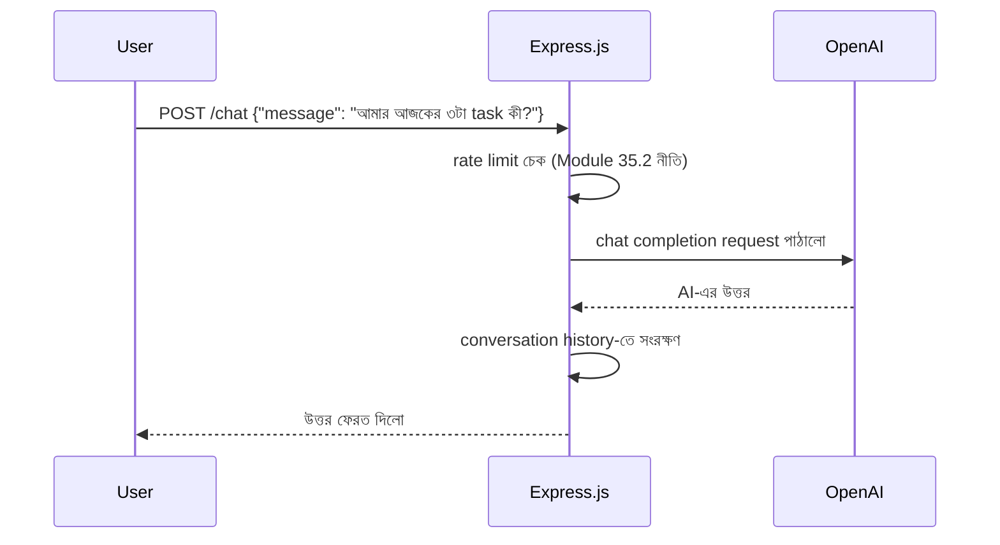

# ৩৯.২ AI Chatbot with OpenAI + Express.js

আগের লেসনে আমরা Express.js-এ একটা সাধারণ REST API বানালাম। এখন Module ৩৬.১৩-এ শেখা "LLM API সরাসরি কল করা" ধারণাটা এবার Node.js-এ প্রয়োগ করবো — একটা AI চ্যাটবট এন্ডপয়েন্ট বানিয়ে, যেটা Express.js-এর মাধ্যমে OpenAI-এর API-কে "মোড়ক" (wrap) দিয়ে ব্যবহারকারীর কাছে উপস্থাপন করবে।

আগের মতোই, ভাবা যায় একজন দোভাষীর মতো — ব্যবহারকারী আমাদের API-কে সাধারণ ভাষায় প্রশ্ন করে, আমাদের সার্ভার সেটা OpenAI-এর কাছে পাঠায়, উত্তর নিয়ে আসে, আর ব্যবহারকারীকে ফেরত দেয়।



```js
const express = require('express');
const OpenAI = require('openai');

const app = express();
app.use(express.json());

const client = new OpenAI(); // OPENAI_API_KEY environment variable থেকে নেয়া হয়
const conversations = {}; // সহজ in-memory history, বাস্তবে Redis/DB ব্যবহার হবে

app.post('/chat', async (req, res, next) => {
  const { message, conversationId } = req.body;
  const history = conversations[conversationId] || [];
  history.push({ role: 'user', content: message });

  try {
    const response = await client.chat.completions.create({
      model: 'gpt-4o-mini',
      messages: [
        { role: 'system', content: 'তুমি একজন সহায়ক টাস্ক ম্যানেজমেন্ট সহকারী।' },
        ...history,
      ],
    });

    const reply = response.choices[0].message.content;
    history.push({ role: 'assistant', content: reply });
    conversations[conversationId] = history;

    res.json({ reply });
  } catch (err) {
    // OpenAI ব্যর্থ হলে পুরো সার্ভার ক্র্যাশ না করে একটা নিয়ন্ত্রিত error
    next(Object.assign(err, { statusCode: 502, message: `AI সার্ভিস ব্যর্থ: ${err.message}` }));
  }
});

app.use((err, req, res, next) => {
  res.status(err.statusCode || 500).json({ error: err.message });
});

app.listen(3000);
```

লক্ষ্য করো `try-catch` আর `next(err)`-এর ব্যবহার — Module ৩৬.২১-এ শেখা error handling নীতি এখানেও প্রযোজ্য: বহিরাগত সার্ভিস (OpenAI) ব্যর্থ হতে পারে, আর সেটা একটা স্পষ্ট, নিয়ন্ত্রিত error-এ রূপান্তর করা উচিত। FastAPI ভার্সনে আমরা `raise HTTPException` করতাম সরাসরি; Express.js-এ এই কাজটা `next(err)` দিয়ে centralized error-handling middleware-এ পাঠিয়ে করা হয় — গঠন আলাদা দেখতে হলেও উদ্দেশ্য একই।

`conversationId` দিয়ে প্রতিটা ব্যবহারকারীর আলাদা কথোপকথনের ইতিহাস ধরে রাখা হচ্ছে, যাতে AI আগের প্রসঙ্গ মনে রাখতে পারে।

একটা বাস্তব production ভুল এখানে খুব সাধারণ — `conversations` অবজেক্টটা in-memory, মানে সার্ভার রিস্টার্ট হলে বা একাধিক instance (horizontal scaling) চললে প্রতিটা instance-এর নিজের আলাদা কপি থাকবে, ফলে একই ব্যবহারকারীর দুটো রিকোয়েস্ট দুই আলাদা সার্ভারে গেলে সে তার আগের কথোপকথন হারিয়ে ফেলবে। এই সমস্যাটা FastAPI ভার্সনেও ছিল, কিন্তু Node.js-এ এটা আরও দ্রুত সামনে আসে কারণ Node.js অ্যাপ প্রায়ই PM2 বা cluster mode দিয়ে একাধিক প্রসেসে চালানো হয় CPU কোরগুলো কাজে লাগানোর জন্য — production-এ এই history অবশ্যই Redis বা database-এ রাখতে হবে, in-memory object কখনোই নয়।

আরেকটা গুরুত্বপূর্ণ পয়েন্ট — Module ৩৫.২-এ শেখা rate limiting এখানে অত্যন্ত গুরুত্বপূর্ণ, কারণ প্রতিটা OpenAI কল টাকা খরচ করে। Express.js-এ এটা `express-rate-limit` প্যাকেজ দিয়ে সহজেই middleware হিসেবে যুক্ত করা যায়, ঠিক যেভাবে FastAPI-তে `slowapi` ব্যবহার করা হতো।

এখন আমরা একটা কথোপকথনমূলক AI ফিচার বানালাম, Node.js-এ। পরের লেসনে আমরা AI-এর একটা সম্পূর্ণ ভিন্ন ব্যবহার দেখবো — টেক্সট না, বরং ভিডিও ফাইল প্রসেস করার একটা প্র্যাকটিক্যাল অটোমেশন টুল।
