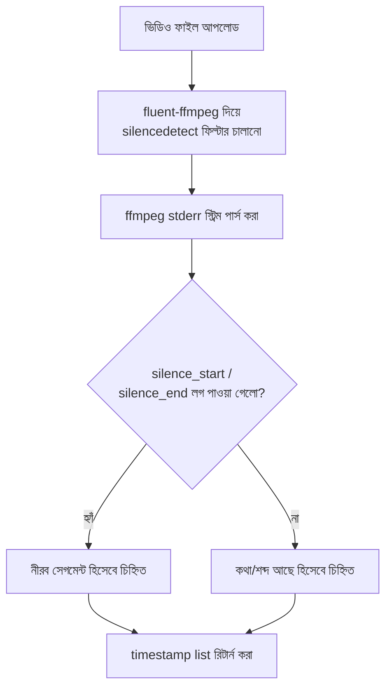

# ৩৯.৩ AI Video Silence Detector

আগের দুই লেসনে আমরা টেক্সট-ভিত্তিক API বানিয়েছি। এই লেসনে আমরা সম্পূর্ণ ভিন্ন ধরনের একটা প্র্যাকটিক্যাল প্রজেক্ট বানাবো — একটা ভিডিও ফাইলে কোথায় কোথায় নীরবতা (silence) আছে সেটা স্বয়ংক্রিয়ভাবে খুঁজে বের করার একটা সার্ভিস, এবার Node.js/Express.js দিয়ে।

এখানেই Python বনাম Node.js-এর একটা বাস্তব সীমাবদ্ধতা সামনে আসে। Python-এর `pydub`-এর মতো mature, উচ্চ-স্তরের audio-analysis লাইব্রেরি Node.js ইকোসিস্টেমে খুব কম আছে — তাই Node.js-এ আমরা সরাসরি `ffmpeg`-এর নিজস্ব silence-detection ফিল্টার (`silencedetect`) ব্যবহার করবো, একটা wrapper লাইব্রেরি (`fluent-ffmpeg`) দিয়ে, আর ffmpeg-এর stderr আউটপুট পার্স করে ফলাফল বের করবো। এটা একটা গুরুত্বপূর্ণ শিক্ষা — কোনো ভাষার ইকোসিস্টেমে সবসময় সব কাজের জন্য প্রস্তুত high-level লাইব্রেরি থাকে না, তখন নিচের স্তরের টুল (raw ffmpeg) দিয়েই কাজ চালাতে হয়।



```js
const express = require('express');
const multer = require('multer');
const ffmpeg = require('fluent-ffmpeg');
const fs = require('fs');
const os = require('os');
const path = require('path');

const app = express();
const upload = multer({ dest: os.tmpdir() });

app.post('/detect-silence', upload.single('video'), (req, res, next) => {
  const videoPath = req.file.path;
  const silentRanges = [];
  let currentStart = null;

  ffmpeg(videoPath)
    .audioFilters('silencedetect=noise=-40dB:d=1') // -40dB-এর নিচে, কমপক্ষে ১ সেকেন্ড
    .format('null')
    .output('/dev/null')
    .on('stderr', (line) => {
      // fluent-ffmpeg এখানে raw ffmpeg log লাইন দেয়, নিজে হাতে পার্স করতে হবে
      const startMatch = line.match(/silence_start: ([\d.]+)/);
      const endMatch = line.match(/silence_end: ([\d.]+)/);
      if (startMatch) currentStart = parseFloat(startMatch[1]);
      if (endMatch && currentStart !== null) {
        silentRanges.push({ start_sec: currentStart, end_sec: parseFloat(endMatch[1]) });
        currentStart = null;
      }
    })
    .on('end', () => {
      fs.unlink(videoPath, () => {}); // অস্থায়ী ফাইল পরিষ্কার
      res.json({ silent_segments: silentRanges });
    })
    .on('error', (err) => {
      fs.unlink(videoPath, () => {});
      next(err);
    })
    .run();
});

app.listen(3000);
```

লক্ষ্য করো `.on('stderr', ...)` অংশটা — এটা Python `pydub` ভার্সনের মতো পরিষ্কার একটা ফাংশন কল (`detect_silence()`) না, বরং raw প্রসেস আউটপুট নিজে হাতে regex দিয়ে পার্স করা। এটাই ffmpeg wrapper লাইব্রেরিগুলোর একটা সাধারণ প্যাটার্ন — লাইব্রেরি প্রসেস চালানো আর স্ট্রিম হ্যান্ডেল করাটা সহজ করে দেয়, কিন্তু ffmpeg-এর নিজস্ব আউটপুট ফরম্যাট বোঝাটা এখনো আমাদের কাজ।

`multer`-এর ব্যবহারও মনে রাখার মতো — Express.js-এ FastAPI-এর `UploadFile`-এর মতো বিল্ট-ইন কোনো file-upload হ্যান্ডলিং নেই, তাই `multer` মিডলওয়্যার যুক্ত করতে হয়, যেটা `req.file` (বা `req.files`) populate করে দেয়।

একটা সাধারণ প্রোডাকশন ভুল — `.on('error', ...)` হ্যান্ডলার না লিখলে, ffmpeg প্রসেস কোনো কারণে ব্যর্থ হলে (যেমন corrupted ভিডিও ফাইল, বা ffmpeg বাইনারি সার্ভারে ইনস্টল না থাকা) request-টা কোনো response ছাড়াই ঝুলে থাকবে, ক্লায়েন্ট শেষ পর্যন্ত timeout পাবে — আর যদি error হ্যান্ডলারে `fs.unlink` কল করতে ভুলে যাও, অস্থায়ী ফাইলটা ডিস্কে পড়ে থাকবে চিরকাল। বড় স্কেলে অনেক ভিডিও প্রসেস হলে এই leaked temp files ধীরে ধীরে ডিস্ক ভরিয়ে ফেলতে পারে — ঠিক Module ৩৯.৩-এর Python ভার্সনে যেমন `os.remove()` করা হয়েছিল, এখানেও `try/finally`-এর সমতুল্য প্যাটার্ন (`end` আর `error` দুই জায়গাতেই cleanup) মিস করা চলবে না।

আরও একটা গুরুত্বপূর্ণ পয়েন্ট — Module ৩৫.১-এ শেখা queueing নীতি অনুযায়ী, ভারী ভিডিও প্রসেসিং সরাসরি request-response চক্রে না রেখে background job (যেমন BullMQ দিয়ে) হিসেবে চালানো উচিত, বিশেষ করে বড় ফাইলের ক্ষেত্রে — একটা synchronous HTTP request কয়েক মিনিট ধরে খোলা রাখা প্রোডাকশনে load balancer বা reverse proxy-এর timeout-এ ধাক্কা খাবে।

ভিডিও প্রসেসিং থেকে এবার আমরা আরেকটা কনটেন্ট-সংক্রান্ত AI টুলের দিকে যাবো — পরের লেসনে YouTube ভিডিওর জন্য AI দিয়ে ট্যাগ আর টাইটেল জেনারেট করা, এবার Node.js-এর OpenAI SDK দিয়ে।
