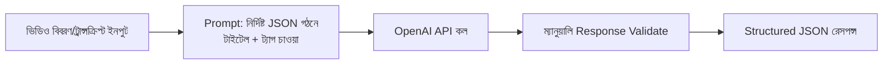

# ৩৯.৪ YouTube Tag & Title Generator

আগের লেসনে আমরা ভিডিওর অডিও প্রসেস করেছি। এই লেসনে আমরা ভিডিও কনটেন্ট প্রকাশের আরেকটা বাস্তব সমস্যা সমাধান করবো — একটা ভিডিওর জন্য আকর্ষণীয়, SEO-বান্ধব টাইটেল আর ট্যাগ বাছাই করা। আমরা Module ৩৯.২-এর মতোই একটা LLM-ভিত্তিক এন্ডপয়েন্ট বানাবো, কিন্তু এবার output-এর গঠন আরও কঠোরভাবে নিয়ন্ত্রিত — Node.js-এ, `openai` SDK ব্যবহার করে।

ভাবো একজন সম্পাদক, যাকে একটা প্রবন্ধের সারাংশ দিলে সে সাথে সাথে কয়েকটা আকর্ষণীয় শিরোনাম প্রস্তাব করে। আমরা এখানে সেই কাজটা LLM-কে দিয়ে করাচ্ছি, ভিডিওর একটা সংক্ষিপ্ত বিবরণ ইনপুট হিসেবে দিয়ে।



FastAPI ভার্সনে আমরা `response_model=TitleTagSuggestion` লিখে Pydantic দিয়ে output-এর গঠন নিশ্চিত করতাম। Express.js-এ এই ধরনের বিল্ট-ইন output validation নেই, তাই আমাদের নিজে হাতে চেক করতে হবে যে LLM যা ফেরত দিলো সেটা প্রত্যাশিত গঠনে আছে কিনা — এটাই এই লেসনের সবচেয়ে গুরুত্বপূর্ণ শিক্ষা।

```js
const express = require('express');
const OpenAI = require('openai');

const app = express();
app.use(express.json());
const client = new OpenAI();

app.post('/generate-metadata', async (req, res, next) => {
  const { description, category = 'technology' } = req.body;

  const prompt = `নিচের ভিডিও বিবরণের জন্য ৫টা আকর্ষণীয় YouTube টাইটেল
এবং ১০টা SEO-বান্ধব ট্যাগ প্রস্তাব করো, শুধু নিচের JSON গঠনে উত্তর দাও:
{"titles": ["...", ...], "tags": ["...", ...]}

ক্যাটাগরি: ${category}
বিবরণ: ${description}`;

  try {
    const response = await client.chat.completions.create({
      model: 'gpt-4o-mini',
      messages: [{ role: 'user', content: prompt }],
      response_format: { type: 'json_object' },
    });

    const result = JSON.parse(response.choices[0].message.content);

    // FastAPI-তে TitleTagSuggestion(**result) স্বয়ংক্রিয়ভাবে এটা করতো —
    // Express.js-এ আমাদের নিজে হাতে গঠন যাচাই করতে হবে
    if (!Array.isArray(result.titles) || !Array.isArray(result.tags)) {
      throw new Error('LLM প্রত্যাশিত গঠনে উত্তর দেয়নি');
    }

    res.json({ titles: result.titles, tags: result.tags });
  } catch (err) {
    next(Object.assign(err, { statusCode: 502 }));
  }
});

app.use((err, req, res, next) => {
  res.status(err.statusCode || 500).json({ error: err.message });
});

app.listen(3000);
```

লক্ষ্য করো `if (!Array.isArray(result.titles) || ...)` অংশটা — এটা এই লেসনের কেন্দ্রীয় "production nuance"। `response_format: { type: 'json_object' }` ব্যবহার করলে OpenAI নিশ্চিত করে যে আউটপুট বৈধ JSON হবে, কিন্তু সেই JSON-এর ভেতরের গঠন (`titles` আসলে একটা array কিনা, `tags`-এ ঠিক string-ই আছে কিনা) সেটা নিশ্চিত করে না। FastAPI-তে Pydantic মডেল দিয়ে এই গ্যারান্টিটা ফ্রেমওয়ার্ক নিজে দিতো — `TitleTagSuggestion(**result)` লাইনটা ব্যর্থ হলে একটা স্পষ্ট validation error উঠতো। Node.js-এ এই সুরক্ষা না রাখলে, LLM যদি কখনো `{"titles": "শুধু একটা string"}` টাইপ কিছু ফেরত দেয় (যা বিরল কিন্তু সম্ভব), তোমার downstream কোড নিঃশব্দে ভুল ডেটা নিয়ে কাজ করবে — কোনো error ছাড়াই।

বাস্তব প্রোডাকশন সিস্টেমে এই সমস্যার সমাধানে `zod`-এর মতো লাইব্রেরি দিয়ে output schema define করে `schema.parse(result)` কল করা হয় — এটাই কার্যত Pydantic-এর কাজের সমতুল্য, শুধু আলাদা প্যাকেজ হিসেবে। এই "structured output" প্যাটার্ন Module ৩৬.৮-এ শেখা AI-assisted development-এর একটা গুরুত্বপূর্ণ কৌশল — LLM-কে মুক্ত টেক্সট না, নির্দিষ্ট গঠনে উত্তর দিতে বাধ্য করা, আর তারপর সেই প্রতিশ্রুতি নিজের কোডেও ভেরিফাই করা।

এই ধরনের ছোট, নির্দিষ্ট-উদ্দেশ্যের AI মাইক্রো-সার্ভিস — প্রতিটা একটা নির্দিষ্ট সমস্যা সমাধান করে, আর সহজেই আলাদা আলাদাভাবে deploy আর scale করা যায়। এতদিন আমরা এই Node.js সার্ভিসগুলো আলাদাভাবে দেখেছি — পরের ও শেষ লেসনে আমরা দেখবো কীভাবে এগুলোকে একটা Python/FastAPI membership অ্যাপ্লিকেশনের সাথে একসাথে কাজ করাতে হয়, ঠিক উল্টো দিক থেকে যেমন Module ৪-এ শিখেছিলে।
