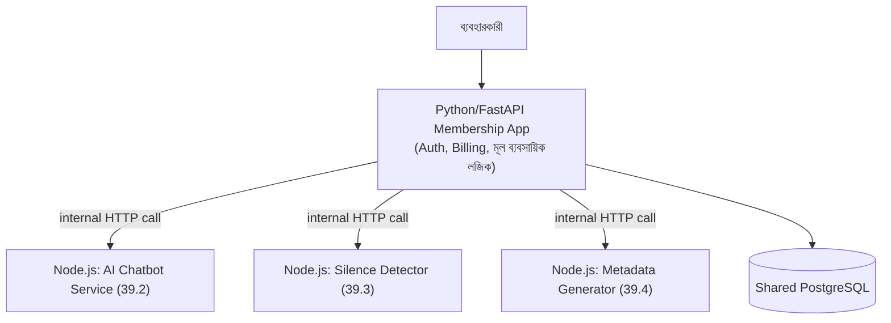

# ৩৯.৫ Connecting Node.js Products with a Python Membership App

এই মডিউলে আমরা চারটা স্বতন্ত্র Node.js/Express.js সার্ভিস বানিয়েছি — একটা REST API, একটা চ্যাটবট, একটা ভিডিও প্রসেসিং টুল, আর একটা মেটাডেটা জেনারেটর। কিন্তু এই কোর্সে আমাদের মূল স্ট্যাক এখন Python/FastAPI — Module ৩৬-এর Personal Growth Tracker বা membership-ভিত্তিক মূল অ্যাপ্লিকেশনটা FastAPI-এ লেখা। এই শেষ লেসনে আমরা দেখবো কীভাবে এই দুই জগৎ — Python আর Node.js — একসাথে কাজ করে একটা সম্পূর্ণ সিস্টেম গঠন করে, যখন Node.js হচ্ছে বোনাস/সাহায্যকারী সার্ভিস আর Python মূল ব্যবসায়িক অ্যাপ।

Module ৪.৭-এ আমরা "backend as client" ধারণা শিখেছিলাম, আর Module ৪.৮-এ দেখেছিলাম FastAPI আর Express কতটা কাঠামোগতভাবে মিল। এখন আমরা সেই মিলটাকে ব্যবহারিক সুবিধায় রূপান্তর করবো — এবার উল্টো দিক থেকে: একটা Python/FastAPI membership app কীভাবে একটা Node.js মাইক্রোসার্ভিসকে ক্লায়েন্ট হিসেবে কল করে।



Python membership app থেকে একটা Node.js সার্ভিস কল করা, ঠিক যেভাবে Module ৪.৭-এ আমরা `httpx` দিয়ে "backend as client" ধারণা শিখেছিলাম — এখানেও একই লাইব্রেরি, শুধু গন্তব্য বদলেছে:

```python
# Python/FastAPI membership app-এর একটা route
import httpx
from fastapi import FastAPI, Depends, HTTPException

app = FastAPI()

@app.post("/api/videos/{video_id}/analyze")
async def analyze_video(video_id: str, current_user=Depends(get_current_user)):
    # membership যাচাই - এটা Python app-এর দায়িত্ব
    if current_user.plan == "free":
        raise HTTPException(status_code=403, detail="এই ফিচার শুধু প্রিমিয়াম সদস্যদের জন্য")

    # ভারী AI/ভিডিও কাজ Node.js সার্ভিসে পাঠানো
    async with httpx.AsyncClient() as client:
        try:
            response = await client.post(
                "http://node-service:3000/detect-silence",
                json={"video_url": get_video_url(video_id)},
                timeout=30.0,
            )
            response.raise_for_status()
        except httpx.HTTPError as e:
            # Module 36.21-এ শেখা centralized error handling নীতি
            raise HTTPException(status_code=502, detail=f"Video সার্ভিস ব্যর্থ: {str(e)}")

    return response.json()
```

লক্ষ্য করো দায়িত্বের স্পষ্ট বিভাজন — membership/plan যাচাই, authentication, billing — এগুলো Python app-এর দায়িত্ব থেকে যাচ্ছে, কারণ এটাই মূল ব্যবসায়িক সিস্টেম। Node.js সার্ভিস শুধু তার নির্দিষ্ট, ভারী কাজটা (AI/ভিডিও প্রসেসিং) করছে, membership নিয়ে কিছু জানারই দরকার নেই। এই বিভাজন Module ৩৮.২-এ শেখা Single Responsibility নীতির-ই একটা সিস্টেম-লেভেল প্রয়োগ।

একটা গুরুত্বপূর্ণ প্রোডাকশন corner case এখানে সহজেই চোখ ফাঁকি দিয়ে যায় — `timeout=30.0` লাইনটা লক্ষ্য করো। যদি Node.js সার্ভিসটা কোনো কারণে ধীর বা আটকে যায় (যেমন ffmpeg প্রসেস হ্যাং করেছে), আর timeout সেট না থাকে, তাহলে Python-এর `httpx` কল অনির্দিষ্টকালের জন্য অপেক্ষা করবে — আর যেহেতু এটা একটা `async` endpoint, এই একটা আটকে থাকা রিকোয়েস্ট বাকি সব ব্যবহারকারীর রিকোয়েস্ট প্রসেস করাও ধীর করে দিতে পারে যদি event loop-এর অন্য কোথাও blocking কাজ চলতে থাকে। যেকোনো service-to-service কলে সবসময় একটা যুক্তিসঙ্গত timeout সেট করা, আর সেই timeout ব্যর্থ হলে কী হবে (retry? user-কে error দেখানো? fallback?) আগে থেকে ভেবে রাখা — এটা microservices আর্কিটেকচারের একটা অলিখিত নিয়ম, যা নতুনরা প্রায়ই উপেক্ষা করে।

উভয় সার্ভিস একসাথে চালানোর জন্য Docker Compose ব্যবহার করা যায়, যাতে ডেভেলপমেন্ট পরিবেশে দুটোই সহজে একসাথে চলে:

```yaml
services:
  python-app:
    build: ./membership-app
    ports: ["8000:8000"]
  node-service:
    build: ./ai-services
    ports: ["3000:3000"]
```

এই আর্কিটেকচার প্যাটার্ন — একাধিক ভাষা/ফ্রেমওয়ার্কের সার্ভিস, প্রতিটা তার নিজের শক্তিশালী দিকে কাজ করছে, একটা কমন নেটওয়ার্কে যোগাযোগ করছে — আসলে একটা বৃহত্তর স্থাপত্য দর্শনের অংশ, যাকে বলে **microservices**। এই বোনাস মডিউলটা এখানেই শেষ — মূল কোর্সের পথে ফিরে গিয়ে, পরের মডিউলে আমরা ঠিক এই ধরনের স্থাপত্য প্যাটার্নগুলো নিয়ে বিস্তারিত আলোচনা করবো — monolith থেকে microservices, event-driven architecture, আর আরও অনেক কিছু।
