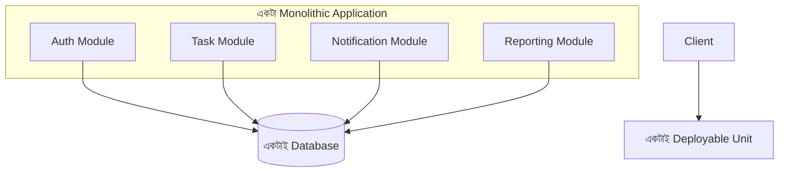

# ৪০.১ Monolithic Architecture

কোর্সের ব্যাকএন্ড-কেন্দ্রিক এই পর্যায়ে এসে আমরা এক ধাপ পিছিয়ে গিয়ে বড় ছবিটা দেখবো — একটা সম্পূর্ণ সিস্টেম কীভাবে সংগঠিত হয়, তার বিভিন্ন স্থাপত্য প্যাটার্ন। শুরু করছি সবচেয়ে পরিচিত আর সহজ প্যাটার্ন দিয়ে, যেটা আমরা এই পুরো কোর্স জুড়ে (Personal Growth Tracker, TaskFlow API) আসলে ব্যবহার করে এসেছি — **monolithic architecture**।

Monolith-কে ভাবা যায় একটা বড় রেস্তোরাঁর মতো, যেখানে রান্নাঘর, ক্যাশিয়ার, ডাইনিং এরিয়া — সব একই ভবনে, একই টিম চালায়। একটা মাত্র কোডবেস, একটা মাত্র deploy করার ইউনিট, যেখানে সব ফিচার (auth, task management, notification) একসাথে বান্ধা।



আমাদের Module ৩৬-এর Personal Growth Tracker আসলে একটা monolith — একটাই FastAPI অ্যাপ, যেখানে habit, goal, journal সবকিছুর route একই সার্ভারে চলে:

```python
# main.py - একটা monolith-এর সাধারণ গঠন
from fastapi import FastAPI

app = FastAPI()

app.include_router(auth_router, prefix="/api/auth")
app.include_router(habits_router, prefix="/api/habits")
app.include_router(goals_router, prefix="/api/goals")
app.include_router(journal_router, prefix="/api/journal")
# uvicorn main:app --host 0.0.0.0 --port 3000 দিয়ে চালানো হয়
```

Monolith-এর সুবিধা স্পষ্ট — শুরু করা সহজ, deploy করা সহজ (একটাই জিনিস), ডিবাগ করা সহজ (Module ৩৫.৫-এর মতো একটাই লগ স্ট্রিম, একটাই stack trace দেখলেই চলে), আর ছোট টিমের জন্য দ্রুত develop করা যায়। এই কারণেই আমরা এই কোর্সে বেশিরভাগ প্রজেক্ট monolith হিসেবে বানিয়েছি — শেখার আর ছোট প্রজেক্টের জন্য এটাই সবচেয়ে বাস্তবসম্মত পছন্দ।

কিন্তু অসুবিধাও আছে — Module ৩৫.৩-এর লোড টেস্টিং যদি দেখায় শুধু `Notification` মডিউলে চাপ বেশি, পুরো অ্যাপটাকেই scale করতে হবে, শুধু সেই অংশটাকে না। একজন ডেভেলপারের সামান্য ভুল (Module ৩৫.৫-এ শেখা মেমরি লিক) পুরো সিস্টেমকে নামিয়ে দিতে পারে। আর টিম বড় হলে, একই কোডবেসে অনেকজন কাজ করলে Module ৩৭.২৩-এর মতো জটিল conflict বেড়ে যায়।

এই সীমাবদ্ধতাগুলোই একটা ভিন্ন স্থাপত্য প্যাটার্নের জন্ম দিয়েছে, যেখানে একটা বড় অ্যাপ্লিকেশনকে ছোট ছোট স্বাধীন সার্ভিসে ভাগ করা হয় — পরের লেসনে আমরা সেই প্যাটার্ন, microservices, নিয়ে আলোচনা করবো।
