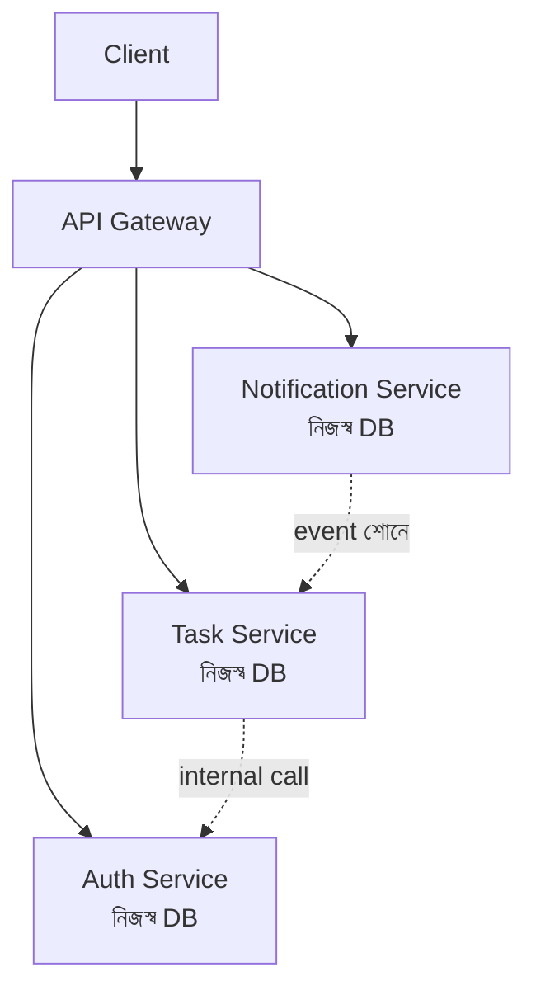
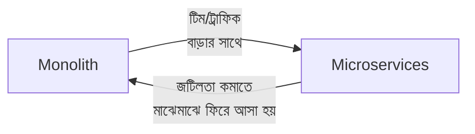

# ৪০.২ Microservices Architecture

আগের লেসনে আমরা monolith-এর সীমাবদ্ধতা দেখলাম — একটা অংশে চাপ বাড়লে পুরো সিস্টেম scale করতে হয়, একজনের ভুল সবাইকে প্রভাবিত করে। **Microservices architecture** এই সমস্যার একটা সমাধান প্রস্তাব করে — একটা বড় অ্যাপ্লিকেশনকে ছোট ছোট, স্বাধীনভাবে deploy করার যোগ্য সার্ভিসে ভাগ করা।

এটা ভাবা যায় একটা রেস্তোরাঁর বদলে একটা ফুড কোর্টের মতো — প্রতিটা স্টল (সার্ভিস) স্বাধীন, নিজের রান্নাঘর, নিজের কর্মী, নিজের মেনু নিয়ে চলে। বিরিয়ানির স্টলে ভিড় বেশি হলে, শুধু সেই স্টলে আরও কর্মী বাড়ানো যায়, পুরো ফুড কোর্ট বন্ধ করে সংস্কার করতে হয় না।



Personal Growth Tracker-কে microservices-এ ভাঙলে দেখতে এরকম হতো — প্রতিটা সার্ভিস আলাদা কোডবেস, আলাদা deploy, প্রায়ই আলাদা ডেটাবেজ:

```
habit-service/     (FastAPI, নিজস্ব PostgreSQL)
goal-service/      (FastAPI, নিজস্ব PostgreSQL)
notification-service/  (Python + Celery worker, নিজস্ব MongoDB)
```

Microservices-এর সুবিধা — প্রতিটা সার্ভিস স্বাধীনভাবে scale করা যায় (Module ৩৫.১-এর নীতি অনুযায়ী শুধু যেটার দরকার), স্বাধীনভাবে deploy করা যায় (Module ৩৫.৬-এর canary deployment একটা সার্ভিসে প্রয়োগ করলে বাকিদের প্রভাবিত করে না), আর ভিন্ন ভিন্ন টেকনোলজি ব্যবহার করা যায় (Module ৩৯-এর মতো একটা সার্ভিস Go, বাকিগুলো Python/FastAPI হতে পারে)।

কিন্তু এই স্বাধীনতার দাম আছে — এখন সার্ভিসগুলোকে একে অপরের সাথে নেটওয়ার্কের মাধ্যমে কথা বলতে হয় (যেটা কখনো ব্যর্থ হতে পারে, Module ৩৮.৪-এর CAP theorem-এর মতো নেটওয়ার্ক পার্টিশনের ঝুঁকি), ডিবাগিং জটিল হয়ে যায় (একটা request একাধিক সার্ভিস দিয়ে যায়, তাই Module ৩৫.৫-এর মতো একটা মাত্র লগ ফাইল দেখলে চলে না), আর প্রতিটা সার্ভিসের নিজস্ব ডেটাবেজ থাকলে ডেটা সামঞ্জস্য রাখা কঠিন হয়ে যায়।



একটা গুরুত্বপূর্ণ শিক্ষা — বেশিরভাগ ছোট বা মাঝারি প্রজেক্টের জন্য monolith-ই সঠিক পছন্দ; microservices তখনই মূল্যবান হয়ে ওঠে যখন টিম বড় (একাধিক স্বাধীন দল), স্কেল বিশাল, বা বিভিন্ন অংশের লোড প্যাটার্ন খুব ভিন্ন। "microservices দিয়ে শুরু করা" একটা সাধারণ ভুল — অনেক সফল প্রজেক্ট monolith দিয়ে শুরু করে, প্রয়োজন হলে পরে ভেঙেছে।

Monolith আর microservices দুটোই সার্ভার সবসময় চালু রাখার ধারণার উপর দাঁড়িয়ে আছে। কিন্তু একটা সম্পূর্ণ ভিন্ন দর্শন আছে, যেখানে সার্ভার সবসময় চালু রাখারই দরকার নেই — পরের লেসনে আমরা সেই প্যাটার্ন, serverless architecture, নিয়ে আলোচনা করবো।
