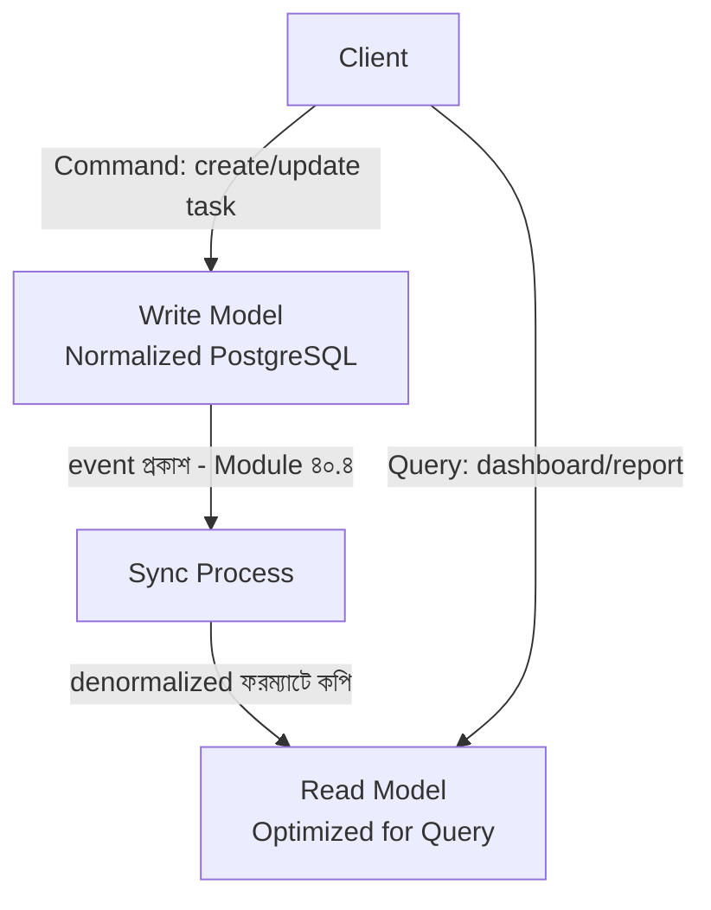

# ৪০.৫ CQRS (Command Query Responsibility Segregation) Architecture

আগের লেসনে আমরা event-driven architecture দেখলাম, যেখানে একটা কাজ (task complete করা) ঘটলে সেটা event হিসেবে ছড়িয়ে যায়। ধরো TaskFlow API-তে লেখার (write) চাহিদা সহজ — শুধু নতুন task তৈরি বা আপডেট করা। কিন্তু পড়ার (read) চাহিদা জটিল — ড্যাশবোর্ডে "গত মাসে কতগুলো high-priority task সম্পন্ন হয়েছে, প্রতিটা ব্যবহারকারীর গড় সময় কত" — এই ধরনের রিপোর্ট। একই ডেটা মডেল দিয়ে দুটো ভিন্ন চাহিদা সামলানো অদক্ষ হয়ে যায়। এই সমস্যার সমাধান দেয় **CQRS**।

এটা ভাবা যায় একটা লাইব্রেরির মতো — বই সংগ্রহ করা (write) আর বই খুঁজে বের করা (read/query)-এর জন্য ভিন্ন ব্যবস্থা থাকে। লাইব্রেরিয়ান বই তাক অনুযায়ী সাজায় (write model, normalized), কিন্তু পাঠকদের জন্য একটা আলাদা, দ্রুত-অনুসন্ধান ক্যাটালগ (read model, denormalized) রাখা হয়, যাতে খোঁজা সহজ হয়।



কোডে, লেখার দিক (command):

```python
# Command Handler (FastAPI) — শুধু ডেটা লেখে, স্বাভাবিক normalized টেবিলে
@app.post("/tasks", status_code=201)
async def create_task(payload: TaskCreate):
    task = await TaskWriteModel.create(payload)
    await event_bus.publish("task.created", task.dict())  # read model-কে জানানো
    return task
```

পড়ার দিক, একটা সম্পূর্ণ ভিন্ন, রিপোর্টের জন্য পূর্ব-তৈরি টেবিল থেকে:

```python
# Query Handler — একটা আলাদা, রিপোর্টের জন্য অপটিমাইজ করা টেবিল থেকে পড়ে
@app.get("/dashboard/task-summary")
async def get_task_summary(current_user: User = Depends(get_current_user)):
    summary = await TaskSummaryReadModel.find_one(user_id=current_user.id)
    # এই টেবিলটা আগে থেকেই গণনা করে রাখা, প্রতিবার জটিল JOIN করতে হয় না
    return summary
```

`task.created` event শুনে, একটা background process `TaskSummaryReadModel`-কে আপডেট করে রাখে, যাতে dashboard query সবসময় দ্রুত হয়, জটিল গণনা প্রতিবার না করে।

CQRS-এর সুবিধা — read আর write আলাদাভাবে scale করা যায় (Module ৩৫.১-এর নীতি অনুযায়ী, রিপোর্ট-ভারী অ্যাপে read model-এর জন্য বেশি instance রাখা যায়), আর প্রতিটা মডেল তার নিজের কাজের জন্য অপটিমাইজ করা যায়। কিন্তু জটিলতাও বাড়ে — দুটো মডেল সবসময় সিঙ্কে না থাকতে পারে (আবার Module ৩৮.৪-এর eventual consistency-র প্রশ্ন), আর ছোট প্রজেক্টে এই আলাদা করাটা অপ্রয়োজনীয় জটিলতা যোগ করতে পারে।

CQRS সবচেয়ে বেশি কাজে লাগে যখন read আর write-এর চাহিদা এবং scale-এর প্রয়োজন খুব ভিন্ন — সাধারণ CRUD অ্যাপে (Module ৩৬-এর Personal Growth Tracker-এর মতো) এটা প্রয়োজনীয় না। এতদিন আমরা ডেটা আর সার্ভিসের সম্পর্ক নিয়ে কথা বলেছি — এখন একটু সরল একটা প্যাটার্নে ফিরে আসি, যেটা প্রতিটা ব্যাকএন্ড ডেভেলপার সবচেয়ে বেশি ব্যবহার করে — পরের লেসনে layered architecture।
