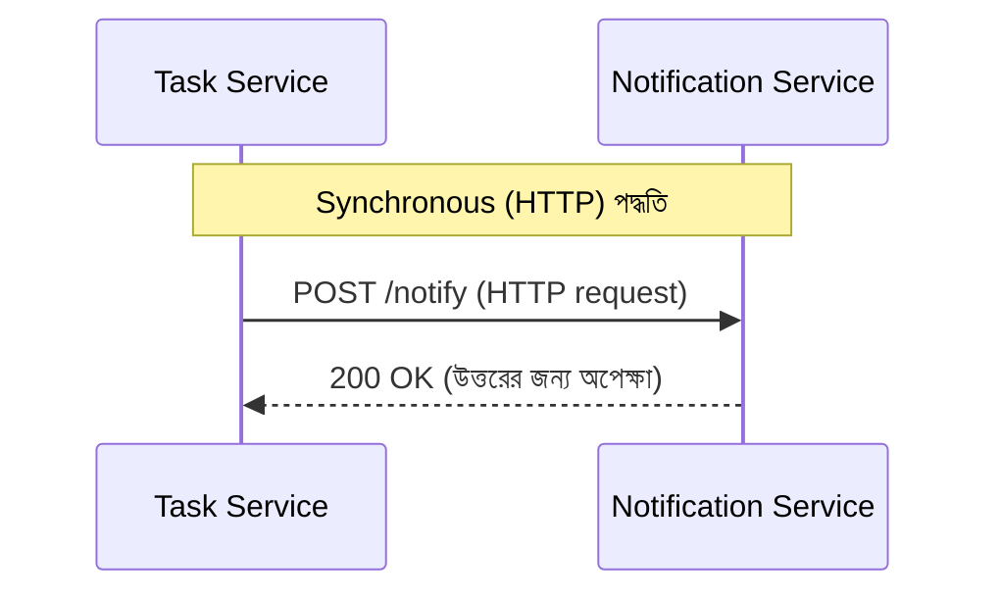
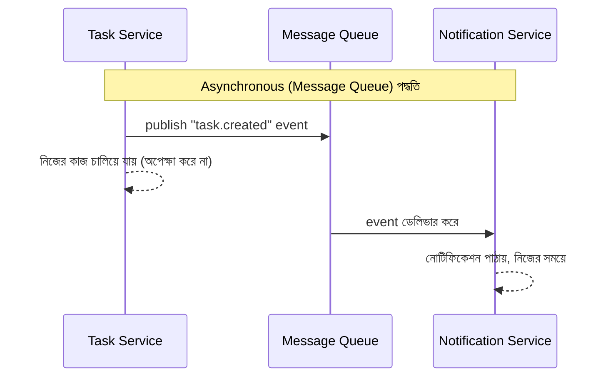

# ৪০.৯ Inter-Service Communication

আগের লেসনে আমরা দেখলাম Gateway কীভাবে ক্লায়েন্ট থেকে আসা রিকোয়েস্ট সঠিক সার্ভিসে পাঠায়। কিন্তু microservices জগতে একটা আরও গুরুত্বপূর্ণ প্রশ্ন থেকে যায় — সার্ভিসগুলো **নিজেদের মধ্যে** কীভাবে কথা বলবে? ধরো TaskFlow API-তে একটা task তৈরি হলে Notification Service-কে জানাতে হবে যাতে ইউজারকে ইমেইল পাঠানো যায়। Task Service কীভাবে এই তথ্য Notification Service-এ পৌঁছাবে?

এই প্রশ্নের উত্তর মূলত দুইটা বড় পথে ভাগ হয় — **synchronous** (সরাসরি কল করে উত্তরের জন্য অপেক্ষা করা) আর **asynchronous** (একটা বার্তা পাঠিয়ে দিয়ে নিজের কাজে ফিরে যাওয়া)। এটা অনেকটা ফোন কল বনাম টেক্সট মেসেজের পার্থক্যের মতো — ফোন কলে তুমি উত্তরের জন্য লাইনে থাকো, টেক্সটে বার্তা পাঠিয়ে নিজের কাজ চালিয়ে যাও, উত্তর যখন আসে তখন দেখো।



Synchronous যোগাযোগের সবচেয়ে সাধারণ রূপ HTTP REST কল, যেটা আমরা Module ৪-৭-এ বিস্তারিত শিখেছি:

```python
# Task Service — সরাসরি HTTP কল করে Notification Service-কে জানানো
import httpx

async def create_task(task_data: dict):
    task = await db.tasks.create(task_data)

    # synchronous কল — উত্তর না আসা পর্যন্ত অপেক্ষা
    async with httpx.AsyncClient() as client:
        await client.post(
            "http://notification-service:4002/notify",
            json={"user_id": task.user_id, "message": f"নতুন Task তৈরি হয়েছে: {task.title}"},
        )

    return task
```

এই পদ্ধতি সহজ এবং বোঝা সহজ, কিন্তু একটা বড় সমস্যা লুকিয়ে আছে — যদি Notification Service সাময়িকভাবে ডাউন থাকে বা ধীর হয়ে যায়, Task তৈরির পুরো প্রক্রিয়াটাই আটকে যায় বা ব্যর্থ হয়। Task তৈরি করা আর নোটিফিকেশন পাঠানো — এই দুইটা কাজ আসলে সরাসরি নির্ভরশীল হওয়ার দরকার নেই।

এখানেই asynchronous পদ্ধতি কাজে লাগে, একটা মেসেজ কিউ বা ব্রোকারের (RabbitMQ, Kafka) মাধ্যমে:



```python
# Task Service — শুধু একটা event পাবলিশ করে, উত্তরের জন্য অপেক্ষা করে না
async def create_task(task_data: dict):
    task = await db.tasks.create(task_data)
    await message_queue.publish("task.created", {"user_id": task.user_id, "title": task.title})
    return task  # সাথে সাথে রেসপন্স দেয়া যায়

# Notification Service — নিজের সময়ে, নিজের গতিতে event শুনে কাজ করে
async def on_task_created(event: dict):
    await send_email(event["user_id"], f"নতুন Task: {event['title']}")

message_queue.subscribe("task.created", on_task_created)
```

এই দুইটা পদ্ধতির মধ্যে পছন্দ নির্ভর করে প্রেক্ষাপটের উপর। যদি তোমার তাৎক্ষণিক উত্তর দরকার হয় (যেমন "এই ইউজারনেম কি available?"), synchronous ছাড়া উপায় নেই। কিন্তু যদি কাজটা "পরে হলেও চলবে" ধরনের (ইমেইল পাঠানো, লগ রাখা, রিপোর্ট আপডেট করা), asynchronous পদ্ধতি সিস্টেমকে অনেক বেশি resilient (স্থিতিস্থাপক) করে তোলে — একটা সার্ভিস ডাউন থাকলেও বাকি সিস্টেম কাজ চালিয়ে যেতে পারে।

তবে synchronous কল ব্যবহার করলেও একটা সমস্যা মাথায় রাখা জরুরি — যদি একটা সার্ভিস বারবার ডাউন সার্ভিসে কল করতে থাকে, পুরো সিস্টেম জুড়ে বিলম্ব আর ব্যর্থতা ছড়িয়ে পড়তে পারে, যাকে বলে **cascading failure**। পরের লেসনে আমরা দেখবো কীভাবে Circuit Breaker Pattern এই সমস্যা থেকে সিস্টেমকে রক্ষা করে।
