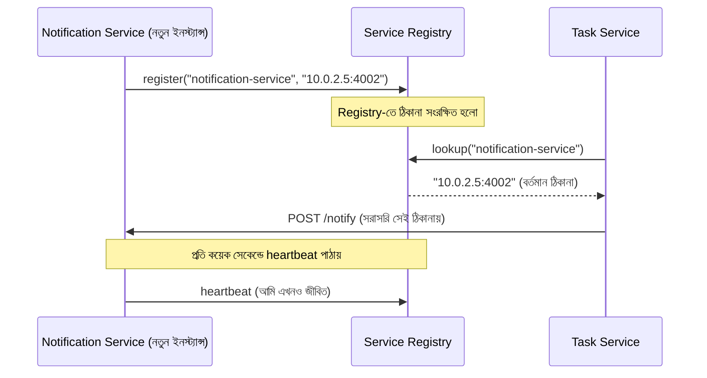

# ৪০.১১ Service Discovery & Registry

আগের লেসনে Circuit Breaker-এর কোডে আমরা সরাসরি লিখেছিলাম `http://notification-service:4002`। এটা ছোট সিস্টেমে চলে, কিন্তু বাস্তব প্রোডাকশনে microservices প্রায়ই কন্টেইনার বা ক্লাউড ইনস্ট্যান্সে চলে, যেগুলো ক্রমাগত তৈরি হয়, ধ্বংস হয়, আর নতুন IP address পায় (Module ৩৫-এ auto-scaling নিয়ে যে ধারণা এসেছিল, সেটাই এখানে প্রযোজ্য)। যদি Task Service-এর কোডে Notification Service-এর ঠিকানা হার্ডকোড করা থাকে, প্রতিবার নতুন ইনস্ট্যান্স আসলে সব জায়গায় কোড আপডেট করতে হবে — এটা টেকসই না।

এই সমস্যার সমাধান দেয় **Service Discovery**। এটাকে ভাবা যায় একটা ফোন ডিরেক্টরির মতো — তুমি কারো নাম জানো, কিন্তু ফোন নম্বর জানো না। ডিরেক্টরিতে নাম দিয়ে খুঁজলে বর্তমান নম্বর পেয়ে যাও। সার্ভিসগুলো যখন চালু হয়, তারা নিজেদের একটা কেন্দ্রীয় **Service Registry**-তে "রেজিস্টার" করে (নাম আর বর্তমান ঠিকানা জানিয়ে), আর অন্য সার্ভিসগুলো কল করার আগে রেজিস্ট্রিতে জিজ্ঞেস করে "notification-service এখন কোথায় আছে?"



লক্ষ্য করার মতো একটা গুরুত্বপূর্ণ বিষয় হলো **heartbeat** বা **health check** — সার্ভিস ইনস্ট্যান্স নিয়মিত রেজিস্ট্রিকে জানায় "আমি এখনও জীবিত"। যদি কোনো ইনস্ট্যান্স নির্দিষ্ট সময় পর্যন্ত heartbeat না পাঠায়, রেজিস্ট্রি ধরে নেয় সেটা মৃত এবং তালিকা থেকে সরিয়ে দেয় — এভাবে অন্য সার্ভিসরা কখনো একটা মৃত ইনস্ট্যান্সে কল করার চেষ্টা করে না।

একটা সরল রেজিস্ট্রি ক্লায়েন্ট কীভাবে কাজ করতে পারে, তার ধারণা দেখা যাক (বাস্তবে Consul বা etcd ব্যবহার হয়, যেটা আমরা ৪০.১৯-এ গভীরভাবে দেখবো):

```python
import os
import random
import asyncio
import httpx

# Notification Service — চালু হওয়ার সময় নিজেকে রেজিস্টার করে
async def register_service():
    await registry_client.register(
        name="notification-service",
        address=os.environ["HOST_IP"],
        port=4002,
        health_check_url="/health",
    )

    async def heartbeat_loop():
        while True:
            await registry_client.heartbeat("notification-service")
            await asyncio.sleep(10)  # প্রতি ১০ সেকেন্ডে heartbeat পাঠায়

    asyncio.create_task(heartbeat_loop())

# Task Service — কল করার আগে বর্তমান ঠিকানা খুঁজে নেয়
async def notify_user(user_id: str, message: str):
    instances = await registry_client.discover("notification-service")
    target = random.choice(instances)  # এলোমেলোভাবে একটা বেছে নেয়া
    async with httpx.AsyncClient() as client:
        await client.post(
            f"http://{target['address']}:{target['port']}/notify",
            json={"user_id": user_id, "message": message},
        )
```

লক্ষ্য করো `discover()` একাধিক ইনস্ট্যান্স ফেরত দিচ্ছে — কারণ প্রোডাকশনে সাধারণত একই সার্ভিসের একাধিক কপি চলে (Module ৪০.১২-তে যে scaling-এর কথা আমরা বলবো তার ফল)। কোন ইনস্ট্যান্সে রিকোয়েস্ট পাঠানো হবে, সেই সিদ্ধান্তটাই আসলে **load balancing**-এর কাজ — পরের লেসনে আমরা সেটা নিয়েই বিস্তারিত আলোচনা করবো।

Service Discovery-এর দুইটা প্রধান ধরন আছে — **client-side discovery** (উপরের উদাহরণের মতো, ক্লায়েন্ট নিজে রেজিস্ট্রিতে জিজ্ঞেস করে কোন ইনস্ট্যান্সে যাবে) আর **server-side discovery** (ক্লায়েন্ট শুধু একটা লোড ব্যালান্সার/Gateway-কে কল করে, লোড ব্যালান্সার নিজেই রেজিস্ট্রি দেখে সঠিক ইনস্ট্যান্স বেছে নেয়)। বাস্তবে বেশিরভাগ আধুনিক সিস্টেম (Kubernetes-ভিত্তিক) server-side discovery ব্যবহার করে, কারণ এতে ক্লায়েন্ট কোডে রেজিস্ট্রির জটিলতা রাখতে হয় না।

পরের লেসনে আমরা দেখবো, একাধিক ইনস্ট্যান্সের মধ্যে রিকোয়েস্ট কীভাবে বিতরণ করা হয় — Load Balancing Strategies।
