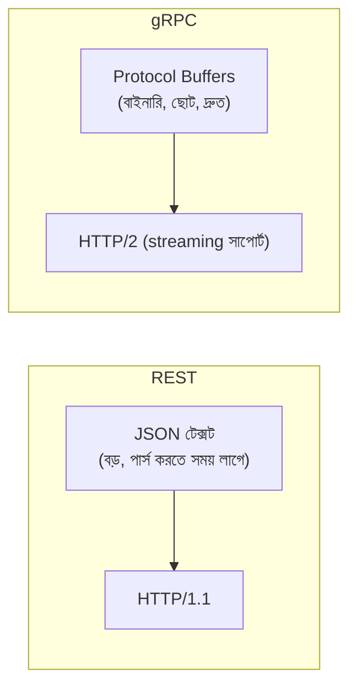
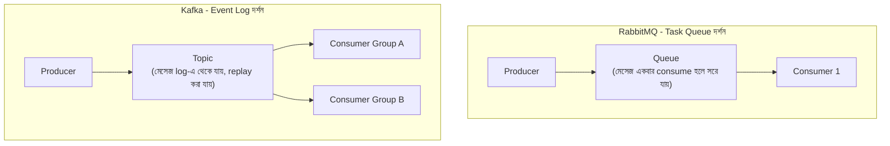

# ৪০.১৪ Inter-Service Communication — Deep Dive: REST/gRPC বনাম মেসেজ কিউ

৪০.৯-এ আমরা synchronous আর asynchronous যোগাযোগের মৌলিক পার্থক্য দেখেছিলাম। এই লেসনে আমরা synchronous জগতের ভেতরে আরেকটা গুরুত্বপূর্ণ পছন্দ নিয়ে আলোচনা করবো — **REST বনাম gRPC**, আর তারপর asynchronous জগতে **RabbitMQ বনাম Kafka**-এর মতো বাস্তব টুলের পার্থক্য দেখবো।

REST আমরা এই পুরো কোর্স জুড়ে ব্যবহার করেছি — JSON, HTTP verbs, human-readable। কিন্তু microservices-এর অভ্যন্তরীণ যোগাযোগে (মানুষ নয়, একটা সার্ভিস আরেকটা সার্ভিসকে কল করছে), **gRPC** একটা শক্তিশালী বিকল্প, যেটা Google তৈরি করেছে উচ্চ-পারফরম্যান্স internal communication-এর জন্য।



gRPC-তে প্রথমে একটা `.proto` ফাইলে সার্ভিসের "কন্ট্রাক্ট" সংজ্ঞায়িত করা হয়:

```protobuf
// task.proto — Task Service-এর কন্ট্রাক্ট
syntax = "proto3";

service TaskService {
  rpc GetTask (TaskRequest) returns (TaskResponse);
  rpc StreamTaskUpdates (TaskRequest) returns (stream TaskResponse); // স্ট্রিমিং
}

message TaskRequest {
  string taskId = 1;
}

message TaskResponse {
  string id = 1;
  string title = 2;
  bool completed = 3;
}
```

এই `.proto` ফাইল থেকে কোড জেনারেট করা হয় (`grpcio-tools` দিয়ে, Python-এর জন্য), যাতে সার্ভার আর ক্লায়েন্ট দুই পাশেই টাইপ-সেফ ফাংশন তৈরি হয় — অনেকটা Module ১৩-এ শেখা Pydantic model-এর মতোই একটা "কন্ট্রাক্ট প্রথম" চিন্তাভাবনা, কিন্তু এটা ভাষা-নিরপেক্ষ (Python সার্ভিস, Go সার্ভিস, Java সার্ভিস — সবাই একই `.proto` থেকে কাজ করতে পারে)।

```python
# Python gRPC ক্লায়েন্ট — Notification Service, Task Service-কে কল করছে
import grpc
import task_pb2
import task_pb2_grpc

async def get_task_title(task_id: str) -> str:
    async with grpc.aio.insecure_channel("task-service:50051") as channel:
        stub = task_pb2_grpc.TaskServiceStub(channel)
        response = await stub.GetTask(task_pb2.TaskRequest(task_id=task_id))
        return response.title  # স্ট্রংলি-টাইপড রেসপন্স
```

REST-এর তুলনায় gRPC অনেক দ্রুত (বাইনারি ফরম্যাট, HTTP/2 multiplexing) আর streaming সাপোর্ট করে, কিন্তু ব্রাউজার থেকে সরাসরি gRPC কল করা কঠিন (তাই এটা মূলত সার্ভিস-টু-সার্ভিস যোগাযোগে ব্যবহার হয়, ক্লায়েন্ট-ফেসিং API-তে REST-ই থেকে যায়) এবং ডিবাগ করা তুলনামূলক কঠিন কারণ Postman দিয়ে সরাসরি সহজে পড়া যায় না।

এখন asynchronous জগতের দিকে তাকাই। ৪০.৯-এ আমরা একটা জেনেরিক "message queue" দেখিয়েছিলাম, কিন্তু বাস্তবে দুইটা ভিন্ন দর্শনের টুল আছে — **RabbitMQ** (traditional message broker, task queue-এর জন্য চমৎকার) আর **Kafka** (event streaming platform, বড় ভলিউমের event log-এর জন্য):



RabbitMQ ব্যবহার করা হয় যখন একটা কাজ ঠিক একবার, কোনো একটা worker-কে দিয়ে সম্পন্ন করাতে চাও (যেমন "একটা ইমেইল পাঠাও")। Kafka ব্যবহার করা হয় যখন একটা event একাধিক পক্ষ শুনতে চায়, আর ইতিহাস ধরে রাখা দরকার (যেমন "task.created" event শুনে Analytics Service, Notification Service, Audit Service — সবাই নিজের কাজ করে, আর প্রয়োজনে পুরনো event আবার replay করা যায়)। এই ধারণাটাই ৪০.১৮-এ আমরা event sourcing আলোচনায় আরও গভীরে নিয়ে যাবো।

কোন পদ্ধতি বেছে নেবে তা নির্ভর করে যোগাযোগের প্রকৃতির উপর — ভেতরের সার্ভিস-টু-সার্ভিস দ্রুত কল দরকার হলে gRPC, ক্লায়েন্ট-ফেসিং API-তে REST, সাধারণ task queue-তে RabbitMQ, আর event-driven সিস্টেমে ভারী থ্রুপুট আর ইতিহাস দরকার হলে Kafka।

পরের লেসনে আমরা Circuit Breaker Pattern-এর গভীরে যাবো — বাস্তব লাইব্রেরি (`pybreaker`) দিয়ে বাস্তবায়ন, আর স্টেট ট্রানজিশনের আরও বিস্তারিত আলোচনা।
