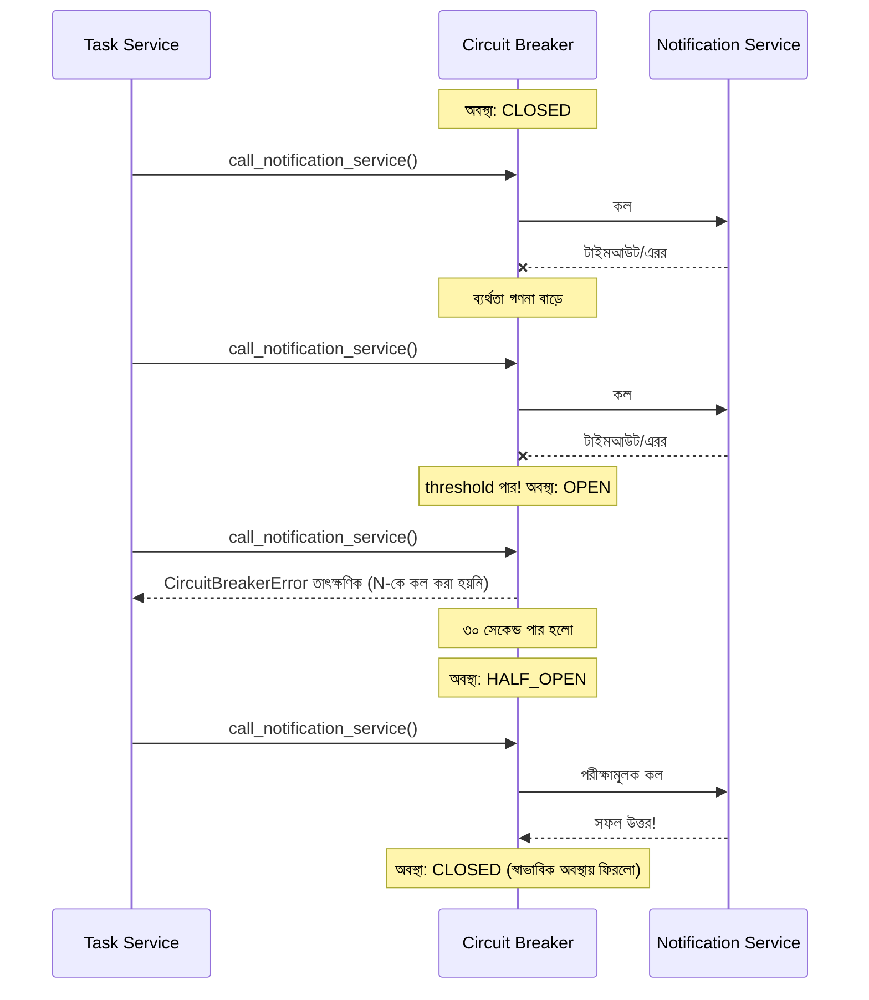

# ৪০.১৫ Circuit Breaker Pattern — Deep Dive: লাইব্রেরি দিয়ে বাস্তবায়ন

৪০.১০-এ আমরা নিজে হাতে একটা সরল Circuit Breaker লিখেছিলাম, যাতে concept-টা স্বচ্ছ থাকে। কিন্তু বাস্তব প্রোডাকশনে নিজের লেখা Circuit Breaker-এ সহজেই সূক্ষ্ম বাগ থেকে যায় — race condition, ভুল timeout হিসাব, বা অসম্পূর্ণ মেট্রিক্স। তাই বাস্তব প্রজেক্টে Python ইকোসিস্টেমের জনপ্রিয় লাইব্রেরি **`pybreaker`** ব্যবহার করাই সাধারণ চর্চা।

```python
import pybreaker
import httpx
import logging

logger = logging.getLogger(__name__)

# ইভেন্ট শোনার জন্য একটা listener — পর্যবেক্ষণযোগ্যতার (Module ৩২) জন্য গুরুত্বপূর্ণ
class NotificationBreakerListener(pybreaker.CircuitBreakerListener):
    def state_change(self, cb, old_state, new_state):
        if new_state.name == "open":
            logger.warning("🔴 Circuit OPEN — Notification Service ব্যর্থ হচ্ছে বারবার")
        elif new_state.name == "half-open":
            logger.info("🟡 Circuit HALF_OPEN — পরীক্ষামূলক কল পাঠানো হচ্ছে")
        elif new_state.name == "closed":
            logger.info("🟢 Circuit CLOSED — সার্ভিস স্বাভাবিক হয়েছে")

notify_breaker = pybreaker.CircuitBreaker(
    fail_max=5,               # রোলিং উইন্ডোতে এই সংখ্যক ব্যর্থতা হলে সার্কিট খুলবে
    reset_timeout=30,         # ৩০ সেকেন্ড পর HALF_OPEN-এ চেষ্টা করবে
    listeners=[NotificationBreakerListener()],
)

# যে ফাংশনটাকে সুরক্ষিত করতে চাই
@notify_breaker
async def call_notification_service(user_id: str, message: str):
    async with httpx.AsyncClient(timeout=3.0) as client:  # ৩ সেকেন্ডের বেশি লাগলে ব্যর্থ ধরে নেয়া
        return await client.post(
            "http://notification-service:4002/notify",
            json={"user_id": user_id, "message": message},
        )

# ব্যবহার — fallback নিজে হাতে সামলাতে হয়, সার্কিট খোলা থাকলে কী করা হবে
async def create_task(task_data: dict):
    task = await db.tasks.create(task_data)
    try:
        await call_notification_service(task.user_id, f"নতুন Task: {task.title}")
    except pybreaker.CircuitBreakerError:
        logger.warning("Notification Service অনুপলব্ধ, পরে retry queue-তে রাখা হচ্ছে")
    return task
```

লক্ষ্য করো `pybreaker`-এর `fail_max` আর `reset_timeout` মিলিয়ে সার্কিট কখন খুলবে সেটা ঠিক করে, যেটা আমাদের ৪০.১০-এর সরল "৩ বার ব্যর্থ হলেই খুলবে" যুক্তির চেয়ে আরও প্রোডাকশন-পরীক্ষিত — কারণ লাইব্রেরিটা নিজে থেই থ্রেড-সেফ কাউন্টার আর state transition সামলায়, যেটা নিজে হাতে লিখলে race condition-এর ঝুঁকি থাকে।

স্টেট ট্রানজিশনগুলো আরও গভীরভাবে দেখা যাক, বাস্তব টাইমলাইন সহ:



একটা গুরুত্বপূর্ণ ডিজাইন সিদ্ধান্ত হলো `CircuitBreakerError` ধরা পড়লে কী করবে — শুধু এরর থ্রো করা যথেষ্ট না, বরং ব্যবসায়িক দৃষ্টিকোণ থেকে চিন্তা করতে হয়। উদাহরণে আমরা except ব্লকে নোটিফিকেশনকে একটা retry queue-তে রেখে দিচ্ছি (Module ৪০.৯-এর asynchronous পদ্ধতির সাথে সংযুক্ত করে), যাতে Notification Service সুস্থ হলে বাকি কাজ পরে সম্পন্ন হয় — এটা "graceful degradation"-এর একটা ভালো উদাহরণ, সিস্টেম পুরোপুরি ভেঙে না পড়ে আংশিকভাবে কাজ চালিয়ে যাচ্ছে।

Circuit Breaker-কে Module ৩২-এর logging আর Module ৩৩-এর alerting-এর সাথে যুক্ত করাও প্রোডাকশনে অত্যন্ত গুরুত্বপূর্ণ — `state_change()` listener-এর `open` অবস্থায় একটা alert পাঠানো উচিত, কারণ সার্কিট খোলা মানে একটা ডাউনস্ট্রিম সার্ভিসে সত্যিকারের সমস্যা হচ্ছে যেটা মানুষের নজরে আনা দরকার।

এই তিনটা গভীর-বিশ্লেষণী লেসন (Gateway, Communication, Circuit Breaker) শেষ করে আমরা এখন সম্পূর্ণ নতুন দুইটা প্যাটার্নে যাবো — পরের লেসনে Multi-Tenant Architecture, যেখানে আমরা দেখবো একটা মাত্র সিস্টেম কীভাবে একাধিক আলাদা গ্রাহক (tenant)-কে নিরাপদে সার্ভ করতে পারে।
