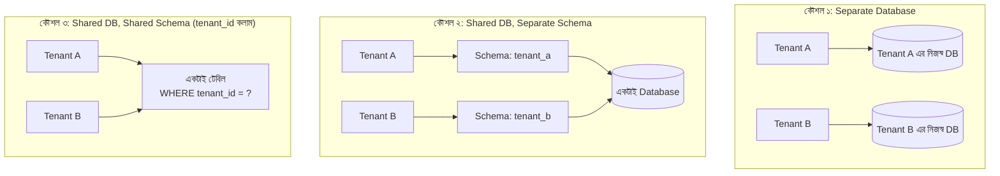

# ৪০.১৬ Multi-Tenant Architecture

আগের তিনটা লেসনে আমরা microservices-এর অভ্যন্তরীণ প্যাটার্ন নিয়ে গভীরে গিয়েছি। এখন একটা ভিন্ন ধরনের স্থাপত্য সমস্যা নিয়ে কথা বলি — ধরো তুমি TaskFlow API-কে একটা SaaS প্রোডাক্ট হিসেবে বিক্রি করতে চাও, যেখানে একশোটা আলাদা কোম্পানি (tenant) তোমার সিস্টেম ব্যবহার করবে। প্রতিটা কোম্পানির জন্য কি আলাদা সার্ভার, আলাদা ডেটাবেজ চালাবে? নাকি সবাইকে একই সিস্টেমে রাখবে, কিন্তু একজনের ডেটা যেন আরেকজন কখনো না দেখতে পারে?

এই প্রশ্নের উত্তরই **Multi-Tenant Architecture**। এটাকে ভাবা যায় একটা অ্যাপার্টমেন্ট ভবনের মতো — সবাই একই ভবন, একই বিদ্যুৎ লাইন, একই লিফট শেয়ার করে (infrastructure শেয়ার), কিন্তু প্রতিটা ফ্ল্যাটের নিজস্ব তালা আছে, একজনের ফ্ল্যাটে আরেকজন ঢুকতে পারে না (data isolation)।

Multi-tenancy বাস্তবায়নের তিনটা প্রধান কৌশল আছে, যেগুলোর মধ্যে isolation আর খরচের ট্রেড-অফ ভিন্ন:



সবচেয়ে সাধারণ আর সাশ্রয়ী কৌশল হলো তৃতীয়টা — **shared schema, tenant_id কলাম দিয়ে আলাদা করা**। Module ১৯-এ শেখা ERD-এর ধারণাকে এখানে প্রসারিত করে প্রতিটা টেবিলে একটা `tenant_id` কলাম যোগ করা হয়:

```sql
-- প্রতিটা টেবিলে tenant_id — Module ২০-এর SQL ভিত্তির উপর তৈরি
CREATE TABLE tasks (
  id SERIAL PRIMARY KEY,
  tenant_id INTEGER NOT NULL REFERENCES tenants(id),
  title VARCHAR(255) NOT NULL,
  completed BOOLEAN DEFAULT FALSE
);

-- Module ২১-এ শেখা ইনডেক্সিং এখানে অত্যন্ত গুরুত্বপূর্ণ —
-- প্রতিটা কোয়েরি tenant_id দিয়ে ফিল্টার হবে
CREATE INDEX idx_tasks_tenant ON tasks(tenant_id);
```

এখন সবচেয়ে ঝুঁকিপূর্ণ অংশ — কোডে প্রতিটা কোয়েরিতে `tenant_id` ফিল্টার করা **বাধ্যতামূলক** করতে হবে, নাহলে এক গ্রাহকের ডেটা আরেকজন দেখে ফেলতে পারে, যেটা একটা মারাত্মক নিরাপত্তা দুর্ঘটনা (Module ৩০-এর API Security-এর সাথে সরাসরি সম্পর্কিত)। এটা ম্যানুয়ালি প্রতিটা কোয়েরিতে মনে রেখে করার বদলে, middleware দিয়ে কেন্দ্রীভূত করা নিরাপদ:

```python
# Tenant-resolving dependency — JWT থেকে tenant শনাক্ত করা (Module ১২-এর JWT)
from fastapi import Depends, Request
import jwt, os

async def resolve_tenant(request: Request) -> str:
    token = request.headers.get("authorization", "").split(" ")[-1]
    decoded = jwt.decode(token, os.environ["JWT_SECRET"], algorithms=["HS256"])
    return decoded["tenant_id"]

# প্রতিটা মডেল ফাংশনে tenant_id বাধ্যতামূলক প্যারামিটার হিসেবে রাখা
class TaskModel:
    @staticmethod
    async def find_all(tenant_id: str):
        return await database.fetch_all(
            "SELECT * FROM tasks WHERE tenant_id = :tenant_id", {"tenant_id": tenant_id}
        )

    @staticmethod
    async def create(tenant_id: str, data: dict):
        return await database.fetch_one(
            "INSERT INTO tasks (tenant_id, title) VALUES (:tenant_id, :title) RETURNING *",
            {"tenant_id": tenant_id, "title": data["title"]},
        )

# রাউট — কখনো tenant_id ভুলে না যাওয়ার নিশ্চয়তা
@app.get("/api/tasks")
async def list_tasks(tenant_id: str = Depends(resolve_tenant)):
    tasks = await TaskModel.find_all(tenant_id)  # current_user.id নয়, tenant_id!
    return tasks
```

তিনটা কৌশলের মধ্যে পছন্দ নির্ভর করে গ্রাহকের চাহিদার উপর — যদি কোনো এন্টারপ্রাইজ গ্রাহক নিয়ন্ত্রক প্রয়োজনীয়তার (compliance) কারণে সম্পূর্ণ আলাদা ডেটাবেজ চায়, "Separate Database" কৌশল বেছে নিতে হবে, যদিও এতে অপারেশনাল খরচ (প্রতিটা tenant-এর জন্য আলাদা ব্যাকআপ, মাইগ্রেশন চালানো) বেড়ে যায়। ছোট আর মাঝারি SaaS প্রোডাক্টে shared schema সবচেয়ে সাশ্রয়ী এবং maintain করা সহজ।

পরের লেসনে আমরা আরেকটা গুরুত্বপূর্ণ স্থাপত্য দর্শনে যাবো — Clean Architecture, যেখানে দেখবো কীভাবে একটা সিস্টেমের কোর ব্যবসায়িক লজিককে ডেটাবেজ বা ফ্রেমওয়ার্কের খুঁটিনাটি থেকে সম্পূর্ণ স্বাধীন রাখা যায়।
