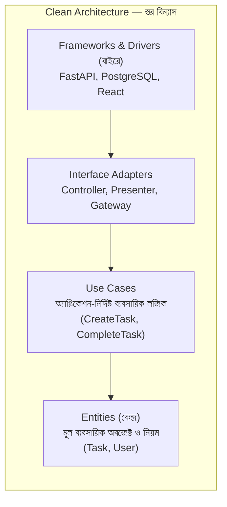

# ৪০.১৭ Clean Architecture

আগের লেসনে আমরা দেখলাম কীভাবে একটা সিস্টেম একাধিক tenant-কে সার্ভ করতে পারে। এখন আমরা ফিরে যাই একটা মাত্র সার্ভিসের **ভেতরের** সংগঠনে — কিন্তু এবার MVC (৪০.৭)-এর চেয়েও গভীরভাবে চিন্তা করবো। প্রশ্নটা হলো — যদি আগামীকাল তুমি PostgreSQL থেকে MongoDB-তে সরে যাও, বা FastAPI থেকে অন্য কোনো ফ্রেমওয়ার্কে মাইগ্রেট করো, তোমার ব্যবসায়িক লজিক (business logic) কি অক্ষত থাকবে, নাকি পুরো অ্যাপ্লিকেশন নতুন করে লিখতে হবে?

**Clean Architecture** (রবার্ট সি. মার্টিন / "Uncle Bob"-এর প্রস্তাবিত) এই প্রশ্নের একটা কঠোর উত্তর দেয় — **ব্যবসায়িক নিয়ম কখনো ফ্রেমওয়ার্ক, ডেটাবেজ, বা UI-এর উপর নির্ভরশীল হবে না; বরং নির্ভরতা সবসময় বাইরে থেকে ভেতরে যাবে**। এটাকে ভাবা যায় পেঁয়াজের স্তরের মতো — কেন্দ্রে থাকে সবচেয়ে গুরুত্বপূর্ণ, স্থিতিশীল জিনিস (ব্যবসায়িক নিয়ম), আর বাইরের স্তরগুলোতে থাকে পরিবর্তনশীল টুকরা (ডেটাবেজ, ফ্রেমওয়ার্ক, UI)।



মূল নিয়ম — **নির্ভরতার তীর সবসময় কেন্দ্রের দিকে যাবে**। `Entities` কখনো জানে না FastAPI বা PostgreSQL-এর কথা। `Use Cases` জানে `Entities`-এর কথা, কিন্তু জানে না ডেটা আসলে কোথা থেকে আসছে — সেটা একটা **abstract base class** দিয়ে বিমূর্ত (abstract) করা হয়, ঠিক যেমন Module ১৪-এ আমরা Interface/Protocol দিয়ে বাস্তবায়ন থেকে চুক্তিকে আলাদা করতে শিখেছিলাম।

```python
from abc import ABC, abstractmethod
from dataclasses import dataclass

# --- কেন্দ্র: Entity — বিশুদ্ধ ব্যবসায়িক অবজেক্ট, কোনো ফ্রেমওয়ার্ক ইমপোর্ট নেই ---
@dataclass
class Task:
    id: str
    title: str
    completed: bool = False

    def mark_complete(self):
        if self.completed:
            raise ValueError("Task ইতিমধ্যে সম্পন্ন")
        self.completed = True


# --- Use Case-এর জন্য একটা abstract interface (Port) — বাস্তবায়ন থেকে স্বাধীন ---
class TaskRepository(ABC):
    @abstractmethod
    async def find_by_id(self, task_id: str) -> Task | None: ...

    @abstractmethod
    async def save(self, task: Task) -> None: ...


# --- Use Case — শুধু interface-এর উপর নির্ভর করে, নির্দিষ্ট ডেটাবেজ জানে না ---
class CompleteTaskUseCase:
    def __init__(self, task_repo: TaskRepository):  # Module ২২-এর DI
        self.task_repo = task_repo

    async def execute(self, task_id: str) -> None:
        task = await self.task_repo.find_by_id(task_id)
        if task is None:
            raise ValueError("Task পাওয়া যায়নি")
        task.mark_complete()
        await self.task_repo.save(task)


# --- বাইরের স্তর: PostgreSQL-নির্দিষ্ট বাস্তবায়ন (Adapter) ---
class PostgresTaskRepository(TaskRepository):
    async def find_by_id(self, task_id: str) -> Task | None:
        row = await database.fetch_one("SELECT * FROM tasks WHERE id = :id", {"id": task_id})
        return Task(row["id"], row["title"], row["completed"]) if row else None

    async def save(self, task: Task) -> None:
        await database.execute(
            "UPDATE tasks SET completed = :completed WHERE id = :id",
            {"completed": task.completed, "id": task.id},
        )


# --- সবচেয়ে বাইরের স্তর: FastAPI Route ---
@app.post("/api/tasks/{task_id}/complete")
async def complete_task(task_id: str):
    use_case = CompleteTaskUseCase(PostgresTaskRepository())
    await use_case.execute(task_id)
    return {"success": True}
```

এই বিন্যাসের সবচেয়ে বড় সুবিধা টেস্টিং-এ দেখা যায় (Module ৩১-এর API Testing মনে করো) — `CompleteTaskUseCase` টেস্ট করার জন্য আসল PostgreSQL লাগে না, একটা fake/in-memory `TaskRepository` দিয়েই যথেষ্ট:

```python
class FakeTaskRepository(TaskRepository):
    def __init__(self):
        self.tasks: dict[str, Task] = {}

    async def find_by_id(self, task_id: str) -> Task | None:
        return self.tasks.get(task_id)

    async def save(self, task: Task) -> None:
        self.tasks[task.id] = task


# টেস্টে — কোনো ডেটাবেজ কানেকশন ছাড়াই ব্যবসায়িক নিয়ম যাচাই করা যায়
fake_repo = FakeTaskRepository()
await fake_repo.save(Task("1", "কেনাকাটা"))
use_case = CompleteTaskUseCase(fake_repo)
await use_case.execute("1")
```

লক্ষ্য করো ভবিষ্যতে যদি PostgreSQL থেকে MongoDB-তে সরে যাওয়ার সিদ্ধান্ত হয়, শুধু একটা নতুন `MongoTaskRepository(TaskRepository)` লিখতে হবে — `CompleteTaskUseCase`-এর একটা লাইনও বদলাতে হবে না। এটাই Clean Architecture-এর প্রতিশ্রুতি — ব্যবসায়িক নিয়ম টিকে থাকে, চারপাশের প্রযুক্তি বদলায়।

FastAPI-এর `Depends()`-ভিত্তিক dependency injection সিস্টেম (Module ৫) এই দর্শনটাকে খুব স্বাভাবিকভাবে ধরে রাখে — route handler-এ `Depends(get_task_repository)` দিয়ে সঠিক adapter ইনজেক্ট করা যায়, আর টেস্টে সহজেই `FakeTaskRepository` দিয়ে override করা যায়।

এতক্ষণ আমরা সার্ভিসের ভেতরের আর একাধিক সার্ভিসের মধ্যেকার স্থাপত্য দেখলাম। পরের লেসনে আমরা ফিরে যাবো Event-Driven Architecture-এ, কিন্তু এবার একটা বিশেষায়িত, শক্তিশালী কৌশল নিয়ে — Event Sourcing, যেখানে সিস্টেমের অবস্থা সংরক্ষণের বদলে প্রতিটা পরিবর্তনের ইতিহাস সংরক্ষণ করা হয়।
